## 1. What Make My Figure does

Make My Figure turns a table you already have — a CSV, a TSV, or an Excel workbook — into a manuscript-style scientific figure, and records how the figure was made so it can be rebuilt later.

The path through the application is always the same:

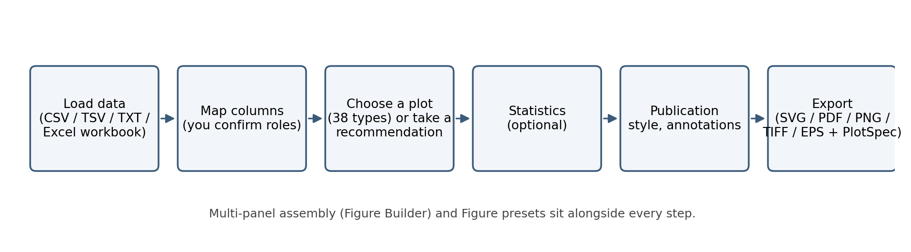

1. **Load** a table (or one worksheet of a workbook).
2. **Map columns** to roles — you confirm which column is x, y, group, p-value, time, event, and so on. The program never guesses biological meaning silently.
3. **Choose a plot type** from the 38 in the registry, or take one of the *advisory* recommendations.
4. **Optionally run statistics** — you choose the method; results are stored and every p-value drawn on the figure comes from a stored result.
5. **Style** the figure with the single **Publication** style (fonts, palette, layout, legend), add annotations.
6. **Assemble** several plots into a multi-panel figure if you need one.
7. **Export** SVG, PDF, PNG (and TIFF/EPS) together with a **PlotSpec** JSON that records the configuration.

Two interfaces share one engine: a **desktop app** (Qt) and a **browser app** (Streamlit). Both run entirely on your computer; nothing is uploaded anywhere.

**Note:** Make My Figure is a plotting and reporting tool. It computes the statistics you ask for and recommends plots from the *shape* of your table, but the choice of method, the interpretation, and journal compliance remain yours. Publication is a general manuscript style, not a journal template.

## 2. Installation

### A. Packaged application (no Python needed)

Download the installer for your system from the project's GitHub **Releases** page (release **v1.1.0**):

| System | File | Steps |
|---|---|---|
| **macOS** | `MakeMyFigure-1.1.0.dmg` | open the DMG, drag *Make My Figure* to *Applications*, launch it. The bundle is not notarised: on first launch right-click → **Open** (or allow it under *System Settings → Privacy & Security*). |
| **Windows** | `MakeMyFigure-1.1.0-Setup.exe` (or `MakeMyFigure-1.1.0-windows.zip`) | run the installer (or unzip and start `MakeMyFigure\MakeMyFigure.exe`). SmartScreen may warn about an unsigned program; choose *More info → Run anyway* if you trust the source. |
| **Linux** | `MakeMyFigure-1.1.0.AppImage` (or `MakeMyFigure-1.1.0-linux.tar.gz`) | `chmod +x MakeMyFigure-1.1.0.AppImage && ./MakeMyFigure-1.1.0.AppImage`, or unpack the tarball and run `MakeMyFigure/MakeMyFigure`. |
| **WSL2** (Linux under Windows) | not a native package | use the source install below with WSLg (Windows 11) or run the browser app and open it in a Windows browser. |

`SHA256SUMS.txt` on the release page lists the checksum of every file. The status bar (desktop) shows `Make My Figure v1.1.0 · <commit> · <platform> · <backend>` on launch, and **Help → About** shows the version.

### B. From source (desktop and browser apps)

Requirements: **Python 3.10–3.12** (the metadata allows 3.9, but Apple's bundled 3.9 failed pip's byte-compile step on a PySide6 file during testing — use a newer interpreter), git, and about 1 GB of disk for the Qt binding.

```bash
git clone https://github.com/surPoudel/make-my-figure.git
cd make-my-figure
python3 -m venv .venv
source .venv/bin/activate            # Windows PowerShell: .venv\Scripts\Activate.ps1
python -m pip install --upgrade pip
python -m pip install --no-compile -r requirements.txt
python -m pip install --no-compile -e ".[desktop]"     # adds PySide6 for the desktop app
```

`--no-compile` skips a byte-compile step that fails on one PySide6 template file with some interpreters; Python compiles what it needs on first import.

Verify the build you are running:

```bash
python -c "from make_my_figure_core.version import build_banner; print(build_banner())"
```

The line shows the version, the git commit, the platform and the Matplotlib backend. The same banner appears in the desktop status bar on launch and in the browser sidebar, so you can always confirm the manual matches the app.

**Linux / WSL only:** the Qt binding needs system libraries that minimal images lack:

```bash
sudo apt install -y libxkbcommon0 libxkbcommon-x11-0 libgl1 libegl1 libxcb-cursor0 \
    libxcb-xinerama0 libxcb-keysyms1 libxcb-randr0 libxcb-render-util0 libxcb-shape0 \
    libxcb-icccm4 libxcb-image0 libxcb-xfixes0 libdbus-1-3
```

If the desktop app cannot start it prints exactly this list. The browser app needs none of it.

## 3. Open the app

**Desktop:**

```bash
python -m apps.desktop_app.main
```

**Browser:**

```bash
streamlit run apps/streamlit_app/streamlit_app.py
```

and open the address Streamlit prints (normally `http://localhost:8501`).

The desktop app opens on the **Home / Upload** page. Drop a file onto it, choose **File → Open data file…**, or pick a bundled example from **File → Open example**.

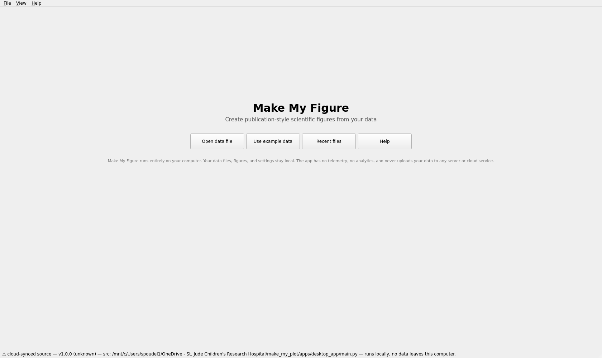

After data loads you are in the **plot workspace**: controls on the left (plot type, recommendations, column mapping, options, labels, Figure preset, Publication style, Statistics, Export), the data preview and messages at the top right, and the figure below them.

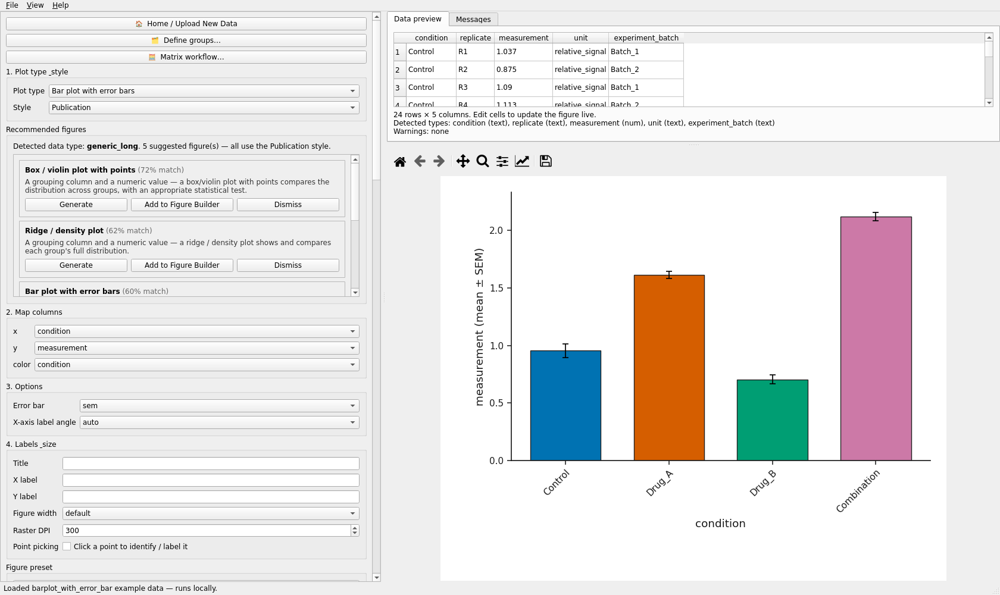

The browser app has the same sections in its sidebar, numbered 1–6, with the table, the figure preview, Publication QC and Export in the main column.

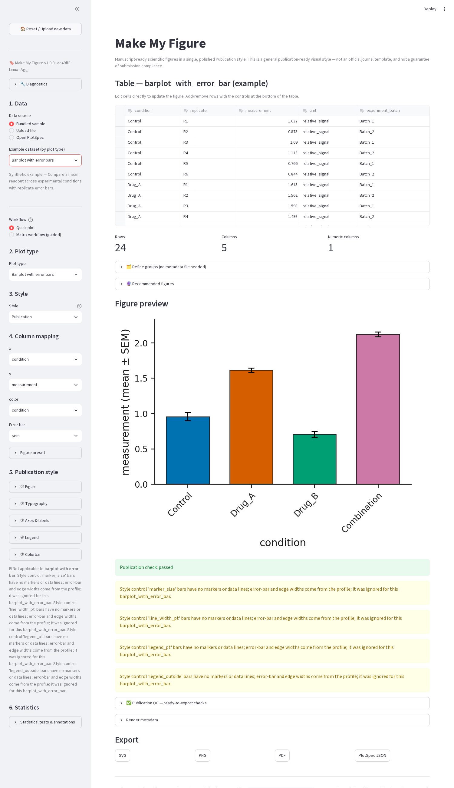

## 4. Load data

Supported files: **CSV, TSV, TXT/TAB** (delimited text) and **Excel `.xlsx`, `.xlsm`, `.xls`**. Put column names in the first row and one observation per row. Numeric measurements should be numeric columns; identifiers and labels can be text.

- **Desktop:** drag a file onto the window, or **File → Open data file…**
- **Browser:** sidebar **1. Data → Upload file → Upload CSV / TSV / XLSX**

**Excel workbooks with several sheets.** Every worksheet is listed and selectable, including notes and empty sheets. Pick one in the **📑 Worksheet** box (desktop) or sidebar (browser). Each sheet is classified — *differential results*, *matrix*, *metadata*, *enrichment*, *documentation*, *generic*, *empty* — as a hint, not a decision; you can plot from any sheet.

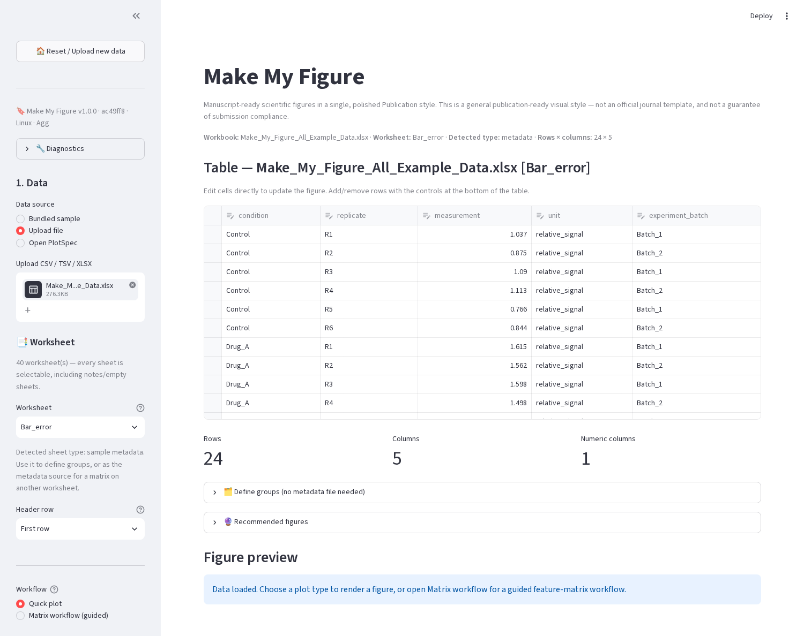

In the browser app you can also choose the **Header row** (first row, a chosen row, two stacked rows, or no header) and, for spreadsheets whose group label is written once over a block of replicate columns, tick **Carry a group label across blank cells**. Merged Excel cells are recovered automatically. The desktop app reads the first row as the header.

**Matrix tables** (features in rows, samples in columns, e.g. an expression or intensity matrix) work in the ordinary editor for heatmaps, clustering and PCA, and have their own guided **Matrix workflow** (section 8).

## 5. Make a basic figure

Use the bundled example so the steps match the screenshots exactly: **File → Open example → Bar plot with error bars** (desktop) or **Bundled sample → Bar plot with error bars** (browser).

1. **Plot type** is already *Bar plot with error bars*; the **Style** is *Publication* (the only style).
2. **2. Map columns:** `x` → `condition`, `y` → `measurement`, `color` → `condition`. With your own data, set each role yourself — the defaults only prefill when a matching column exists.
3. **3. Options:** **Error bar** → `sem`, `sd`, `ci95` or `none`; **X-axis label angle**.
4. The figure re-renders as you change anything (the desktop debounces continuous controls so dragging stays responsive).
5. **4. Labels & size:** title, axis labels, **Figure width** preset (default / single / onehalf / double column) and **Raster DPI**.
6. **5. Publication style** — tick the box to enable it (desktop) or open the expanders (browser): typography, palette, tick angles, padding, legend location, colorbar, margins.

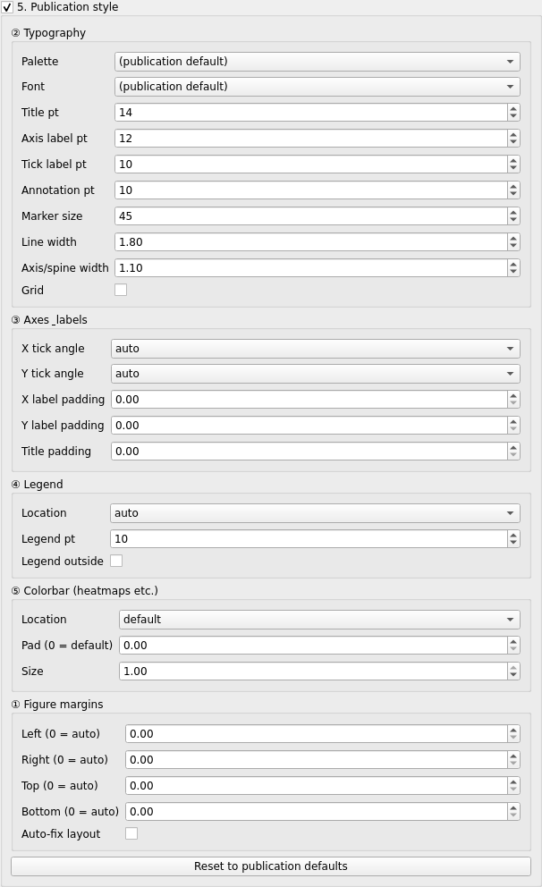

7. **Export:** desktop **5. Export → Export SVG / PNG / PDF / PlotSpec JSON** or **Export all as ZIP**; browser **Export → SVG / PNG / PDF / PlotSpec JSON** download buttons. A `.plot_spec.json` sidecar is written with every export so the figure can be reproduced.

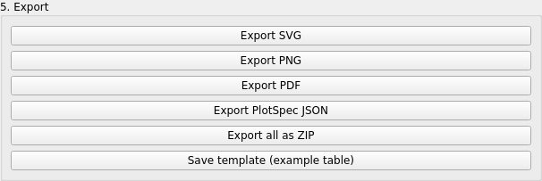

Controls that do not apply to the current plot are reported rather than silently ignored — for a bar plot, for example, the marker-size and line-width controls do nothing and the app says so.

## 6. Use recommendations

When a table loads, Make My Figure profiles it (numeric vs. categorical columns, identifiers, p-value-like columns, matrix shape, edge lists, survival columns…) and suggests plots with a match score and the reason.

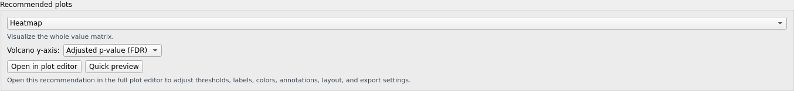

- **Desktop:** the **Recommended figures** group under the plot type; **Generate** switches to that plot with the suggested mapping; **Add to Figure Builder** saves it as a panel.
- **Browser:** the **🔮 Recommended figures** expander above the figure.

Recommendations are **advisory**. The score is a rule-based heuristic on the table's shape, not a measure of scientific appropriateness. You remain responsible for choosing what the figure should show.

## 7. Run statistics

Example: **Box / violin plot with points** (bundled). In **6. Statistics** (desktop: tick the group box, then **Enable statistics**; browser: **Statistical tests & annotations** expander):

1. **Test** — e.g. *Welch's t-test*. Eighteen methods are available (t-tests, Mann-Whitney, Wilcoxon, ANOVA variants, Kruskal-Wallis, Dunn, chi-square, Fisher, log-rank, Cox, Pearson, Spearman, linear regression, GLM). *Auto-suggest* proposes one from the mapping; it is a suggestion, not a decision.
2. **Comparison** — all groups pairwise, compare to a control, within each x category, selected pairs, or omnibus only.
3. **Correction** — Benjamini–Hochberg FDR, Bonferroni, Holm, or none.
4. **Annotation shows / placement** — stars, exact p, adjusted p, statistic, effect size…; brackets between compared groups, or one label above each bar when comparing to a control.
5. **Run statistics.** The results table lists each comparison with p, adjusted p, effect size and n, and a **method sentence** is written for your Methods section. Export the table (CSV) or the method report (Markdown).

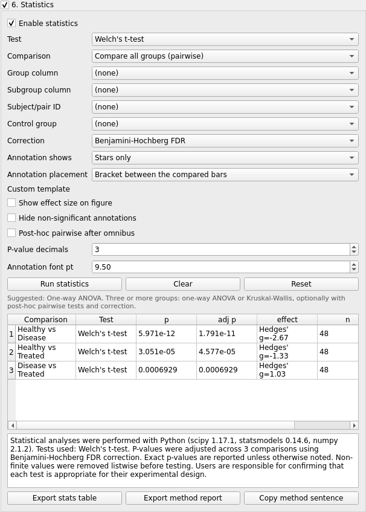

**Warning:** the program performs the calculation you request. It does not verify that a test suits your design. Check assumptions (independence, pairing, distribution) before you rely on a result.

## 8. Matrix workflow

For a feature-by-sample matrix, open **🧮 Matrix workflow…** (desktop) or choose **Workflow → Matrix workflow (guided)** (browser).

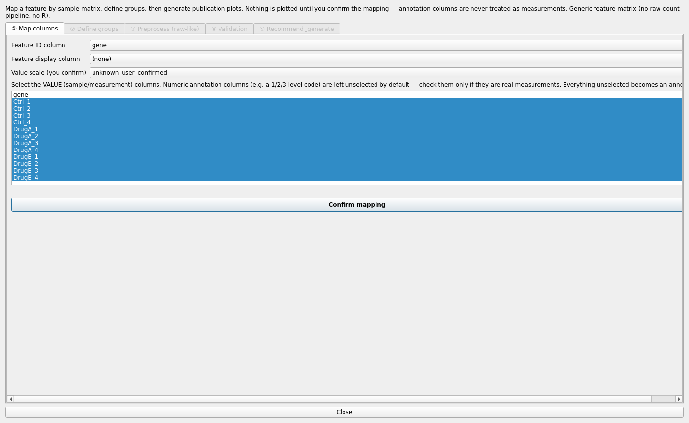

1. **① Map columns** — the feature ID column, optional display column, the **value (sample) columns**, and the **value scale** (`normalized`, `log_normalized`, `raw_numeric`, or `unknown_user_confirmed`). Numeric annotation columns are left unselected until you tick them. Click **Confirm mapping**.
2. **② Define groups** — upload a metadata file, take one from another worksheet, or type a group per sample column; then **Confirm groups**.
3. **③ Preprocess (raw-like)** — optional, for raw-like data: **Run diagnostics** (suspected data type, skew, zeros, negatives), preview a **QC plot**, pick one of the **recommended preprocessing** recipes (e.g. *Total-sum normalize → log2 → z-score*; nothing is applied automatically), then **Apply preprocessing → use processed matrix**. Each step is recorded; the original matrix is never modified; **Save before/after QC report…** writes the report.
4. **④ Validation** — a report of the confirmed mapping and groups (features, samples, groups, missing values, duplicate ids) with warnings or *✓ Validation passed*.
5. **⑤ Recommend & generate** — an optional two-group **differential summary** (test, correction, groups A/B), then recommended plots (heatmap, PCA, box plots, volcano/MA once a summary exists) with **Quick preview** and **Open in plot editor**, which hands the derived table to the full editor with its provenance.

## 9. Save a Figure preset

A **Figure preset** is your configuration without your data. Configure a figure once, save the preset, and apply it to a new dataset of the same plot type later.

- **Figure style only** — fonts, palette, line/marker sizes, tick angles, margins, legend and colorbar placement, export size/DPI, and visual plot options (violin vs box, colormap, node colours…). Portable: this is the lab's *Lab_Default_Heatmap.mmfpreset.json*.
- **Full figure configuration** — everything above plus column roles, thresholds, axis labels and the statistics test. On new data it applies what fits and lists the columns it could not find, for you to map — it never guesses.

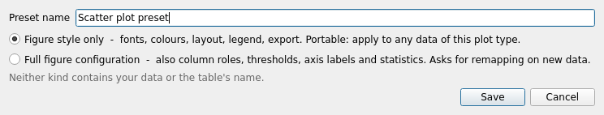

**Desktop:** the **Figure preset** group (above Publication style) — choose a preset, **Apply**, **Save preset…**, **Delete**, **Import…**, **Export…**, **Reset to Publication defaults**; the same actions are in **File → Figure preset**. **Browser:** the **Figure preset** expander in the sidebar.

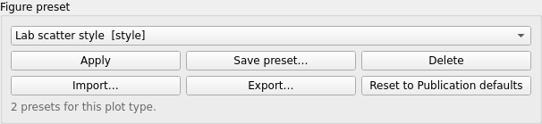

A **PlotSpec** is different: it is the exact record of *one* figure, including the table name and column names. Every export writes one. An existing PlotSpec can be loaded as a full preset.

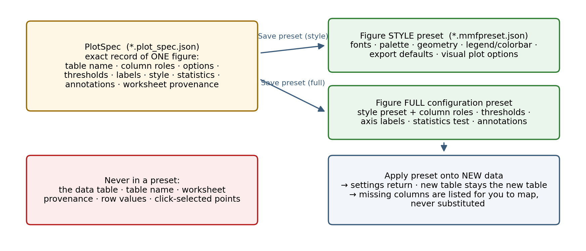

## 10. Figure Builder (multi-panel figures)

In the desktop app, click **Save current plot as panel** for each plot you want, then **Open Figure Builder…**.

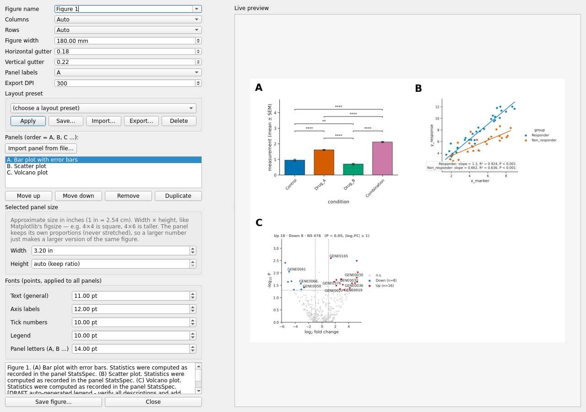

- Add generated plots (they re-render from their PlotSpecs) or **Import panel from file…** (PNG, JPG, TIFF, WEBP, BMP; PDF/SVG/EPS with the optional `import-panels` extra).
- Set **Columns**, **Rows**, **Figure width** (mm), the two **gutters**, **Panel labels** (A / a / 1) and **Export DPI**.
- Select a panel to set its **Width** and **Height** in inches (proportions are preserved, never stretched), reorder, duplicate or remove it.
- **Fonts** apply to every panel. **Layout preset** saves the grid/sizes/fonts for reuse without any panel content.
- **Save figure…** writes PNG/SVG/PDF plus a **FigureSpec** (`.figure_spec.json`).

**Note:** the composite embeds each panel's content as a raster image at the export DPI; panel letters and titles stay vector text. For a fully vector single panel, export that plot directly as SVG or PDF. The browser app has a simpler Figure Builder (columns only) inside the guided Matrix workflow.

## 11. Export

| Format | Type | DPI | Text | Typical use |
|---|---|---|---|---|
| SVG | vector | — | editable | edit further in Illustrator/Inkscape; journals accepting SVG |
| PDF | vector | — | editable (embedded Type 42 fonts) | manuscript submission, print |
| EPS | vector | — | editable | legacy journal systems (core/ZIP export) |
| PNG | raster | 150–600 (set in **Raster DPI**) | — | slides, previews, journals requiring raster |
| TIFF | raster (LZW) | as PNG | — | journals requiring TIFF (core/ZIP export) |

Every export also writes `name.plot_spec.json`; when statistics ran, `name.stats_spec.json` as well. The desktop **Export all as ZIP** bundles formats and sidecars.

## 12. Where to get help

- **Desktop Help menu:** **Help…** (plot types, how to format your data, privacy, the Publication-style disclaimer), **About** (version), **Copy debug info**.
- **Browser sidebar:** the version banner and **🔧 Diagnostics**.
- The full **User Manual** (this folder) documents every control, plot, statistic and file.
- Repository: `https://github.com/surPoudel/make-my-figure` (issues, if the repository is public for you).

Always quote the banner line (version · commit · platform · backend) when reporting a problem.
