# Make My Figure — User Manual

**MakeMyFigure version:** 1.1.0  
**Documentation generated from commit:** `473d495`  
**Date:** 2026-09-11

This manual describes the application exactly as built at the commit above. Where the packaged installers of an earlier release differ, the text says so.

## Part I — Introduction

### 1. About Make My Figure

Make My Figure (package `make_my_figure_core`, version 1.1.0) turns tabular scientific data — CSV/TSV/TXT files and Excel workbooks — into manuscript-style figures, and records how each figure was made. One engine serves two interfaces: a **desktop application** built with Qt (PySide6) and a **browser application** built with Streamlit. Both run entirely on your own computer.

### 2. Intended users

Bench and computational scientists who have a table of results and need a clean, consistent, reproducible figure: a bar or box plot of replicate measurements, a volcano from a differential-expression table, a heatmap or PCA from a normalised matrix, a Kaplan–Meier curve, a network, a multi-panel composite for a manuscript. No programming is required; the PlotSpec files it writes are plain JSON if you want to look inside.

### 3. Design principles

- **You confirm the mapping.** Columns are assigned to roles (x, y, group, p-value, time, event…) by you. Auto-detection only prefills a suggestion — for a differential-expression table it recognises edgeR/limma/DESeq2 headers, for a matrix it proposes value columns — and you accept or change it.
- **No silent guessing.** A numeric annotation column is not treated as a measurement until you tick it; a value scale (raw, normalised, log) is declared, not inferred; a survival curve that is already computed is refused as a 0/1 event column instead of being drawn wrong.
- **Every number drawn is stored.** A p-value or effect size on a figure always comes from a stored statistical result that is exported alongside the figure. Renderers never format p-values themselves.
- **Controls that do not apply are reported**, never ignored quietly.
- **One style.** The **Publication** style is a general manuscript-ready visual style — readable fonts, colour-blind-aware palettes, tidy axes. It is not a journal template and the app says so in its exported metadata.
- **Original data are never modified.** Preprocessing creates a new, derived table with its steps recorded; the source stays as loaded.

### 4. What Make My Figure does

- Loads delimited text and Excel (including every worksheet of a multi-sheet workbook, stacked and merged headers).
- Profiles a table and **recommends** plots, with a reason and a match score.
- Renders **38 plot types** from a single registry.
- Runs **18 statistical methods** with multiple-testing correction and effect sizes, and annotates figures from stored results.
- Guides a **Matrix Workflow** (feature × sample matrices): mapping, groups/metadata, preprocessing, QC, differential summary, plot generation.
- Offers **Publication controls** (typography, palette, axes, legend, colorbar, margins) with capability-aware honesty.
- Supports **annotations** (click-to-label points, duplicate-label policies, a manual annotation layer in the PlotSpec).
- Saves and applies **Figure presets** (style-only or full configuration) across datasets.
- Assembles **multi-panel figures** from generated and imported panels.
- Exports **SVG, PDF, EPS, PNG, TIFF** with a **PlotSpec** (and StatsSpec / FigureSpec) record, and saves **figure packages** (`.mmfpackage`) that carry the specification together with the frozen data.

### 5. What Make My Figure does not do

- It does **not** perform differential-expression inference (no DESeq2, edgeR or limma). It plots a DE table you already have and reads its p-values verbatim. (A separate, opt-in `count-de` extra exists for a Python-only count model; it is not part of the standard install and is not covered by this manual.)
- It does **not** choose a statistical test for you. Suggestions are advisory.
- It does **not** guarantee journal acceptance or compliance with any journal's author guidelines.
- It does **not** upload data, collect telemetry, or need a network connection to run.
- It does **not** implement Dunnett's test; comparisons against a control use the pairwise test you choose with a multiple-testing correction.

### 6. Reproducibility and provenance model

**Export PlotSpec JSON**, **Export all as ZIP** and the browser downloads write a **PlotSpec** (`name.plot_spec.json`): the plot type, the table name, the column roles, every option, the style tokens, the layout, statistics settings, manual annotations, worksheet provenance, a content digest of the table, and the render metadata (including the software versions used for statistics). The single-format desktop buttons (SVG/PNG/PDF) write the figure file only. When statistics ran, **Export all as ZIP** and the browser also write a **StatsSpec** (`name.stats_spec.json`) with every result. The Figure Builder writes a **FigureSpec** referencing each panel's PlotSpec. A PlotSpec or FigureSpec records the *identity* of its tables, not their values, so it needs the data to reopen. The Matrix Workflow's **MatrixSpec**, **SampleMetadataSpec** and **PreprocessingSpec** reach an export only through the figure package.

The **figure package** (`name.mmfpackage`) is the portable record: one file with the PlotSpec (or FigureSpec), a frozen lossless copy of the exact table(s) the plot used, the original source file when available, the StatsSpec results, the MatrixSpec / SampleMetadataSpec / PreprocessingSpec where they apply, imported images, PNG/SVG/PDF previews, the software environment and a manifest with a SHA-256 for every file. **Open Figure Package** verifies every checksum and reopens the figure from the frozen data on any computer (Part XV).

A figure is therefore **reconstructable under a recorded software environment**: open the figure package (or the PlotSpec with its data) with the same code, and the same figure is rebuilt. Byte-identical output across different machines is not promised — fonts, Matplotlib versions and platform text rendering differ slightly.

### 7. Local, open-source architecture

Python, pandas, NumPy, SciPy, statsmodels, Matplotlib, openpyxl, networkx. The desktop app adds PySide6; the browser app adds Streamlit. Data flow: **loader → PlotSpec (validated against a JSON schema) → renderer → RenderResult → export + sidecar**. Source: `https://github.com/surPoudel/make-my-figure`.

## Part II — Installation and startup

### 8. Which installation is for you

| You want to… | Use |
|---|---|
| Run the desktop app without installing Python | **Packaged installer** (Windows `.exe`/`.zip`, macOS `.dmg`, Linux `.AppImage`/`.tar.gz`) |
| Run the newest code, the browser app, or develop | **Source install** with Python 3.10–3.12 |
| Use Make My Figure from your own scripts | `pip install` the core wheel (`make_my_figure_core-*.whl`) — no GUI included |

The installers attached to release **v1.1.0** (`MakeMyFigure-1.1.0.dmg`, `MakeMyFigure-1.1.0-Setup.exe` / `MakeMyFigure-1.1.0-windows.zip`, `MakeMyFigure-1.1.0.AppImage` / `MakeMyFigure-1.1.0-linux.tar.gz`) are built from the tagged v1.1.0 source on native macOS, Windows and Linux runners and contain everything this manual documents (Figure presets, the histogram plot, survival-curve and merged-header fixes, the R-validated statistical corrections). Download them from the project's GitHub *Releases* page and check the file's SHA-256 against `SHA256SUMS.txt` if you want to verify the download.

### 9. macOS

**Packaged:** open `MakeMyFigure-1.1.0.dmg`, drag *Make My Figure* to *Applications*. The bundle is not notarised: on first launch right-click → **Open**, or allow it in *System Settings → Privacy & Security*.

**Source:**

```bash
git clone https://github.com/surPoudel/make-my-figure.git
cd make-my-figure
# use a modern interpreter (Homebrew python@3.11/3.12 or a conda base python):
python3.11 -m venv .venv_mac
source .venv_mac/bin/activate
python -m pip install --upgrade pip
python -m pip install --no-compile -r requirements.txt
python -m pip install --no-compile -e ".[desktop]"
python -c "from make_my_figure_core.version import build_banner; print(build_banner())"
python -m apps.desktop_app.main
```

Common macOS startup errors:

| Symptom | Cause | Fix |
|---|---|---|
| `ModuleNotFoundError: No module named 'pandas'` while the prompt shows `(.venv)` | a stale venv label; the folder was moved or the wrong `python` is first on PATH | `deactivate; conda deactivate`, then re-create the venv in the project folder and `source` it again |
| `numpy.dtype size changed … Expected 96 from C header, got 88` | two environments stacked (`(base)` + a venv) so pandas came from one and NumPy from another | deactivate everything, create one fresh venv, install into it |
| pip crashes with `SyntaxError … ` while installing PySide6 | Apple's Python 3.9 byte-compiling a Jinja template inside PySide6 | use Python 3.10+ and `pip install --no-compile` |

### 10. Windows

**Packaged:** run `MakeMyFigure-1.1.0-Setup.exe` (Inno Setup installer) or unzip `MakeMyFigure-1.1.0-windows.zip` and start `MakeMyFigure\MakeMyFigure.exe`. Windows Defender may show a SmartScreen prompt for an unsigned binary; choose *More info → Run anyway* if you trust the source.

**Source (PowerShell):**

```powershell
git clone https://github.com/surPoudel/make-my-figure.git
cd make-my-figure
py -3.11 -m venv .venv
.venv\Scripts\Activate.ps1        # if blocked: Set-ExecutionPolicy -Scope Process RemoteSigned
python -m pip install --upgrade pip
python -m pip install --no-compile -r requirements.txt
python -m pip install --no-compile -e ".[desktop]"
python -m apps.desktop_app.main
```

First launch of the packaged app can take 10–20 s while Windows unpacks and scans the bundle; later launches are faster. Rendering runs in background workers so the window stays responsive.

### 11. Linux

**Packaged:** `chmod +x MakeMyFigure-1.1.0.AppImage && ./MakeMyFigure-1.1.0.AppImage`, or unpack `MakeMyFigure-1.1.0-linux.tar.gz` and run `MakeMyFigure/MakeMyFigure`.

**Source:** as for macOS, using the distribution's `python3` (3.10+). The Qt binding needs system libraries that server and container images usually lack:

```bash
sudo apt install -y libxkbcommon0 libxkbcommon-x11-0 libgl1 libegl1 libxcb-cursor0 \
    libxcb-xinerama0 libxcb-keysyms1 libxcb-randr0 libxcb-render-util0 libxcb-shape0 \
    libxcb-icccm4 libxcb-image0 libxcb-xfixes0 libdbus-1-3
```

If PySide6 cannot load, the desktop app prints this exact list and exits cleanly; the browser app is unaffected.

### 12. WSL2 (Linux running under Windows)

WSL2 is Linux running inside Windows; it is not native Windows and the Windows installer does not apply to it. The source install works in WSL 2. The desktop app needs a display: WSLg (Windows 11) provides one automatically; otherwise use the browser app, which needs no display — `streamlit run apps/streamlit_app/streamlit_app.py --server.headless true` and open the printed URL in a Windows browser. Install the Linux Qt libraries above if you want the desktop app.

### 13. Launching, verifying the version, updating, uninstalling

- **Desktop:** `python -m apps.desktop_app.main` (source) or the installed application. The status bar shows the build banner on launch (`Make My Figure v1.1.0 · <commit> · <platform> · <backend>`); **Help → About** shows the version.
- **Browser:** `streamlit run apps/streamlit_app/streamlit_app.py`; the banner is in the sidebar, with a **🔧 Diagnostics** expander listing the module path and backend. If the commit there does not match your pulled HEAD, an older installed package is shadowing the checkout — run `python -m pip install -e .`.
- **Update a source install:** `git pull`, then re-run the two `pip install` lines.
- **Uninstall:** delete the project folder and the venv; packaged apps uninstall like any application. User presets live in a separate folder (Part XIV) and are not removed with the app.

## Part III — The application interface

### 14. Desktop layout


Left column (scrollable, "Plot Controls"): **Home / Upload New Data**, **Define groups…**, **Matrix workflow…**; **1. Plot type & style**; **Recommended figures**; **2. Map columns**; **3. Options**; **4. Labels & size** (title, axis labels, figure width, raster DPI, point picking); **Figure preset**; **5. Publication style** (checkable; ② Typography, ③ Axes & labels, ④ Legend, ⑤ Colorbar, ① Figure margins); **6. Statistics**; **5. Export**; **6. Multi-panel figure**.

Right: **Data preview** (editable — edits re-render the figure) and **Messages** tabs above the **figure** with the Matplotlib toolbar (home/zoom/pan/save). The status bar shows the build banner, loaded-file messages and statistics results.

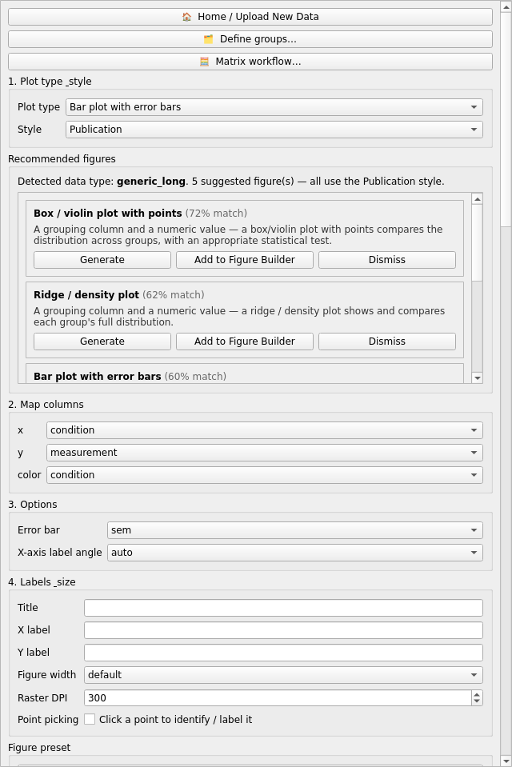

**Menus.** *File:* Home / Upload New Data, Open data file…, Open Figure Package…, Open PlotSpec… (specification only), Save Reproducible Figure Package…, Open example ▸ (all 38), Recent files (packages marked 📦), Save template…, Figure preset ▸ (Apply, Save, Import, Export, Delete, Reset), Quit. *View:* Reset Layout, Maximize Figure Panel, Show Data Preview, Dock All Panels. *Help:* Help…, About, Copy debug info, Diagnose toolbar.

**Pop-out panels.** *Plot Controls*, *Data & Messages* and the *Figure* can each be popped out into their own window (for a second monitor) and docked back with **⮊ Dock back** or **View → Dock All Panels**; the arrangement persists between sessions.

**Home / Upload New Data** clears the data, spec, results and statistics and returns to the welcome page without restarting. The Matplotlib toolbar's own *home* only resets zoom/pan.

**Help.** *Help → Help…* opens a dialog with tabs **Plot types** (one entry per registered type, from the example manifest), **Format your data**, **Privacy** (everything runs locally, no telemetry) and **Publication style disclaimer**.

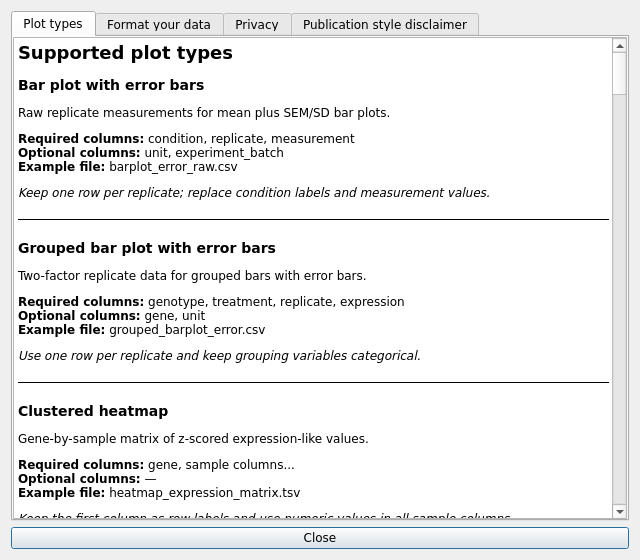

### 15. Browser layout

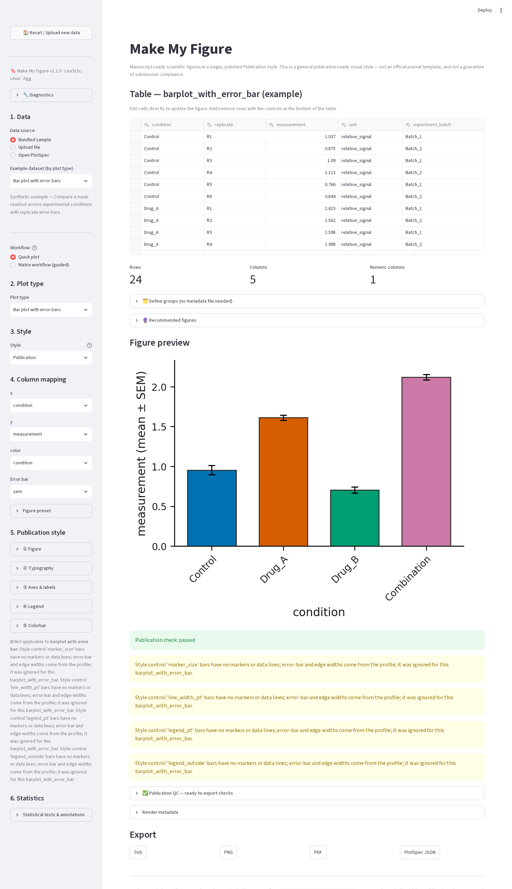

Sidebar: **1. Data** (Bundled sample / Upload file / Open PlotSpec / Open Figure Package; Worksheet + Header row for workbooks; **Workflow**: Quick plot or Matrix workflow (guided)); **2. Plot type**; **3. Style**; **4. Column mapping** (plus the plot's own options); **Figure preset**; **5. Publication style** (five expanders); **6. Statistics**. Main column: the editable table with row/column counts, **🗂 Define groups**, **🔮 Recommended figures**, **Figure preview** with warnings and the publication check, **✅ Publication QC**, **Render metadata**, and **Export** (SVG / PNG / PDF / PlotSpec JSON / Figure Package downloads). **🏠 Reset / Upload new data** clears the session.

### 16. Functional equivalence and differences

| Capability | Desktop | Browser |
|---|---|---|
| Header-row choice for uploads | first row only | first / chosen / two stacked / none, plus forward fill |
| Font family control | yes | no |
| Click-to-label | click on the canvas | pick from a list + numeric offsets |
| Figure Builder | full (grid, sizes, imports, layout presets) | columns-only composer inside the Matrix workflow |
| Export EPS/TIFF | via **Export all as ZIP** | not offered (SVG/PNG/PDF) |
| Statistics export | stats table, method report, copy sentence | shown in-page |
| Preset library | shared folder | shared folder |

## Part IV — Data input

### 17. Supported files

| Type | Extensions | Notes |
|---|---|---|
| Delimited text | `.csv`, `.tsv`, `.txt`, `.tab` | delimiter is sniffed; an unknown extension is parsed as text with a warning |
| Excel | `.xlsx`, `.xlsm`, `.xls` | every worksheet is selectable; merged header cells are recovered for `.xlsx`/`.xlsm` (`.xls` has no merge map) |

Text encoding should be UTF-8. Column names should be in the first row (desktop) or the row you choose (browser).

### 18. Headers, missing values, types

- **Header row** (browser): *First row*, *Choose row…* (skips title/report rows above the header), *Two rows (stacked)* (outer group + inner replicate labels become `Group | Replicate` column names), *No header* (positional names `column_1`, `column_2`…). Excel merged cells spanning a block of replicate columns are expanded to every column of the block. For labels typed once **without** merging, tick **Carry a group label across blank cells**.
- **Duplicate column names** are disambiguated (`event`, `event.1`, `event.2`) and kept as separate columns — row-level identity is preserved, nothing is collapsed by label.
- **Missing values** (blank, `NA`, `NaN`) are reported per column in Messages; renderers drop them where a statistic or geometry needs a value and say so.
- **Numeric detection** is by content; a column mixing text and numbers stays text — the preview lists *Detected types*.
- **Empty or documentation worksheets** load (you may plot nothing from them) and are labelled as such.
- **Hidden worksheets** in a workbook are listed and marked hidden.

### 19. Shapes of data

- **Long table** — one row per observation with a grouping column (bar, box, violin, strip, beeswarm, raincloud, histogram long form).
- **Wide table** — one column per group of unequal length (histogram *wide* form: `Input form → wide`, tick the columns), or a feature × sample **matrix** (heatmap, clustering, PCA, Matrix Workflow).
- **Precomputed differential results** — one row per feature with logFC, p, adjusted p (volcano, MA).
- **Survival** — one row per subject with time, 0/1 event and group; or a *precomputed* curve with one S(t) column per group.
- **Edge list** — source, target, weight (network). **Set membership** — one 0/1 column per set (UpSet). **Coordinates** — x, y, colour (embedding scatter).
- **Metadata** — one row per sample with group/batch columns (PCA colour/shape, Matrix Workflow groups).

### 20. In-app grouping without a metadata file

**🗂 Define groups…** (desktop) / **🗂 Define groups (no metadata file needed)** (browser):

- *Assign sample groups (wide matrix)*: choose the **Feature id column**, then type a group for each sample column (leave blank to exclude). **Auto-guess groups from names** (desktop) or the prefilled table (browser) uses shared name tokens (`Ctrl_1`, `Ctrl_2` → `Ctrl`). **Create grouped table** produces a long table `feature / sample / group / value` that flows into any plot.
- *Group by column values*: map the values of an existing column to group labels in a new column.

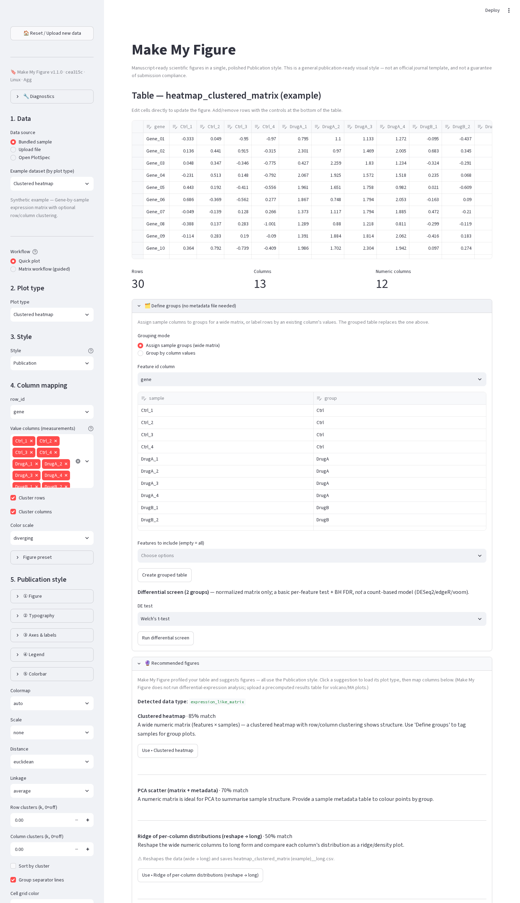

The grouped table is a new table; **↩ Revert to original data** restores the source.

## Part V — Column mapping

### 21. How mapping works

Every plot type declares its **column roles** in one registry (`ui_hints.py`), and both apps build their mapping controls from it — a combo box per single-column role, a multi-select list per multi-column role. When a table loads, a role is prefilled only if a column with the expected name exists (bundled examples), or, for a volcano plot, if a DE-style header is recognised (`logFC` / `log2FoldChange`, `P.Value` / `pvalue`, `adj.P.Val` / `padj`, gene symbol). Everything else you set yourself, and everything prefilled you can change.

**Note:** Make My Figure does not infer biological meaning. A column called `time` is not a survival time until you map it to *time*; a numeric column in a matrix is not a measurement until it is a selected value column.

### 22. Roles by plot family

| Role | Meaning | Plots |
|---|---|---|
| `x`, `y` | category / value, or numeric axes | bar, grouped bar, box/violin, strip, beeswarm, raincloud, scatter, line, waterfall, lollipop, MA, embedding |
| `group`, `color`, `stack`, `shape` | series colour, stacking, marker shape | grouped bar, line, ridge, histogram, dose-response, swimmer, spider, stacked bar, PCA (metadata) |
| `label`, `id_col` | point labels / feature identity (duplicate-safe) | volcano, MA, scatter, lollipop, embedding, Bland-Altman |
| `p`, `x` (effect) | p-value / log fold change | volcano, MA, Manhattan (`p`), Q-Q (`p`) |
| `chrom`, `pos`, `snp` | chromosome, position, variant id | Manhattan |
| `time`, `event`, `group`; `survival_columns` | subject-level survival; or precomputed S(t) columns | Kaplan-Meier |
| `subject`, `condition`, `value` | paired measurements | paired slopegraph |
| `subject`, `start`, `end`, `duration`, `event` | timelines | swimmer |
| `subject`, `time`, `value` | longitudinal change | spider |
| `label`, `score`, `score2` | truth label and one or two scores | ROC, precision-recall |
| `true`, `predicted` | confusion matrix | confusion matrix |
| `label`, `prob` | calibration | calibration |
| `label`, `estimate`, `lower`, `upper` | forest plot rows | forest |
| `dose`, `response`, `group` | dose-response | dose-response |
| `method_a`, `method_b` | two measurements of the same thing | Bland-Altman |
| `source`, `target`, `value` / `weight`, `interaction_type` | flows and edges | Sankey, network |
| `row_id`, `matrix_row_id`, `value_columns` | matrix feature id and measurement columns | heatmap, clustering, dendrogram, PCA |
| `sample`, `row`, `fill` | oncoprint long form | oncoprint |
| `sets` | 0/1 membership columns | UpSet |
| `y`, `x`, `size`, `color` | term, enrichment, count, significance | enrichment dot plot |

Multi-column roles (`value_columns`, `survival_columns`) are lists: tick every column that belongs — a single choice would silently plot one series.

### 23. Statistics columns

The Statistics panel has its own **Group column**, **Subgroup column**, **Subject/pair ID** and **Control group** selectors. When left at *(none)* they follow the plot mapping (x as the group, y as the value); set them explicitly for paired tests (subject id), two-way designs (subgroup) and comparisons against a control.

## Part VI — Data-aware recommendations

### 24. What the engine does

On load, `recommend_for_table` profiles the table — column kinds, identifier columns, binary columns, missingness, p-value-like ranges, matrix shape, correlation/adjacency structure — and assigns a **schema**: `precomputed_differential`, `survival`, `gwas`, `classification`, `dose_response`, `network_edge_list`, `mutation_matrix`, `enrichment`, `correlation_matrix`, `expression_like_matrix`, `numeric_matrix`, `matrix_plus_metadata`, `paired`, `generic_long`, or `unknown`. Rules per schema propose plots with a **confidence score**, a **reason**, the **suggested mapping**, missing mappings, suggested statistics and thresholds.

The desktop **Recommended figures** group shows cards (*Generate*, *Add to Figure Builder*, *Dismiss*); the browser shows the **🔮 Recommended figures** expander. **Generate** switches the plot type and applies the suggested mapping; you still confirm it in *Map columns*.


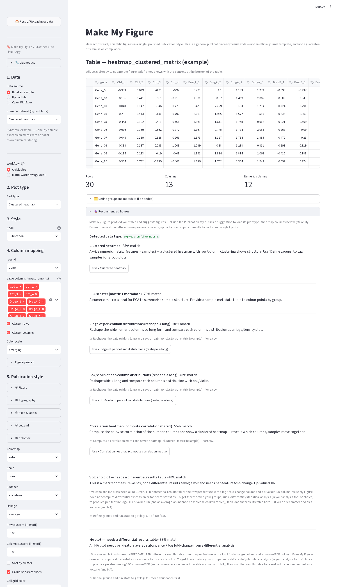

### 25. Typical recommendations (from the bundled examples, this commit)

| Table shape (schema) | Suggested plots (score) |
|---|---|
| grouping column + numeric value (`generic_long`) | box/violin with points (0.72), ridge/density (0.62), bar with error bars (0.60), grouped bar (0.55) |
| logFC + p-value (+ FDR) per feature (`precomputed_differential`) | volcano (0.92); heatmap of the values (0.55) |
| feature × sample numeric matrix (`expression_like_matrix`) | clustered heatmap (0.85), PCA (0.70) |
| time + 0/1 event + group (`survival`) | Kaplan-Meier (0.88) |
| source/target(/weight) (`network_edge_list`) | network graph (0.80) |
| chromosome + position + p (`gwas`) | Manhattan (0.82), Q-Q (0.70) |
| subject × two conditions (`paired`) | paired slopegraph (0.75), box/violin (0.70) |
| term + enrichment + count (`enrichment`) | enrichment dot plot (0.80) |

An embedding table (UMAP/t-SNE coordinates) is recognised as a numeric matrix and gets matrix suggestions; choose *UMAP / t-SNE embedding scatter* yourself.

### 26. Limitations

Scores are rule-based heuristics about the table's shape, not probabilities and not a judgement of scientific appropriateness. A wrong column-name convention lowers a score; an unusual but valid design may get no recommendation. Treat every suggestion as a starting point to confirm in *Map columns*.

## Part VII — Matrix Workflow

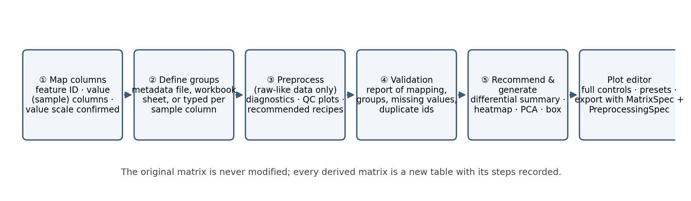

### 27. Opening it

Load the matrix (any file or worksheet), then **🧮 Matrix workflow…** (desktop) or **Workflow → Matrix workflow (guided)** (browser). The desktop dialog has five tabs; later tabs stay disabled until the earlier step is confirmed. The browser shows the same steps as expanders.

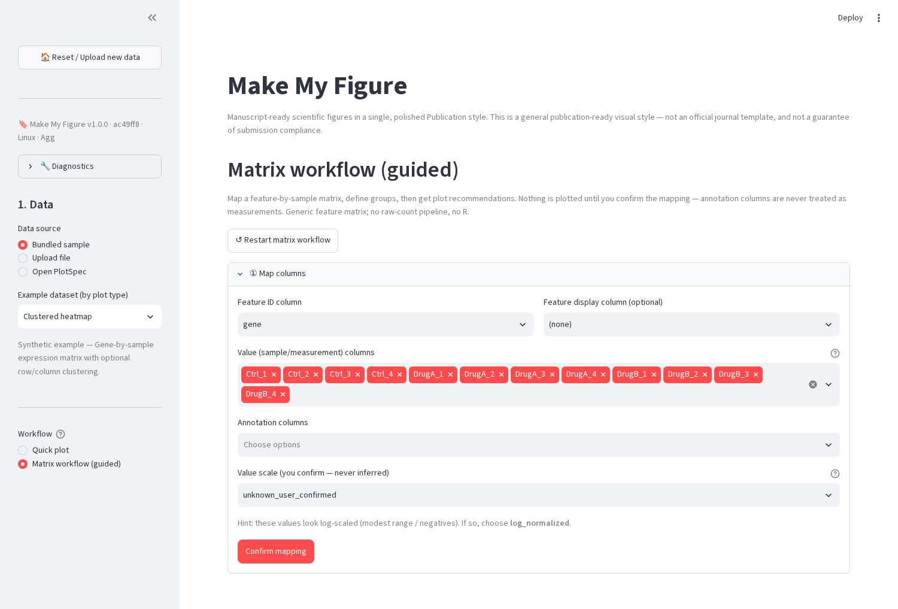

### 28. ① Map columns


- **Feature ID column** — the identifier (gene, protein, feature).
- **Feature display column** — optional friendlier name for labels.
- **Value scale (you confirm)** — `normalized`, `log_normalized`, `raw_numeric`, or `unknown_user_confirmed`. Preprocessing is offered only for raw-like data.
- **Value columns** — every measurement column; numeric annotation columns (e.g. a 1/2/3 level code) are unselected by default and stay out unless you tick them.
- The browser adds an explicit **Annotation columns** selector and shows a hint when the values look log-scaled (*"If so, choose log_normalized"*) — a hint, never a decision.
- **Confirm mapping** writes the **MatrixSpec** (source file/sheet, feature column, annotation columns, value columns, excluded columns, value type, missing-value and duplicate-feature policies, confirmation flag).

### 29. ② Define groups

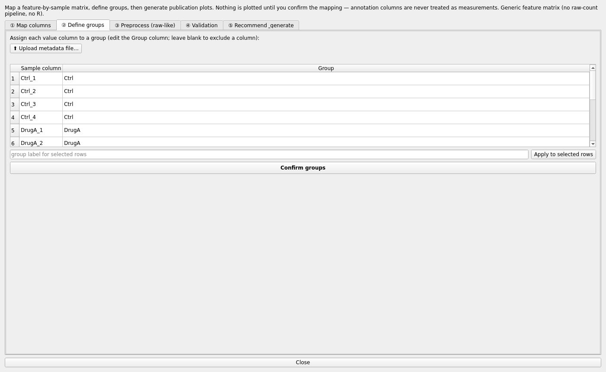

Three sources, in order of preference: **⬆ Upload metadata file…** (CSV/TSV/XLSX with a sample column and a group column), a metadata **worksheet** of the same workbook (browser), or the in-app table — type a group per sample column, or select rows and **Apply to selected rows**; leave a cell blank to exclude that column. **Confirm groups** writes the **SampleMetadataSpec** and reports **sample matching** (columns in the matrix without metadata and vice versa).

### 30. ③ Preprocess (raw-like)

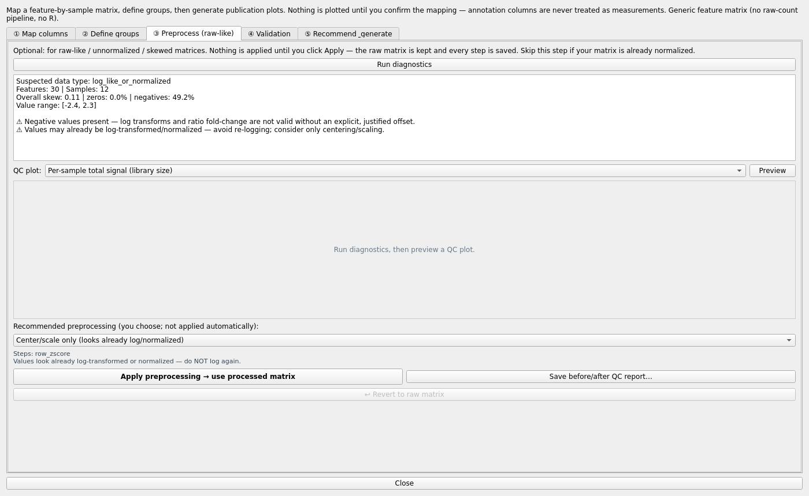

Optional, for raw-like / unnormalised / skewed matrices; skip it if the matrix is already normalised.

1. **Run diagnostics** — reports the *suspected data type* (e.g. `log_like_or_normalized`), features × samples, overall skew, zero and negative fractions, the value range, and warnings such as *"Negative values present — log transforms and ratio fold-change are not valid without an explicit, justified offset"* or *"Values may already be log-transformed/normalized — avoid re-logging"*.
2. **QC plot** — choose one of the nine QC plots (Part VIII §36) and **Preview** it for the current matrix.
3. **Recommended preprocessing (you choose; not applied automatically)** — a list of recipes derived from the diagnostics, each a short chain of steps with its reasoning and assumptions:

| Recipe | Steps | Offered when |
|---|---|---|
| Center/scale only (looks already log/normalized) | `row_zscore` | values look log-like / normalised — do **not** log again |
| Total-sum normalize → log2 → z-score | `total_sum` (scale 1e6) → `log2` (pseudocount 1) → `row_zscore` | sample totals differ, values non-negative/skewed |
| Median-scale → log2 | `median_scale` → `log2` (pseudocount 1) | robust alternative when a few features dominate totals |
| log2(x + 1) → z-score | `log2` (pseudocount 1) → `row_zscore` | strong right skew, non-negative values |
| arcsinh (intensity-like) → z-score | `arcsinh` (cofactor 5) → `row_zscore` | intensity-like skew with zeros |
| Filter sparse features → log2 | `filter` (max zero fraction 0.5, drop constant) → `log2` | high zero fraction |
| Z-score for visualization only (negatives present) | `row_zscore` | negative values — no log, no ratio fold change |
| Internal-standard normalization | `internal_standard_features` / `_columns` | you have internal-standard features or columns |

The selected recipe's steps and note are shown under the list. **Apply preprocessing → use processed matrix** applies them; the derived matrix becomes the working table and every step is recorded as a **PreprocessingStep** in the **PreprocessingSpec** (method, parameters, input/output matrix ids, QC before/after, confirmation). **Save before/after QC report…** writes a contact sheet (PDF + PNG) and one vector file per QC plot. **↩ Revert to raw matrix** returns to the source.

### 31. ④ Validation

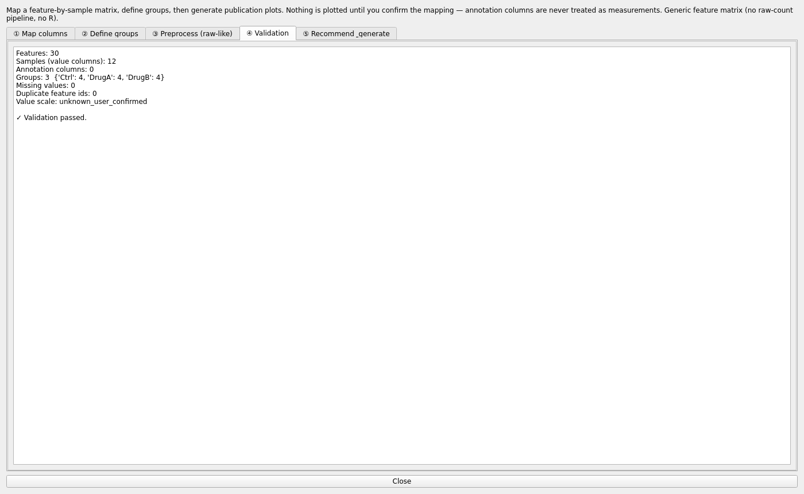

A read-only report of the confirmed MatrixSpec and metadata: features, samples (value columns), annotation columns, groups with their sizes, missing values, duplicate feature ids and the declared value scale, followed by **ERRORS**, **Warnings** (⚠) — for example sample columns without a group or non-numeric value columns — or *✓ Validation passed*.

### 32. ⑤ Recommend & generate

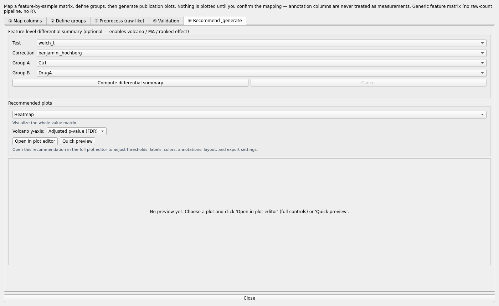

- **Feature-level differential summary (optional — enables volcano / MA / ranked effect):** choose **Test** (Welch's t, Student's t, Mann-Whitney, paired t, Wilcoxon; ANOVA or Kruskal-Wallis for more groups), **Correction** (Benjamini-Hochberg, Bonferroni, Holm), **Group A** and **Group B**, then **Compute differential summary** (runs in the background; **Cancel** is available). The result is a per-feature table (log2 fold change, p, adjusted p, effect size) that can be saved and that enables volcano and MA recommendations. It is a screen, not DESeq2/edgeR/limma (Part VIII §36).
- **Recommended plots:** a dropdown (Heatmap, PCA, box/violin of selected features, volcano/MA when a summary exists) with a one-line rationale; **Volcano y-axis** → *Adjusted p-value (FDR)* or *Raw p-value*.
- **Open in plot editor** hands the (processed) table, mapping, metadata and provenance to the ordinary editor with full controls; **Quick preview** renders in the dialog.

### 33. Provenance

The exported PlotSpec of a figure generated from the workflow carries the workbook/sheet, the MatrixSpec, the PreprocessingSpec and the metadata assignment under `source`, and the statistics block echoes it, so the figure is traceable to the matrix and the steps that produced it.

## Part VIII — Preprocessing and QC

### 34. Principles

No preprocessing is applied silently. A step is applied only when you add it, and the original matrix is preserved; the output is a new matrix with a new id. Each method below is what its name says; parameters (pseudocount, percentile, reference features…) appear as fields on the step when the method takes any. **No method is universally correct** — the normalisation catalogue lists assumptions and risks for that reason.

### 35. Implemented methods (`available_methods()`)

| Method | What it does | Typical use | Caveats |
|---|---|---|---|
| `log2`, `log10`, `ln`, `log` | logarithm of the values | compress dynamic range of positive intensities | needs positive values (pseudocount parameter) |
| `sqrt`, `arcsinh` | variance-stabilising transforms | counts with zeros (arcsinh tolerates 0) | changes scale, not just spread |
| `cpm` | counts per million per sample; optional log2-CPM with a prior count | count-like data | library-size differences only |
| `total_sum` | divide by each sample's total, rescale | comparable total signal per sample | distorted by dominant features |
| `median_scale` | scale samples so medians match | robust size correction | breaks if most features change |
| `upper_quartile` | scale by the 75th percentile | data with a few dominant features | sensitive to sparsity |
| `quantile` | force identical distributions | technical distribution differences | erases real global shifts |
| `tmm` | TMM-CPM: counts per million using TMM-adjusted effective library sizes (optionally log2) | non-negative count-like data | scaling only; **not** differential inference |
| `voom` | limma-style log-CPM transform of the matrix | preparing counts for linear-model-style summaries | transform only; no DE fitting |
| `internal_standard_features`, `internal_standard_columns`, `control_features`, `reference_sample` | normalise to spike-ins / stable features / control set / a reference sample | targeted assays | an unstable standard propagates error |
| `row_zscore`, `column_zscore`, `zscore`, `global_zscore`, `center`, `standard_scale`, `robust_scale` | centring/scaling by feature, sample or globally | heatmap contrast, PCA input | loses absolute magnitude |
| `filter`, `winsorize`, `impute` | drop low features, clip extremes, fill missing (missing-value policies: keep, drop features, zero, mean impute) | before scaling | alters n or values — recorded |

The **normalisation recommendation catalogue** (total sum, median scale, upper quartile, quantile, row z-score, internal-standard features) states for each: assumptions, risks, suitable/unsuitable data, output scale. Recommendations are advisory and require confirmation.

### 36. QC plots and the differential summary

QC plots: per-sample total signal, per-sample median, per-sample distribution (box), value density, zero fraction, missing fraction, sample-correlation heatmap, PCA of samples, mean–variance trend. All are ordinary figures (exportable) and appear in the before/after report.

**Differential summary** (two groups: Welch's t, Student's t, Mann-Whitney, paired t, Wilcoxon; more groups: ANOVA, Kruskal-Wallis; correction: Benjamini-Hochberg, Bonferroni, Holm) yields per-feature log2 fold change, p, adjusted p and effect size for a *normalised* matrix. **It is a screen, not a count model** — it is not DESeq2, edgeR or limma, and the app labels it so.

## Part IX — Statistics

**Note:** Make My Figure performs calculations; the researcher remains responsible for choosing a scientifically appropriate method. Every method is pinned against SciPy/statsmodels in the test suite; the method sentence names the versions used.

### 37. Where statistics live

Desktop **6. Statistics** (a checkable group) and browser **Statistical tests & annotations**: **Test** (Auto-suggest or one of the 18), **Comparison**, **Group / Subgroup / Subject** columns, **Control group**, **Correction**, **Annotation shows**, **Annotation placement**, **Custom template**, effect-size toggle, hide non-significant, post-hoc after omnibus, p-value decimals, annotation font. **Run statistics** fills the results table (comparison, test, p, adjusted p, effect, n) and the **method sentence**; **Export stats table**, **Export method report**, **Copy method sentence**. Results are written to `name.stats_spec.json` on export.


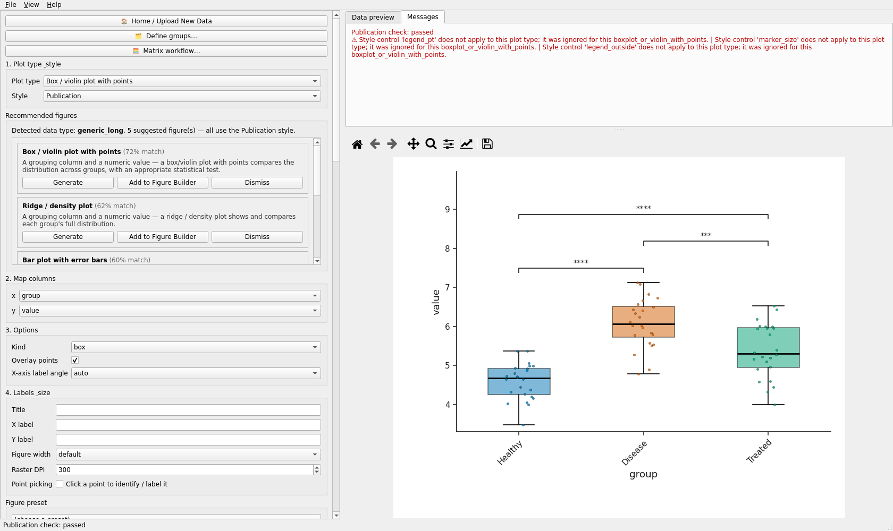

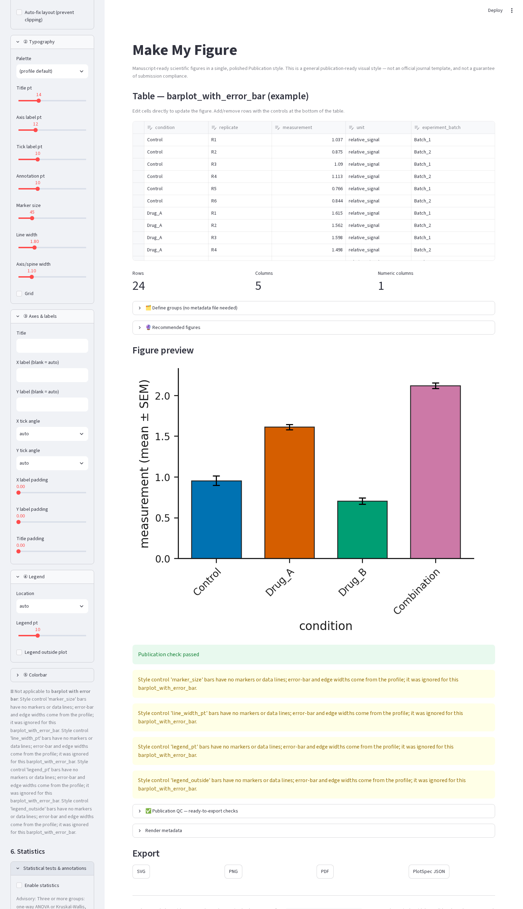

### 38. Methods

**Two-group (unpaired)**

| Method | Input | Assumptions | Output | Effect size |
|---|---|---|---|---|
| Student's t-test | numeric value, two groups | normality, equal variances | t, df, p, CI of the mean difference | Cohen's d |
| Welch's t-test | as above | normality; variances may differ | t, df (Welch), p, CI | Hedges' g |
| Mann-Whitney U | numeric/ordinal, two groups | independent samples | U, p | rank-biserial / Cliff's delta |

**Two-group (paired)** — require **Subject/pair ID**

| Method | Assumptions | Output | Effect size |
|---|---|---|---|
| Paired t-test | normal paired differences | t, df, p, CI of mean difference | Cohen's d_z |
| Wilcoxon signed-rank | symmetric differences | W, p | rank-biserial |

**Multi-group (omnibus)** — three or more groups (two-way / repeated-measures from two)

| Method | Design | Output | Effect size |
|---|---|---|---|
| One-way ANOVA | one factor | F, df, p | eta-squared |
| Two-way ANOVA | group × subgroup | F per term, p | partial eta-squared (approx.) |
| Repeated-measures ANOVA | subject × condition | F, p | partial eta-squared (approx.) |
| Kruskal-Wallis | one factor, non-parametric | H, p | epsilon-squared |
| Dunn's test (post-hoc) | after Kruskal-Wallis | pairwise z, p (corrected) | — |

After an omnibus test, tick **Post-hoc pairwise after omnibus** to add pairwise comparisons with correction.

**Categorical** — two categorical columns (stacked composition, oncoprint)

| Method | Output | Effect size |
|---|---|---|
| Chi-square test | chi², df, p (Yates' continuity correction on 2 × 2 tables) | Cramér's V |
| Fisher's exact test (2 × 2) | p | odds ratio |

**Correlation / regression** — scatter plot

| Method | Output | Effect size |
|---|---|---|
| Pearson correlation | r, p, CI (Fisher z) | r / R² |
| Spearman correlation | rho, p | rho |
| Linear regression | slope, intercept, R², p | R² (fit statistics box on the plot) |
| GLM regression (multi-predictor) | coefficients, p per term | — |

**Survival** — Kaplan-Meier (subject-level input only)

| Method | Output | Effect size |
|---|---|---|
| Log-rank test | chi², p | — |
| Cox proportional hazards | HR, CI, p | hazard ratio |

A log-rank test **cannot** be computed from a precomputed curve (no numbers at risk); the app refuses with a message rather than inventing one.

### 39. Multiple testing

Corrections apply across the family of pairwise comparisons in one run: **Benjamini-Hochberg FDR**, **Bonferroni**, **Holm-Bonferroni**, or **None**. Both raw and adjusted p are stored and either can be shown.

### 40. Annotation on figures

Supported on: bar plot, grouped bar plot (within-x brackets), box/violin (brackets or above-bar), scatter (fit-statistics box), Kaplan-Meier and stacked composition (corner panel). **Not** supported on the line/time-course plot and other types. Content modes: stars, p, adjusted p, p + stars, statistic, effect size, p + statistic, full, flags, or a **custom template** with tokens such as `{p}`, `{p_adj}`, `{stars}` and `{stat_symbol}` (the Custom template field lists the tokens available for the chosen test). Placement: **bracket** between compared categories (auto-stacked) or **above each bar** (comparisons against a control; the control bar stays unmarked). Star thresholds: `*` p < 0.05, `**` p < 0.01, `***` p < 0.001, `****` p < 0.0001; `n.s.` optional. Hiding a value on the figure never removes it from the exported StatsSpec.

## Part X — Plot catalogue

The 38 plot types below are the complete registry on this commit, enumerated from code (`plots/registry.py`) — not a historical list. Each figure was rendered from its bundled synthetic example with Publication defaults. Colour and control facts come from the same capability scan that the test suite enforces, so a control listed here is one the renderer actually reads.

### Bar plot with error bars

*Registry key:* `barplot_with_error_bar`

**Purpose:** Compare a mean (or median) per category with an error bar.  
**When to use:** few categories, replicate measurements; consider a box or strip plot when you want to show every point

**Required / optional input:** one table with the roles below; the bundled example has columns `condition`, `replicate`, `measurement`, `unit`, `experiment_batch`.

**Column mapping:** `x`, `y`, `color`; example mapping `{"x": "condition", "y": "measurement", "color": "condition"}`.

**Statistics supported:** yes — pairwise brackets or above-bar labels.

**Colour controls:** Publication palette (publication / colorblind_safe / high_contrast / grayscale).

**Annotation controls:** manual annotation layer via PlotSpec; statistical annotation (stars / p / effect).

**Axis controls:** title, x/y labels, tick angles, label/title padding, margins (layout engine).

**Legend / colorbar controls:** no legend drawn.

**Plot-specific controls (visual, carried in a style preset):** `error` — Error bar, `x_tick_rotation` — X-axis label angle.  
**Analytical / data-dependent options (full preset only):** none.

**Recommended export:** SVG or PDF for vector; PNG/TIFF at 300–600 dpi for raster.

**Figure preset support:** style and full presets (verified in the registry-wide preset QC).

**Example data:** `examples/by_plot_type/bar_error/` (synthetic).

**Known limitations:** none specific beyond the general limitations in Part XXV.


### Grouped bar plot with error bars

*Registry key:* `grouped_barplot_with_error_bar`

**Purpose:** Compare means across categories split by a second factor.  
**When to use:** two crossed factors with replicates

**Required / optional input:** one table with the roles below; the bundled example has columns `genotype`, `treatment`, `replicate`, `expression`, `gene`, `unit`.

**Column mapping:** `x`, `group`, `y`; example mapping `{"x": "genotype", "group": "treatment", "y": "expression"}`.

**Statistics supported:** yes — comparisons within each x category.

**Colour controls:** Publication palette (publication / colorblind_safe / high_contrast / grayscale).

**Annotation controls:** manual annotation layer via PlotSpec; statistical annotation (stars / p / effect).

**Axis controls:** title, x/y labels, tick angles, label/title padding, margins (layout engine).

**Legend / colorbar controls:** legend location (inside/outside), legend size.

**Plot-specific controls (visual, carried in a style preset):** `error` — Error bar, `x_tick_rotation` — X-axis label angle.  
**Analytical / data-dependent options (full preset only):** none.

**Recommended export:** SVG or PDF for vector; PNG/TIFF at 300–600 dpi for raster.

**Figure preset support:** style and full presets (verified in the registry-wide preset QC).

**Example data:** `examples/by_plot_type/grouped_bar/` (synthetic).

**Known limitations:** none specific beyond the general limitations in Part XXV.


### Clustered heatmap

*Registry key:* `heatmap_clustered_matrix`

**Purpose:** Show a feature × sample matrix as colour, optionally clustered on both axes.  
**When to use:** expression, intensity, or any normalised matrix; z-score rows for pattern contrast

**Required / optional input:** one table with the roles below; the bundled example has columns `gene`, `Ctrl_1`, `Ctrl_2`, `Ctrl_3`, `Ctrl_4`, `DrugA_1`, `DrugA_2`, `DrugA_3` ….

**Column mapping:** `row_id`; example mapping `{"row_id": "gene"}`.

**Statistics supported:** no on-figure statistical annotation (the Statistics panel still runs for the mapped columns where a test applies).

**Colour controls:** Publication palette (publication / colorblind_safe / high_contrast / grayscale); continuous colormap (sequential/diverging from the palette; `colormap` option where present); plot options: `color_scale`, `colormap`, `cell_border_color`, `group_separator_color`, `colorbar_location`, `colorbar_pad`, `colorbar_shrink`.

**Annotation controls:** manual annotation layer via PlotSpec.

**Axis controls:** title, x/y labels, tick angles, label/title padding, margins (layout engine).

**Legend / colorbar controls:** legend location (inside/outside), legend size; colorbar location / pad / size.

**Plot-specific controls (visual, carried in a style preset):** `color_scale` — Color scale, `colormap` — Colormap, `y_label_rotation` — Y-label angle, `group_separators` — Group separator lines, `cell_border_color` — Cell grid color, `cell_border_width` — Cell grid width (0 = off), `group_separator_color` — Group separator color, `group_separator_width` — Group separator width, `colorbar_location` — Colorbar location, `colorbar_pad` — Colorbar pad, `colorbar_shrink` — Colorbar size, `row_label_fontsize` — Row label font (0=auto), `col_label_fontsize` — Column label font (0=auto), `y_label_pad` — Y-axis label padding.  
**Analytical / data-dependent options (full preset only):** `cluster_rows` — Cluster rows, `cluster_columns` — Cluster columns, `scale` — Scale, `distance_metric` — Distance, `linkage_method` — Linkage, `cluster_k_rows` — Row clusters (k, 0=off), `cluster_k_columns` — Column clusters (k, 0=off), `sort_by_cluster` — Sort by cluster, `max_features` — Max features (rows) for clustering.

**Recommended export:** SVG or PDF for vector; PNG/TIFF at 300–600 dpi for raster. Heat-map cells and dense point clouds are still vector in SVG/PDF but large; PNG is often the practical choice.

**Figure preset support:** style and full presets (verified in the registry-wide preset QC).

**Example data:** `examples/by_plot_type/heatmap/` (synthetic).

**Known limitations:** Rows are capped at `max_features` (default 2 000, selected by variance) for responsiveness..


### Volcano plot

*Registry key:* `volcano_plot`

**Purpose:** Effect size against significance for every feature of a differential-expression table.  
**When to use:** any precomputed DE result (edgeR, limma, DESeq2, proteomics)

**Required / optional input:** one table with the roles below; the bundled example has columns `gene`, `log2_fold_change`, `p_value`, `adjusted_p_value`, `gene_class`, `label`.

**Column mapping:** `x`, `p`, `label`, `id_col`; example mapping `{"x": "log2_fold_change", "p": "adjusted_p_value", "label": "label"}`.

**Statistics supported:** no on-figure statistical annotation (the Statistics panel still runs for the mapped columns where a test applies).

**Colour controls:** plot options: `color_up`, `color_down`, `color_ns`.

**Annotation controls:** point picking, label selection, duplicate-label policy.

**Axis controls:** title, x/y labels, tick angles, label/title padding, margins (layout engine), marker size.

**Legend / colorbar controls:** legend location (inside/outside), legend size.

**Plot-specific controls (visual, carried in a style preset):** `show_legend` — Show Up / Down / n.s. legend, `color_up` — Up-regulated colour, `color_down` — Down-regulated colour, `color_ns` — Not-significant colour, `annotate` — Show labels, `show_arrows` — Arrows to points, `label_box` — Label background box, `duplicate_label_policy` — Duplicate labels, `duplicate_label_representative_rule` — Representative point, `duplicate_label_show_count` — Append (n=…) count.  
**Analytical / data-dependent options (full preset only):** `lfc_cutoff` — log2FC cutoff, `p_cutoff` — p-value / FDR cutoff, `use_fdr` — P column is FDR/adjusted (y-axis = −log10 FDR), `label_mode` — Label mode, `top_n` — Top N labels, `top_n_up` — Top N up, `top_n_down` — Top N down, `label_by` — Label by.

**Recommended export:** SVG or PDF for vector; PNG/TIFF at 300–600 dpi for raster.

**Figure preset support:** style and full presets (verified in the registry-wide preset QC).

**Example data:** `examples/by_plot_type/volcano/` (synthetic).

**Known limitations:** The palette does not apply — points are coloured by significance class (up / down / not significant options). Thresholds travel only in a full preset..


### Scatter plot

*Registry key:* `scatterplot_with_regression`

**Purpose:** Two numeric variables per observation, optionally coloured by group, with a fitted line and its statistics.  
**When to use:** relationships, method comparison, dose vs response before fitting a model

**Required / optional input:** one table with the roles below; the bundled example has columns `sample_id`, `x_marker`, `y_response`, `group`, `label`.

**Column mapping:** `x`, `y`, `color`, `label`; example mapping `{"x": "x_marker", "y": "y_response", "color": "group"}`.

**Statistics supported:** yes — correlation / regression statistics box.

**Colour controls:** Publication palette (publication / colorblind_safe / high_contrast / grayscale).

**Annotation controls:** point picking, label selection, duplicate-label policy; statistical annotation (stars / p / effect).

**Axis controls:** title, x/y labels, tick angles, label/title padding, margins (layout engine), marker size, line width.

**Legend / colorbar controls:** legend location (inside/outside), legend size.

**Plot-specific controls (visual, carried in a style preset):** `show_fit_stats` — Show regression stats box, `show_slope` —   • slope, `show_r2` —   • R², `show_p` —   • p-value, `show_r` —   • Pearson r, `show_intercept` —   • intercept, `show_n` —   • n, `show_equation` —   • full equation (y = a·x + b), `fit_stats_loc` — Stats box location.  
**Analytical / data-dependent options (full preset only):** `fit_line` — Fit regression line.

**Recommended export:** SVG or PDF for vector; PNG/TIFF at 300–600 dpi for raster.

**Figure preset support:** style and full presets (verified in the registry-wide preset QC).

**Example data:** `examples/by_plot_type/scatter/` (synthetic).

**Known limitations:** none specific beyond the general limitations in Part XXV.


### Box / violin plot with points

*Registry key:* `boxplot_or_violin_with_points`

**Purpose:** Distribution per category as a box or violin, with the individual points.  
**When to use:** replicate measurements across conditions; the default recommendation for grouped observations

**Required / optional input:** one table with the roles below; the bundled example has columns `sample_id`, `group`, `value`, `batch`, `sex`.

**Column mapping:** `x`, `y`; example mapping `{"x": "group", "y": "value"}`.

**Statistics supported:** yes — pairwise brackets or above-bar labels.

**Colour controls:** Publication palette (publication / colorblind_safe / high_contrast / grayscale).

**Annotation controls:** manual annotation layer via PlotSpec; statistical annotation (stars / p / effect).

**Axis controls:** title, x/y labels, tick angles, label/title padding, margins (layout engine), line width.

**Legend / colorbar controls:** no legend drawn.

**Plot-specific controls (visual, carried in a style preset):** `point_size` — Point size (pt²), `kind` — Kind, `points` — Overlay points, `x_tick_rotation` — X-axis label angle.  
**Analytical / data-dependent options (full preset only):** none.

**Recommended export:** SVG or PDF for vector; PNG/TIFF at 300–600 dpi for raster.

**Figure preset support:** style and full presets (verified in the registry-wide preset QC).

**Example data:** `examples/by_plot_type/box_violin/` (synthetic).

**Known limitations:** none specific beyond the general limitations in Part XXV.


### Line / time-course with error band

*Registry key:* `lineplot_timecourse_with_error_band`

**Purpose:** Mean over an ordered x (time, dose, contraction number) per series with an SEM/SD/CI band.  
**When to use:** time courses, fatigue protocols, force–frequency curves

**Required / optional input:** one table with the roles below; the bundled example has columns `time_hours`, `treatment`, `replicate`, `signal`, `unit`.

**Column mapping:** `x`, `y`, `color`, `style_by`; example mapping `{"x": "time_hours", "y": "signal", "color": "treatment"}`.

**Statistics supported:** no on-figure statistical annotation (the Statistics panel still runs for the mapped columns where a test applies).

**Colour controls:** Publication palette (publication / colorblind_safe / high_contrast / grayscale).

**Annotation controls:** manual annotation layer via PlotSpec.

**Axis controls:** title, x/y labels, tick angles, label/title padding, margins (layout engine), line width.

**Legend / colorbar controls:** legend location (inside/outside), legend size.

**Plot-specific controls (visual, carried in a style preset):** `error` — Error band.  
**Analytical / data-dependent options (full preset only):** none.

**Recommended export:** SVG or PDF for vector; PNG/TIFF at 300–600 dpi for raster.

**Figure preset support:** style and full presets (verified in the registry-wide preset QC).

**Example data:** `examples/by_plot_type/line_timecourse/` (synthetic).

**Known limitations:** No statistical annotation on this plot type..


### Ridge / density plot

*Registry key:* `ridge_or_density_plot`

**Purpose:** Smoothed density per group, stacked (ridgeline) or overlaid.  
**When to use:** comparing distribution shapes across several groups

**Required / optional input:** one table with the roles below; the bundled example has columns `cell_id`, `sample_id`, `condition`, `pseudotime`, `score`.

**Column mapping:** `x`, `group`; example mapping `{"x": "pseudotime", "group": "condition"}`.

**Statistics supported:** no on-figure statistical annotation (the Statistics panel still runs for the mapped columns where a test applies).

**Colour controls:** Publication palette (publication / colorblind_safe / high_contrast / grayscale).

**Annotation controls:** manual annotation layer via PlotSpec.

**Axis controls:** title, x/y labels, tick angles, label/title padding, margins (layout engine), line width.

**Legend / colorbar controls:** legend location (inside/outside), legend size.

**Plot-specific controls (visual, carried in a style preset):** `density_mode` — Density mode, `overlap` — Ridge overlap.  
**Analytical / data-dependent options (full preset only):** none.

**Recommended export:** SVG or PDF for vector; PNG/TIFF at 300–600 dpi for raster.

**Figure preset support:** style and full presets (verified in the registry-wide preset QC).

**Example data:** `examples/by_plot_type/ridge/` (synthetic).

**Known limitations:** A kernel density estimate can merge two modes into one shoulder; use the histogram when shape matters..


### Histogram (binned distribution)

*Registry key:* `histogram_distribution`

**Purpose:** Binned counts of one measurement, one panel per group or overlaid, bars and/or a frequency polygon.  
**When to use:** distribution shape when modes, gaps and tails matter — bins never smooth

**Required / optional input:** one table with the roles below; the bundled example has columns `cell_id`, `group`, `replicate`, `measurement`.

**Column mapping:** `x`, `group`, `value_columns` (multi-select); example mapping `{"x": "measurement", "group": "group"}`.

**Statistics supported:** no on-figure statistical annotation (the Statistics panel still runs for the mapped columns where a test applies).

**Colour controls:** Publication palette (publication / colorblind_safe / high_contrast / grayscale).

**Annotation controls:** manual annotation layer via PlotSpec.

**Axis controls:** title, x/y labels, tick angles, label/title padding, margins (layout engine), marker size, line width.

**Legend / colorbar controls:** legend location (inside/outside), legend size.

**Plot-specific controls (visual, carried in a style preset):** `panel_mode` — Arrangement, `draw_style` — Draw as, `normalize` — Y axis shows, `cumulative` — Cumulative, `show_mean` — Mark the mean, `show_median` — Mark the median, `bar_alpha` — Fill opacity, `log_y` — Logarithmic Y axis, `share_axes` — Panels share both axes, `x_tick_rotation` — X-axis label angle.  
**Analytical / data-dependent options (full preset only):** `input_form` — Input form, `bins` — Number of bins, `bin_width` — Bin width, `x_min` — X-axis minimum, `x_max` — X-axis maximum, `y_min` — Y-axis minimum, `y_max` — Y-axis maximum.

**Recommended export:** SVG or PDF for vector; PNG/TIFF at 300–600 dpi for raster.

**Figure preset support:** style and full presets (verified in the registry-wide preset QC).

**Example data:** `examples/by_plot_type/histogram/` (synthetic).

**Known limitations:** Bins are shared across groups by design; an overlay of raw counts with unequal group sizes warns you to use percent..


### Enrichment dot plot

*Registry key:* `enrichment_dotplot`

**Purpose:** Enriched terms ranked by enrichment, dot size = count, colour = significance.  
**When to use:** GO / pathway enrichment results

**Required / optional input:** one table with the roles below; the bundled example has columns `term`, `category`, `gene_ratio`, `gene_count`, `fdr`, `neg_log10_fdr`.

**Column mapping:** `y`, `x`, `size`, `color`; example mapping `{"y": "term", "x": "gene_ratio", "size": "gene_count", "color": "neg_log10_fdr"}`.

**Statistics supported:** no on-figure statistical annotation (the Statistics panel still runs for the mapped columns where a test applies).

**Colour controls:** Publication palette (publication / colorblind_safe / high_contrast / grayscale); continuous colormap (sequential/diverging from the palette; `colormap` option where present).

**Annotation controls:** manual annotation layer via PlotSpec.

**Axis controls:** title, x/y labels, tick angles, label/title padding, margins (layout engine).

**Legend / colorbar controls:** legend location (inside/outside), legend size; colorbar location / pad / size.

**Plot-specific controls (visual, carried in a style preset):** none.  
**Analytical / data-dependent options (full preset only):** `top_n` — Top N terms.

**Recommended export:** SVG or PDF for vector; PNG/TIFF at 300–600 dpi for raster.

**Figure preset support:** style and full presets (verified in the registry-wide preset QC).

**Example data:** `examples/by_plot_type/enrichment/` (synthetic).

**Known limitations:** none specific beyond the general limitations in Part XXV.


### Kaplan-Meier survival curve

*Registry key:* `kaplan_meier_survival_curve`

**Purpose:** Survival probability over time per group, from subject-level events or a precomputed curve.  
**When to use:** time-to-event data

**Required / optional input:** one table with the roles below; the bundled example has columns `sample_id`, `group`, `time_months`, `event`, `censor_reason`.

**Column mapping:** `time`, `event`, `group`, `survival_columns` (multi-select); example mapping `{"time": "time_months", "event": "event", "group": "group"}`.

**Statistics supported:** yes — log-rank / Cox in a corner panel (subject-level input only).

**Colour controls:** Publication palette (publication / colorblind_safe / high_contrast / grayscale).

**Annotation controls:** manual annotation layer via PlotSpec; statistical annotation (stars / p / effect).

**Axis controls:** title, x/y labels, tick angles, label/title padding, margins (layout engine), line width.

**Legend / colorbar controls:** legend location (inside/outside), legend size.

**Plot-specific controls (visual, carried in a style preset):** `y_scale` — Y-axis scale, `reference_line` — Reference line (y-axis units, blank for none), `curve_style` — Curve style (line: precomputed curves only), `y_ticks` — Y ticks.  
**Analytical / data-dependent options (full preset only):** `input_form` — Input form, `x_min` — X-axis minimum (blank for auto), `x_max` — X-axis maximum (blank for auto).

**Recommended export:** SVG or PDF for vector; PNG/TIFF at 300–600 dpi for raster.

**Figure preset support:** style and full presets (verified in the registry-wide preset QC).

**Example data:** `examples/by_plot_type/kaplan_meier/` (synthetic).

**Known limitations:** A precomputed curve cannot yield a log-rank test (no numbers at risk); the app refuses rather than invents one..


### Stacked composition bar plot

*Registry key:* `stacked_bar_composition`

**Purpose:** Composition of categories within each x as stacked bars (counts or proportions).  
**When to use:** cell-type or class composition per sample

**Required / optional input:** one table with the roles below; the bundled example has columns `sample_id`, `group`, `cell_type`, `fraction`.

**Column mapping:** `x`, `stack`, `y`, `facet_or_sort_by`; example mapping `{"x": "sample_id", "stack": "cell_type", "y": "fraction", "facet_or_sort_by": "group"}`.

**Statistics supported:** yes — chi-square / Fisher in a corner panel.

**Colour controls:** Publication palette (publication / colorblind_safe / high_contrast / grayscale).

**Annotation controls:** manual annotation layer via PlotSpec; statistical annotation (stars / p / effect).

**Axis controls:** title, x/y labels, tick angles, label/title padding, margins (layout engine).

**Legend / colorbar controls:** legend location (inside/outside), legend size.

**Plot-specific controls (visual, carried in a style preset):** `x_tick_rotation` — X-axis label angle.  
**Analytical / data-dependent options (full preset only):** none.

**Recommended export:** SVG or PDF for vector; PNG/TIFF at 300–600 dpi for raster.

**Figure preset support:** style and full presets (verified in the registry-wide preset QC).

**Example data:** `examples/by_plot_type/stacked/` (synthetic).

**Known limitations:** none specific beyond the general limitations in Part XXV.


### Waterfall plot

*Registry key:* `waterfall_plot`

**Purpose:** Sorted per-subject responses as bars around zero.  
**When to use:** best response per patient, screen hits

**Required / optional input:** one table with the roles below; the bundled example has columns `patient_id`, `treatment_arm`, `best_percent_change`, `response_category`, `duration_months`.

**Column mapping:** `x`, `y`, `color`; example mapping `{"x": "patient_id", "y": "best_percent_change", "color": "response_category"}`.

**Statistics supported:** no on-figure statistical annotation (the Statistics panel still runs for the mapped columns where a test applies).

**Colour controls:** Publication palette (publication / colorblind_safe / high_contrast / grayscale).

**Annotation controls:** manual annotation layer via PlotSpec.

**Axis controls:** title, x/y labels, tick angles, label/title padding, margins (layout engine).

**Legend / colorbar controls:** legend location (inside/outside), legend size.

**Plot-specific controls (visual, carried in a style preset):** `sort` — Sort.  
**Analytical / data-dependent options (full preset only):** none.

**Recommended export:** SVG or PDF for vector; PNG/TIFF at 300–600 dpi for raster.

**Figure preset support:** style and full presets (verified in the registry-wide preset QC).

**Example data:** `examples/by_plot_type/waterfall/` (synthetic).

**Known limitations:** none specific beyond the general limitations in Part XXV.


### PCA scatter (matrix + metadata)

*Registry key:* `pca_scatter_from_matrix`

**Purpose:** Principal-component scores of samples from a matrix, coloured and shaped from a metadata table.  
**When to use:** sample structure, batch effects, outliers

**Required / optional input:** one table with the roles below; the bundled example has columns `gene`, `S01`, `S02`, `S03`, `S04`, `S05`, `S06`, `S07` ….

**Column mapping:** `matrix_row_id`; example mapping `{"matrix_row_id": "gene"}` — plus PCA metadata roles `color`, `shape` from the metadata table.

**Statistics supported:** no on-figure statistical annotation (the Statistics panel still runs for the mapped columns where a test applies).

**Colour controls:** Publication palette (publication / colorblind_safe / high_contrast / grayscale).

**Annotation controls:** manual annotation layer via PlotSpec.

**Axis controls:** title, x/y labels, tick angles, label/title padding, margins (layout engine), marker size.

**Legend / colorbar controls:** legend location (inside/outside), legend size.

**Plot-specific controls (visual, carried in a style preset):** none.  
**Analytical / data-dependent options (full preset only):** none.

**Recommended export:** SVG or PDF for vector; PNG/TIFF at 300–600 dpi for raster.

**Figure preset support:** style and full presets (verified in the registry-wide preset QC).

**Example data:** `examples/by_plot_type/pca/` (synthetic).

**Known limitations:** none specific beyond the general limitations in Part XXV.


### Oncoprint mutation heatmap

*Registry key:* `oncoprint_mutation_heatmap`

**Purpose:** Samples × genes grid of alteration classes.  
**When to use:** mutation / alteration matrices in long form

**Required / optional input:** one table with the roles below; the bundled example has columns `patient_id`, `gene`, `alteration_type`, `variant_annotation`, `variant_allele_fraction`.

**Column mapping:** `sample`, `row`, `fill`; example mapping `{"sample": "patient_id", "row": "gene", "fill": "alteration_type"}`.

**Statistics supported:** no on-figure statistical annotation (the Statistics panel still runs for the mapped columns where a test applies).

**Colour controls:** Publication palette (publication / colorblind_safe / high_contrast / grayscale).

**Annotation controls:** manual annotation layer via PlotSpec.

**Axis controls:** title, x/y labels, tick angles, label/title padding, margins (layout engine).

**Legend / colorbar controls:** legend location (inside/outside), legend size.

**Plot-specific controls (visual, carried in a style preset):** `show_sample_labels` — Show sample labels (auto: <= 12 samples).  
**Analytical / data-dependent options (full preset only):** `order` — Row / column order.

**Recommended export:** SVG or PDF for vector; PNG/TIFF at 300–600 dpi for raster.

**Figure preset support:** style and full presets (verified in the registry-wide preset QC).

**Example data:** `examples/by_plot_type/oncoprint/` (synthetic).

**Known limitations:** none specific beyond the general limitations in Part XXV.


### Lollipop mutation plot

*Registry key:* `lollipop_mutation_plot`

**Purpose:** Positions along a protein with lollipops sized by count and coloured by class.  
**When to use:** mutation positions along a sequence

**Required / optional input:** one table with the roles below; the bundled example has columns `gene`, `protein_position`, `amino_acid_change`, `mutation_type`, `sample_count`, `domain`.

**Column mapping:** `x`, `y`, `color`, `label`; example mapping `{"x": "protein_position", "y": "sample_count", "color": "mutation_type", "label": "amino_acid_change"}`.

**Statistics supported:** no on-figure statistical annotation (the Statistics panel still runs for the mapped columns where a test applies).

**Colour controls:** Publication palette (publication / colorblind_safe / high_contrast / grayscale).

**Annotation controls:** manual annotation layer via PlotSpec.

**Axis controls:** title, x/y labels, tick angles, label/title padding, margins (layout engine), line width.

**Legend / colorbar controls:** legend location (inside/outside), legend size.

**Plot-specific controls (visual, carried in a style preset):** `show_labels` — Show mutation labels, `legend_loc` — Legend position, `marker_scale` — Marker scale, `y_margin` — Top y-margin, `label_font_size` — Label font size (0=auto).  
**Analytical / data-dependent options (full preset only):** `label_top_n` — Label top N mutations.

**Recommended export:** SVG or PDF for vector; PNG/TIFF at 300–600 dpi for raster.

**Figure preset support:** style and full presets (verified in the registry-wide preset QC).

**Example data:** `examples/by_plot_type/lollipop/` (synthetic).

**Known limitations:** none specific beyond the general limitations in Part XXV.


### ROC curve

*Registry key:* `roc_curve`

**Purpose:** True- vs false-positive rate for one or two scores with AUC.  
**When to use:** classifier or biomarker evaluation

**Required / optional input:** one table with the roles below; the bundled example has columns `sample_id`, `true_label`, `score_model_a`, `score_model_b`, `cohort`.

**Column mapping:** `label`, `score`, `score2`; example mapping `{"label": "true_label", "score": "score_model_a", "score2": "score_model_b"}`.

**Statistics supported:** no on-figure statistical annotation (the Statistics panel still runs for the mapped columns where a test applies).

**Colour controls:** Publication palette (publication / colorblind_safe / high_contrast / grayscale).

**Annotation controls:** manual annotation layer via PlotSpec.

**Axis controls:** title, x/y labels, tick angles, label/title padding, margins (layout engine), line width.

**Legend / colorbar controls:** legend location (inside/outside), legend size.

**Plot-specific controls (visual, carried in a style preset):** none.  
**Analytical / data-dependent options (full preset only):** none.

**Recommended export:** SVG or PDF for vector; PNG/TIFF at 300–600 dpi for raster.

**Figure preset support:** style and full presets (verified in the registry-wide preset QC).

**Example data:** `examples/by_plot_type/roc/` (synthetic).

**Known limitations:** none specific beyond the general limitations in Part XXV.


### Forest plot

*Registry key:* `forest_plot`

**Purpose:** Point estimates with confidence intervals per row and a reference line.  
**When to use:** hazard/odds ratios, subgroup effects, meta-analysis

**Required / optional input:** one table with the roles below; the bundled example has columns `study`, `subgroup`, `hazard_ratio`, `ci_low`, `ci_high`, `p_value`, `n`.

**Column mapping:** `label`, `estimate`, `lower`, `upper`; example mapping `{"label": "subgroup", "estimate": "hazard_ratio", "lower": "ci_low", "upper": "ci_high"}`.

**Statistics supported:** no on-figure statistical annotation (the Statistics panel still runs for the mapped columns where a test applies).

**Colour controls:** Publication palette (publication / colorblind_safe / high_contrast / grayscale).

**Annotation controls:** manual annotation layer via PlotSpec.

**Axis controls:** title, x/y labels, tick angles, label/title padding, margins (layout engine), line width.

**Legend / colorbar controls:** no legend drawn.

**Plot-specific controls (visual, carried in a style preset):** `reference` — Reference line, `log_scale` — Log x-axis.  
**Analytical / data-dependent options (full preset only):** none.

**Recommended export:** SVG or PDF for vector; PNG/TIFF at 300–600 dpi for raster.

**Figure preset support:** style and full presets (verified in the registry-wide preset QC).

**Example data:** `examples/by_plot_type/forest/` (synthetic).

**Known limitations:** none specific beyond the general limitations in Part XXV.


### Dot / strip plot

*Registry key:* `dot_strip_plot`

**Purpose:** Every observation per category with a summary marker.  
**When to use:** small-n replicate data

**Required / optional input:** one table with the roles below; the bundled example has columns `group`, `value`, `cohort`.

**Column mapping:** `x`, `y`, `color`; example mapping `{"x": "group", "y": "value"}`.

**Statistics supported:** no on-figure statistical annotation (the Statistics panel still runs for the mapped columns where a test applies).

**Colour controls:** Publication palette (publication / colorblind_safe / high_contrast / grayscale).

**Annotation controls:** manual annotation layer via PlotSpec.

**Axis controls:** title, x/y labels, tick angles, label/title padding, margins (layout engine), marker size, line width.

**Legend / colorbar controls:** legend location (inside/outside), legend size.

**Plot-specific controls (visual, carried in a style preset):** `summary` — Summary overlay, `jitter` — Jitter points, `x_tick_rotation` — X-axis label angle.  
**Analytical / data-dependent options (full preset only):** none.

**Recommended export:** SVG or PDF for vector; PNG/TIFF at 300–600 dpi for raster.

**Figure preset support:** style and full presets (verified in the registry-wide preset QC).

**Example data:** `examples/by_plot_type/dot_strip/` (synthetic).

**Known limitations:** none specific beyond the general limitations in Part XXV.


### Beeswarm plot

*Registry key:* `beeswarm_plot`

**Purpose:** Every observation per category, spread to avoid overlap.  
**When to use:** small- to medium-n distributions

**Required / optional input:** one table with the roles below; the bundled example has columns `group`, `value`, `sex`.

**Column mapping:** `x`, `y`, `color`; example mapping `{"x": "group", "y": "value"}`.

**Statistics supported:** no on-figure statistical annotation (the Statistics panel still runs for the mapped columns where a test applies).

**Colour controls:** Publication palette (publication / colorblind_safe / high_contrast / grayscale).

**Annotation controls:** manual annotation layer via PlotSpec.

**Axis controls:** title, x/y labels, tick angles, label/title padding, margins (layout engine), marker size, line width.

**Legend / colorbar controls:** legend location (inside/outside), legend size.

**Plot-specific controls (visual, carried in a style preset):** `summary` — Summary overlay, `x_tick_rotation` — X-axis label angle.  
**Analytical / data-dependent options (full preset only):** none.

**Recommended export:** SVG or PDF for vector; PNG/TIFF at 300–600 dpi for raster.

**Figure preset support:** style and full presets (verified in the registry-wide preset QC).

**Example data:** `examples/by_plot_type/beeswarm/` (synthetic).

**Known limitations:** none specific beyond the general limitations in Part XXV.


### Paired dot plot / slopegraph

*Registry key:* `paired_slopegraph`

**Purpose:** Each subject's paired values joined by a line across conditions.  
**When to use:** before/after or matched designs

**Required / optional input:** one table with the roles below; the bundled example has columns `subject`, `condition`, `value`, `arm`.

**Column mapping:** `subject`, `condition`, `value`, `color`; example mapping `{"subject": "subject", "condition": "condition", "value": "value"}`.

**Statistics supported:** no on-figure statistical annotation (the Statistics panel still runs for the mapped columns where a test applies).

**Colour controls:** Publication palette (publication / colorblind_safe / high_contrast / grayscale); plot options: `point_color`, `line_color`.

**Annotation controls:** manual annotation layer via PlotSpec.

**Axis controls:** title, x/y labels, tick angles, label/title padding, margins (layout engine), marker size, line width.

**Legend / colorbar controls:** legend location (inside/outside), legend size.

**Plot-specific controls (visual, carried in a style preset):** `point_color` — Point color, `line_color` — Line color, `point_size` — Point size, `line_width` — Line width, `line_alpha` — Line alpha.  
**Analytical / data-dependent options (full preset only):** none.

**Recommended export:** SVG or PDF for vector; PNG/TIFF at 300–600 dpi for raster.

**Figure preset support:** style and full presets (verified in the registry-wide preset QC).

**Example data:** `examples/by_plot_type/paired_slope/` (synthetic).

**Known limitations:** none specific beyond the general limitations in Part XXV.


### Raincloud plot

*Registry key:* `raincloud_plot`

**Purpose:** Half-violin, box and jittered points per category.  
**When to use:** distribution + summary + raw data in one

**Required / optional input:** one table with the roles below; the bundled example has columns `group`, `value`, `batch`.

**Column mapping:** `x`, `y`; example mapping `{"x": "group", "y": "value"}`.

**Statistics supported:** no on-figure statistical annotation (the Statistics panel still runs for the mapped columns where a test applies).

**Colour controls:** Publication palette (publication / colorblind_safe / high_contrast / grayscale).

**Annotation controls:** manual annotation layer via PlotSpec.

**Axis controls:** title, x/y labels, tick angles, label/title padding, margins (layout engine), marker size, line width.

**Legend / colorbar controls:** no legend drawn.

**Plot-specific controls (visual, carried in a style preset):** `x_tick_rotation` — X-axis label angle.  
**Analytical / data-dependent options (full preset only):** none.

**Recommended export:** SVG or PDF for vector; PNG/TIFF at 300–600 dpi for raster.

**Figure preset support:** style and full presets (verified in the registry-wide preset QC).

**Example data:** `examples/by_plot_type/raincloud/` (synthetic).

**Known limitations:** none specific beyond the general limitations in Part XXV.


### Hierarchical clustering dendrogram

*Registry key:* `hierarchical_dendrogram`

**Purpose:** Tree of hierarchical clustering of the matrix rows or columns.  
**When to use:** similarity structure among samples or features

**Required / optional input:** one table with the roles below; the bundled example has columns `gene`, `Tumor_1`, `Tumor_2`, `Tumor_3`, `Tumor_4`, `Tumor_5`, `Normal_1`, `Normal_2` ….

**Column mapping:** `row_id`; example mapping `{"row_id": "gene"}`.

**Statistics supported:** no on-figure statistical annotation (the Statistics panel still runs for the mapped columns where a test applies).

**Colour controls:** Publication palette (publication / colorblind_safe / high_contrast / grayscale).

**Annotation controls:** manual annotation layer via PlotSpec.

**Axis controls:** title, x/y labels, tick angles, label/title padding, margins (layout engine).

**Legend / colorbar controls:** no legend drawn.

**Plot-specific controls (visual, carried in a style preset):** `orientation` — Orientation.  
**Analytical / data-dependent options (full preset only):** `method` — Linkage method, `cluster` — Cluster.

**Recommended export:** SVG or PDF for vector; PNG/TIFF at 300–600 dpi for raster.

**Figure preset support:** style and full presets (verified in the registry-wide preset QC).

**Example data:** `examples/by_plot_type/dendrogram/` (synthetic).

**Known limitations:** none specific beyond the general limitations in Part XXV.


### MA plot (differential expression)

*Registry key:* `ma_plot`

**Purpose:** Log fold change against average abundance per feature.  
**When to use:** DE tables; intensity-dependent bias

**Required / optional input:** one table with the roles below; the bundled example has columns `AveExpr`, `logFC`, `adj.P.Val`, `gene`.

**Column mapping:** `x`, `y`, `p`, `label`, `id_col`; example mapping `{"x": "AveExpr", "y": "logFC", "p": "adj.P.Val", "label": "gene"}`.

**Statistics supported:** no on-figure statistical annotation (the Statistics panel still runs for the mapped columns where a test applies).

**Colour controls:** Publication palette (publication / colorblind_safe / high_contrast / grayscale); plot options: `color_ns`.

**Annotation controls:** point picking, label selection, duplicate-label policy.

**Axis controls:** title, x/y labels, tick angles, label/title padding, margins (layout engine), marker size.

**Legend / colorbar controls:** legend location (inside/outside), legend size.

**Plot-specific controls (visual, carried in a style preset):** `color_ns` — Not-significant colour, `duplicate_label_policy` — Duplicate labels, `duplicate_label_representative_rule` — Representative point, `duplicate_label_show_count` — Append (n=…) count.  
**Analytical / data-dependent options (full preset only):** `p_cutoff` — Significance cutoff, `lfc_cutoff` — |log2FC| cutoff (0 = none), `label_top_n` — Label top N hits.

**Recommended export:** SVG or PDF for vector; PNG/TIFF at 300–600 dpi for raster.

**Figure preset support:** style and full presets (verified in the registry-wide preset QC).

**Example data:** `examples/by_plot_type/ma_plot/` (synthetic).

**Known limitations:** none specific beyond the general limitations in Part XXV.


### Manhattan plot (GWAS)

*Registry key:* `manhattan_plot`

**Purpose:** −log10 p by genomic position, coloured by chromosome, with significance lines.  
**When to use:** GWAS / association results

**Required / optional input:** one table with the roles below; the bundled example has columns `chromosome`, `position`, `p_value`, `snp`.

**Column mapping:** `chrom`, `pos`, `p`, `snp`; example mapping `{"chrom": "chromosome", "pos": "position", "p": "p_value", "snp": "snp"}`.

**Statistics supported:** no on-figure statistical annotation (the Statistics panel still runs for the mapped columns where a test applies).

**Colour controls:** Publication palette (publication / colorblind_safe / high_contrast / grayscale); plot options: `cutoff_line_color`.

**Annotation controls:** manual annotation layer via PlotSpec.

**Axis controls:** title, x/y labels, tick angles, label/title padding, margins (layout engine), marker size, line width.

**Legend / colorbar controls:** legend location (inside/outside), legend size.

**Plot-specific controls (visual, carried in a style preset):** `x_tick_rotation` — X-axis label angle, `show_cutoff_line` — Genome-wide cutoff line, `cutoff_line_color` — Cutoff line color, `cutoff_line_style` — Cutoff line style, `cutoff_line_width` — Cutoff line width, `show_suggestive_line` — Suggestive line.  
**Analytical / data-dependent options (full preset only):** `genome_wide_threshold` — Cutoff threshold (p).

**Recommended export:** SVG or PDF for vector; PNG/TIFF at 300–600 dpi for raster. Heat-map cells and dense point clouds are still vector in SVG/PDF but large; PNG is often the practical choice.

**Figure preset support:** style and full presets (verified in the registry-wide preset QC).

**Example data:** `examples/by_plot_type/manhattan/` (synthetic).

**Known limitations:** none specific beyond the general limitations in Part XXV.


### Q-Q plot (p-value / quantile)

*Registry key:* `qq_plot`

**Purpose:** Observed vs expected p-value quantiles (or sample quantiles).  
**When to use:** checking p-value inflation or normality

**Required / optional input:** one table with the roles below; the bundled example has columns `p_value`.

**Column mapping:** `p`; example mapping `{"p": "p_value"}`.

**Statistics supported:** no on-figure statistical annotation (the Statistics panel still runs for the mapped columns where a test applies).

**Colour controls:** Publication palette (publication / colorblind_safe / high_contrast / grayscale).

**Annotation controls:** manual annotation layer via PlotSpec.

**Axis controls:** title, x/y labels, tick angles, label/title padding, margins (layout engine), marker size, line width.

**Legend / colorbar controls:** no legend drawn.

**Plot-specific controls (visual, carried in a style preset):** none.  
**Analytical / data-dependent options (full preset only):** `mode` — Mode.

**Recommended export:** SVG or PDF for vector; PNG/TIFF at 300–600 dpi for raster.

**Figure preset support:** style and full presets (verified in the registry-wide preset QC).

**Example data:** `examples/by_plot_type/qq/` (synthetic).

**Known limitations:** none specific beyond the general limitations in Part XXV.


### Bland-Altman (method agreement)

*Registry key:* `bland_altman_plot`

**Purpose:** Difference vs mean of two measurement methods with bias and limits of agreement.  
**When to use:** method agreement

**Required / optional input:** one table with the roles below; the bundled example has columns `sample_id`, `device_A`, `device_B`.

**Column mapping:** `method_a`, `method_b`, `label`; example mapping `{"method_a": "device_A", "method_b": "device_B"}`.

**Statistics supported:** no on-figure statistical annotation (the Statistics panel still runs for the mapped columns where a test applies).

**Colour controls:** Publication palette (publication / colorblind_safe / high_contrast / grayscale).

**Annotation controls:** manual annotation layer via PlotSpec.

**Axis controls:** title, x/y labels, tick angles, label/title padding, margins (layout engine), marker size, line width.

**Legend / colorbar controls:** no legend drawn.

**Plot-specific controls (visual, carried in a style preset):** `show_ci` — Shade 95% CI of bias.  
**Analytical / data-dependent options (full preset only):** none.

**Recommended export:** SVG or PDF for vector; PNG/TIFF at 300–600 dpi for raster.

**Figure preset support:** style and full presets (verified in the registry-wide preset QC).

**Example data:** `examples/by_plot_type/bland_altman/` (synthetic).

**Known limitations:** none specific beyond the general limitations in Part XXV.


### Precision-recall curve

*Registry key:* `precision_recall_curve`

**Purpose:** Precision vs recall for one or two scores.  
**When to use:** imbalanced classification

**Required / optional input:** one table with the roles below; the bundled example has columns `sample_id`, `true_label`, `score_model_a`, `score_model_b`, `cohort`.

**Column mapping:** `label`, `score`, `score2`; example mapping `{"label": "true_label", "score": "score_model_a", "score2": "score_model_b"}`.

**Statistics supported:** no on-figure statistical annotation (the Statistics panel still runs for the mapped columns where a test applies).

**Colour controls:** Publication palette (publication / colorblind_safe / high_contrast / grayscale).

**Annotation controls:** manual annotation layer via PlotSpec.

**Axis controls:** title, x/y labels, tick angles, label/title padding, margins (layout engine), line width.

**Legend / colorbar controls:** legend location (inside/outside), legend size.

**Plot-specific controls (visual, carried in a style preset):** none.  
**Analytical / data-dependent options (full preset only):** none.

**Recommended export:** SVG or PDF for vector; PNG/TIFF at 300–600 dpi for raster.

**Figure preset support:** style and full presets (verified in the registry-wide preset QC).

**Example data:** `examples/by_plot_type/precision_recall/` (synthetic).

**Known limitations:** none specific beyond the general limitations in Part XXV.


### Confusion matrix

*Registry key:* `confusion_matrix`

**Purpose:** Counts (or normalised rates) of true vs predicted classes.  
**When to use:** classifier evaluation

**Required / optional input:** one table with the roles below; the bundled example has columns `sample_id`, `true_label`, `predicted_label`.

**Column mapping:** `true`, `predicted`; example mapping `{"true": "true_label", "predicted": "predicted_label"}`.

**Statistics supported:** no on-figure statistical annotation (the Statistics panel still runs for the mapped columns where a test applies).

**Colour controls:** Publication palette (publication / colorblind_safe / high_contrast / grayscale); continuous colormap (sequential/diverging from the palette; `colormap` option where present).

**Annotation controls:** manual annotation layer via PlotSpec.

**Axis controls:** title, x/y labels, tick angles, label/title padding, margins (layout engine).

**Legend / colorbar controls:** no legend drawn; colorbar location / pad / size.

**Plot-specific controls (visual, carried in a style preset):** `normalize` — Normalize.  
**Analytical / data-dependent options (full preset only):** none.

**Recommended export:** SVG or PDF for vector; PNG/TIFF at 300–600 dpi for raster.

**Figure preset support:** style and full presets (verified in the registry-wide preset QC).

**Example data:** `examples/by_plot_type/confusion_matrix/` (synthetic).

**Known limitations:** none specific beyond the general limitations in Part XXV.


### Calibration plot

*Registry key:* `calibration_plot`

**Purpose:** Predicted probability vs observed frequency in bins.  
**When to use:** probability calibration

**Required / optional input:** one table with the roles below; the bundled example has columns `sample_id`, `true_label`, `predicted_prob`.

**Column mapping:** `label`, `prob`; example mapping `{"label": "true_label", "prob": "predicted_prob"}`.

**Statistics supported:** no on-figure statistical annotation (the Statistics panel still runs for the mapped columns where a test applies).

**Colour controls:** Publication palette (publication / colorblind_safe / high_contrast / grayscale).

**Annotation controls:** manual annotation layer via PlotSpec.

**Axis controls:** title, x/y labels, tick angles, label/title padding, margins (layout engine), marker size, line width.

**Legend / colorbar controls:** legend location (inside/outside), legend size.

**Plot-specific controls (visual, carried in a style preset):** none.  
**Analytical / data-dependent options (full preset only):** `n_bins` — Number of bins.

**Recommended export:** SVG or PDF for vector; PNG/TIFF at 300–600 dpi for raster.

**Figure preset support:** style and full presets (verified in the registry-wide preset QC).

**Example data:** `examples/by_plot_type/calibration/` (synthetic).

**Known limitations:** none specific beyond the general limitations in Part XXV.


### Dose-response curve

*Registry key:* `dose_response_curve`

**Purpose:** Response vs dose per group with an optional four-parameter logistic fit.  
**When to use:** IC50/EC50-style experiments

**Required / optional input:** one table with the roles below; the bundled example has columns `drug`, `concentration_uM`, `viability_pct`.

**Column mapping:** `dose`, `response`, `group`; example mapping `{"dose": "concentration_uM", "response": "viability_pct", "group": "drug"}`.

**Statistics supported:** no on-figure statistical annotation (the Statistics panel still runs for the mapped columns where a test applies).

**Colour controls:** Publication palette (publication / colorblind_safe / high_contrast / grayscale).

**Annotation controls:** manual annotation layer via PlotSpec.

**Axis controls:** title, x/y labels, tick angles, label/title padding, margins (layout engine), marker size, line width.

**Legend / colorbar controls:** legend location (inside/outside), legend size.

**Plot-specific controls (visual, carried in a style preset):** none.  
**Analytical / data-dependent options (full preset only):** `fit` — Fit 4PL curve.

**Recommended export:** SVG or PDF for vector; PNG/TIFF at 300–600 dpi for raster.

**Figure preset support:** style and full presets (verified in the registry-wide preset QC).

**Example data:** `examples/by_plot_type/dose_response/` (synthetic).

**Known limitations:** The 4PL fit is a display fit; report parameters from a dedicated tool for inference..


### UpSet plot (set intersections)

*Registry key:* `upset_plot`

**Purpose:** Set intersections as a matrix with intersection-size bars.  
**When to use:** overlaps among several sets

**Required / optional input:** one table with the roles below; the bundled example has columns `gene`, `DEG_up`, `DEG_down`, `Promoter_peak`, `Conserved`.

**Column mapping:**  — set columns are given as the `sets` list.

**Statistics supported:** no on-figure statistical annotation (the Statistics panel still runs for the mapped columns where a test applies).

**Colour controls:** Publication palette (publication / colorblind_safe / high_contrast / grayscale).

**Annotation controls:** manual annotation layer via PlotSpec.

**Axis controls:** title, x/y labels, tick angles, label/title padding, margins (layout engine), marker size, line width.

**Legend / colorbar controls:** no legend drawn.

**Plot-specific controls (visual, carried in a style preset):** none.  
**Analytical / data-dependent options (full preset only):** none.

**Recommended export:** SVG or PDF for vector; PNG/TIFF at 300–600 dpi for raster.

**Figure preset support:** style and full presets (verified in the registry-wide preset QC).

**Example data:** `examples/by_plot_type/upset/` (synthetic).

**Known limitations:** none specific beyond the general limitations in Part XXV.


### Swimmer plot

*Registry key:* `swimmer_plot`

**Purpose:** One horizontal bar per subject with events marked along time.  
**When to use:** treatment timelines

**Required / optional input:** one table with the roles below; the bundled example has columns `patient_id`, `start_month`, `end_month`, `duration_month`, `response`, `event_type`.

**Column mapping:** `subject`, `start`, `end`, `duration`, `event`, `group`; example mapping `{"subject": "patient_id", "start": "start_month", "end": "end_month", "event": "event_type", "group": "response"}`.

**Statistics supported:** no on-figure statistical annotation (the Statistics panel still runs for the mapped columns where a test applies).

**Colour controls:** Publication palette (publication / colorblind_safe / high_contrast / grayscale).

**Annotation controls:** manual annotation layer via PlotSpec.

**Axis controls:** title, x/y labels, tick angles, label/title padding, margins (layout engine), marker size.

**Legend / colorbar controls:** legend location (inside/outside), legend size.

**Plot-specific controls (visual, carried in a style preset):** `right_pad_frac` — Right-side headroom.  
**Analytical / data-dependent options (full preset only):** none.

**Recommended export:** SVG or PDF for vector; PNG/TIFF at 300–600 dpi for raster.

**Figure preset support:** style and full presets (verified in the registry-wide preset QC).

**Example data:** `examples/by_plot_type/swimmer/` (synthetic).

**Known limitations:** none specific beyond the general limitations in Part XXV.


### Spider plot (longitudinal change)

*Registry key:* `spider_plot`

**Purpose:** Change from baseline per subject over time.  
**When to use:** longitudinal response

**Required / optional input:** one table with the roles below; the bundled example has columns `patient_id`, `week`, `pct_change`, `arm`.

**Column mapping:** `subject`, `time`, `value`, `group`; example mapping `{"subject": "patient_id", "time": "week", "value": "pct_change", "group": "arm"}`.

**Statistics supported:** no on-figure statistical annotation (the Statistics panel still runs for the mapped columns where a test applies).

**Colour controls:** Publication palette (publication / colorblind_safe / high_contrast / grayscale).

**Annotation controls:** manual annotation layer via PlotSpec.

**Axis controls:** title, x/y labels, tick angles, label/title padding, margins (layout engine), marker size, line width.

**Legend / colorbar controls:** legend location (inside/outside), legend size.

**Plot-specific controls (visual, carried in a style preset):** `reference` — Reference line (y).  
**Analytical / data-dependent options (full preset only):** none.

**Recommended export:** SVG or PDF for vector; PNG/TIFF at 300–600 dpi for raster.

**Figure preset support:** style and full presets (verified in the registry-wide preset QC).

**Example data:** `examples/by_plot_type/spider/` (synthetic).

**Known limitations:** none specific beyond the general limitations in Part XXV.


### Sankey / alluvial flow (two-stage)

*Registry key:* `sankey_plot`

**Purpose:** Flows between two stages as proportional bands.  
**When to use:** transitions, allocations

**Required / optional input:** one table with the roles below; the bundled example has columns `baseline_response`, `outcome`, `n_patients`.

**Column mapping:** `source`, `target`, `value`; example mapping `{"source": "baseline_response", "target": "outcome", "value": "n_patients"}`.

**Statistics supported:** no on-figure statistical annotation (the Statistics panel still runs for the mapped columns where a test applies).

**Colour controls:** Publication palette (publication / colorblind_safe / high_contrast / grayscale).

**Annotation controls:** manual annotation layer via PlotSpec.

**Axis controls:** title, x/y labels, tick angles, label/title padding, margins (layout engine).

**Legend / colorbar controls:** no legend drawn.

**Plot-specific controls (visual, carried in a style preset):** none.  
**Analytical / data-dependent options (full preset only):** none.

**Recommended export:** SVG or PDF for vector; PNG/TIFF at 300–600 dpi for raster.

**Figure preset support:** style and full presets (verified in the registry-wide preset QC).

**Example data:** `examples/by_plot_type/sankey/` (synthetic).

**Known limitations:** none specific beyond the general limitations in Part XXV.


### UMAP / t-SNE embedding scatter

*Registry key:* `embedding_scatter`

**Purpose:** Precomputed 2-D embedding coordinates coloured by a label or a continuous value.  
**When to use:** UMAP / t-SNE results computed elsewhere

**Required / optional input:** one table with the roles below; the bundled example has columns `UMAP_1`, `UMAP_2`, `cell_type`, `batch`, `n_genes`.

**Column mapping:** `x`, `y`, `color`, `shape`, `label`; example mapping `{"x": "UMAP_1", "y": "UMAP_2", "color": "cell_type"}`.

**Statistics supported:** no on-figure statistical annotation (the Statistics panel still runs for the mapped columns where a test applies).

**Colour controls:** Publication palette (publication / colorblind_safe / high_contrast / grayscale); continuous colormap (sequential/diverging from the palette; `colormap` option where present).

**Annotation controls:** point picking, label selection, duplicate-label policy.

**Axis controls:** title, x/y labels, tick angles, label/title padding, margins (layout engine), marker size.

**Legend / colorbar controls:** legend location (inside/outside), legend size; colorbar location / pad / size.

**Plot-specific controls (visual, carried in a style preset):** none.  
**Analytical / data-dependent options (full preset only):** none.

**Recommended export:** SVG or PDF for vector; PNG/TIFF at 300–600 dpi for raster. Heat-map cells and dense point clouds are still vector in SVG/PDF but large; PNG is often the practical choice.

**Figure preset support:** style and full presets (verified in the registry-wide preset QC).

**Example data:** `examples/by_plot_type/embedding/` (synthetic).

**Known limitations:** Coordinates must be precomputed; the app does not run UMAP or t-SNE..


### Hierarchical clustering (heatmap + clusters)

*Registry key:* `hierarchical_clustering`

**Purpose:** Clustered heatmap with k clusters marked and a dendrogram.  
**When to use:** grouping features/samples into k clusters

**Required / optional input:** one table with the roles below; the bundled example has columns `gene`, `Ctrl_1`, `Ctrl_2`, `Ctrl_3`, `Ctrl_4`, `TreatA_1`, `TreatA_2`, `TreatA_3` ….

**Column mapping:** `row_id`; example mapping `{"row_id": "gene"}`.

**Statistics supported:** no on-figure statistical annotation (the Statistics panel still runs for the mapped columns where a test applies).

**Colour controls:** Publication palette (publication / colorblind_safe / high_contrast / grayscale); continuous colormap (sequential/diverging from the palette; `colormap` option where present); plot options: `colormap`, `colorbar_location`, `colorbar_pad`, `colorbar_shrink`.

**Annotation controls:** manual annotation layer via PlotSpec.

**Axis controls:** title, x/y labels, tick angles, label/title padding, margins (layout engine).

**Legend / colorbar controls:** legend location (inside/outside), legend size; colorbar location / pad / size.

**Plot-specific controls (visual, carried in a style preset):** `colormap` — Colormap, `y_label_rotation` — Y-label angle, `cluster_legend_title` — Show cluster legend title, `show_dendrogram` — Show dendrogram tree, `colorbar_location` — Colorbar location, `colorbar_pad` — Colorbar pad, `colorbar_shrink` — Colorbar size, `row_label_fontsize` — Row label font (0=auto), `col_label_fontsize` — Column label font (0=auto), `y_label_pad` — Y-axis label padding.  
**Analytical / data-dependent options (full preset only):** `cluster` — Cluster, `k` — Number of clusters k, `scale` — Scale, `distance_metric` — Distance, `linkage_method` — Linkage, `max_features` — Max features (rows) for clustering.

**Recommended export:** SVG or PDF for vector; PNG/TIFF at 300–600 dpi for raster. Heat-map cells and dense point clouds are still vector in SVG/PDF but large; PNG is often the practical choice.

**Figure preset support:** style and full presets (verified in the registry-wide preset QC).

**Example data:** `examples/by_plot_type/hier_clustering/` (synthetic).

**Known limitations:** Rows are capped at `max_features` (default 2 000)..


### Network graph

*Registry key:* `network_graph`

**Purpose:** Nodes and edges from an edge list with layout, community detection and colour/size mappings.  
**When to use:** interaction or correlation networks

**Required / optional input:** one table with the roles below; the bundled example has columns `source`, `target`, `weight`, `interaction_type`.

**Column mapping:** `source`, `target`, `weight`, `interaction_type`; example mapping `{"source": "source", "target": "target", "weight": "weight"}`.

**Statistics supported:** no on-figure statistical annotation (the Statistics panel still runs for the mapped columns where a test applies).

**Colour controls:** Publication palette (publication / colorblind_safe / high_contrast / grayscale); continuous colormap (sequential/diverging from the palette; `colormap` option where present); plot options: `color_by`, `node_color`, `node_cmap`, `edge_color_by`, `edge_color`, `edge_color_positive`, `edge_color_negative`, `label_color`.

**Annotation controls:** manual annotation layer via PlotSpec.

**Axis controls:** title, x/y labels, tick angles, label/title padding, margins (layout engine).

**Legend / colorbar controls:** legend location (inside/outside), legend size; colorbar location / pad / size.

**Plot-specific controls (visual, carried in a style preset):** `layout` — Layout, `node_color` — Node color (when 'none'), `node_cmap` — Node colormap (when 'value'), `node_size` — Fixed node size (when 'fixed'), `edge_color` — Edge color (single), `edge_color_positive` — Edge color +corr, `edge_color_negative` — Edge color -corr, `edge_width` — Fixed edge width (when 'fixed'), `node_labels` — Show node labels, `label_color` — Label color, `label_font_size` — Label font size (0=auto), `show_legend` — Show legend (grouped).  
**Analytical / data-dependent options (full preset only):** `seed` — Layout seed, `color_by` — Color nodes by, `size_by` — Size nodes by, `edge_color_by` — Color edges by category, `edge_width_by` — Edge width by, `min_weight` — Min edge weight, `corr_cutoff` — |correlation| cutoff, `top_n_edges` — Top N edges (0=all), `min_degree` — Min node degree, `remove_isolates` — Remove isolated nodes, `detect_communities` — Detect communities (heuristic).

**Recommended export:** SVG or PDF for vector; PNG/TIFF at 300–600 dpi for raster.

**Figure preset support:** style and full presets (verified in the registry-wide preset QC).

**Example data:** `examples/by_plot_type/network/` (synthetic).

**Known limitations:** Layouts with a random component are reproducible only with the `seed` option; large networks are slow..


## Part XI — Publication controls

### 41. The Publication style

There is one style, **Publication**: a general manuscript-ready visual style with readable sizes (title 14 pt, axis labels 12 pt, ticks 10 pt, annotations 10 pt), thin spines, no grid, a colour-blind-aware default palette, and editable text in vector exports. It is **not** an official journal template; the exported metadata carries a disclaimer to that effect. Older PlotSpecs that named one of the removed, journal-named style profiles are migrated to Publication when loaded, with a notice.

### 42. Shared controls

Desktop: tick **5. Publication style** to enable the group (unticked, the defaults apply). Browser: the five expanders under **5. Publication style**.

| Group | Controls | Where the value goes |
|---|---|---|
| ① Figure | width preset (default / single / onehalf / double column), raster DPI (150–600), left/right/top/bottom margins (0 = auto), auto-fix layout | layout / output |
| ② Typography | palette, font (desktop only), title pt, axis label pt, tick label pt, annotation pt, marker size, line width, axis/spine width, grid | style tokens |
| ③ Axes & labels | title, x label, y label (in *4. Labels & size* on desktop), x/y tick angle (auto / 0 / 45 / 90), x/y label padding, title padding | layout |
| ④ Legend | location (auto, inside upper/lower left/right, outside right/left/top/bottom), legend pt, legend outside | layout / style |
| ⑤ Colorbar | location (default/right/left/top/bottom), pad, size | mapping (read by colorbar-capable plots) |

**Reset to publication defaults** returns every control to the defaults.


### 43. Capability-aware honesty

Not every control applies to every plot: bars have no markers, a heatmap has no categorical palette, a network has no axes. Which controls a renderer honours is declared per plot type in `styles/capabilities.py`, and that table is **generated from the renderer source** and checked by a test, so a control shown for a plot is one the code reads. When a control does not apply the app says so — a caption under the controls (desktop) or yellow notices under the figure (browser). Because the browser app always sends every style token, a bar plot shows notices for marker size, line width and legend controls even at their defaults; they are informational.

### 44. Axis ranges and ticks

Some plot types expose **x_min / x_max / y_min / y_max** and **y ticks** options (histogram, Kaplan-Meier, forest plot); line plots also take a layout **x/y axis scale** (linear, log, symlog — a log axis is skipped when the data include non-positive values). A range that would hide plotted data is **refused** with a message, never silently clipped — a truncated axis overstates differences. Leave the field on *(auto)* to let the figure choose.

## Part XII — Colour customisation

### 45. Where colours come from

| Colour model | Plots | Control |
|---|---|---|
| Categorical palette (one colour per category/series) | bar, grouped bar, box/violin, strip, beeswarm, raincloud, line, ridge, histogram, KM, ROC, PR, calibration, dose-response, forest, waterfall, stacked, swimmer, spider, Sankey, UpSet, lollipop, oncoprint, dendrogram, paired slopegraph, MA, Manhattan, PCA, embedding, network | **Palette** (publication, colorblind_safe, high_contrast, grayscale) |
| Continuous colormap (+ colorbar) | clustered heatmap, hierarchical clustering, confusion matrix, enrichment dot plot, embedding (continuous colour), network (node colour by value) | `colormap` option (heatmaps: auto, RdBu_r, coolwarm, seismic, RdYlBu_r, PuOr, BrBG, viridis, magma, cividis, Blues, YlOrRd, Greys); the palette also switches the sequential/diverging maps (grayscale → Greys/gray) |
| Significance classes | volcano (`color_up`, `color_down`, `color_ns`), MA (`color_ns`) | options with a curated colour list; the palette does not apply to the volcano and the app says so |
| Threshold-line colour | Manhattan (`cutoff_line_color`, style, width) | options |
| Node / edge mapping | network (`node_color`, `node_cmap`, `edge_color`, `edge_color_positive`, `edge_color_negative`, `label_color`, custom node-colour JSON in the browser) | options |
| Point / line colour | paired slopegraph (`point_color`, `line_color`) | options |
| Cell borders / separators | heatmap (`cell_border_color`, `group_separator_color`) | options |

Colours in option lists are hex values and named Matplotlib colours from curated lists; there is **no free colour picker** in either app. A colour that is not in a list can be set by editing the PlotSpec JSON (any Matplotlib colour name or hex) and reopening it.

### 46. Volcano example

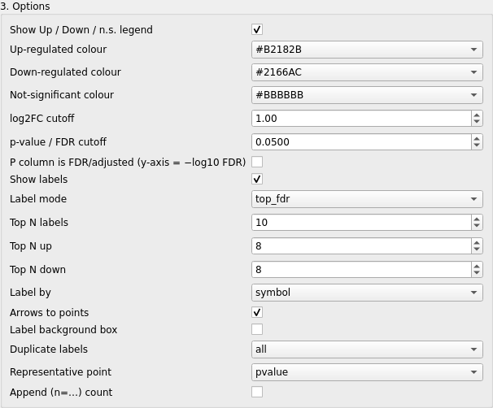

Set **Up-regulated colour**, **Down-regulated colour** and **Not-significant colour** in *3. Options*; the points recolour immediately. Save a style preset to reuse the three colours on every volcano.

### 47. Category mapping example

A categorical palette assigns colours in category order. To fix which category gets which colour, order the categories in your table (or in the grouping step) — the first category takes the first palette colour. Per-category manual colour maps exist only for the network graph (custom node-colour JSON, browser) and oncoprint alteration classes (fixed).

## Part XIII — Annotations

### 48. Click to label (desktop)

Tick **Point picking — Click a point to identify / label it** (4. Labels & size). On volcano, MA, scatter and embedding plots, clicking near a point shows its name in the status bar and **toggles a label** on it; clicking again removes it. Volcano and MA toggle by *point identity* (row), so two rows sharing a gene symbol are independent; other plots toggle by label text. Selections are stored in the PlotSpec (`selected_points` / `selected_labels`) and survive export and reload.

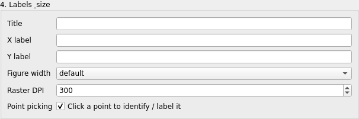

Manual offsets: the desktop app does **not** currently support dragging a label; offsets stored in a PlotSpec (`label_offsets`, `point_offsets`) are honoured when rendering.

### 49. Label points (browser)

The **Label points (annotate)** expander (volcano, MA): choose **Points to label** from the list, then **Move which label** with **x offset / y offset (pt)** and **Reset this label position**. The same AnnotationState round-trips into the PlotSpec as the desktop picks.

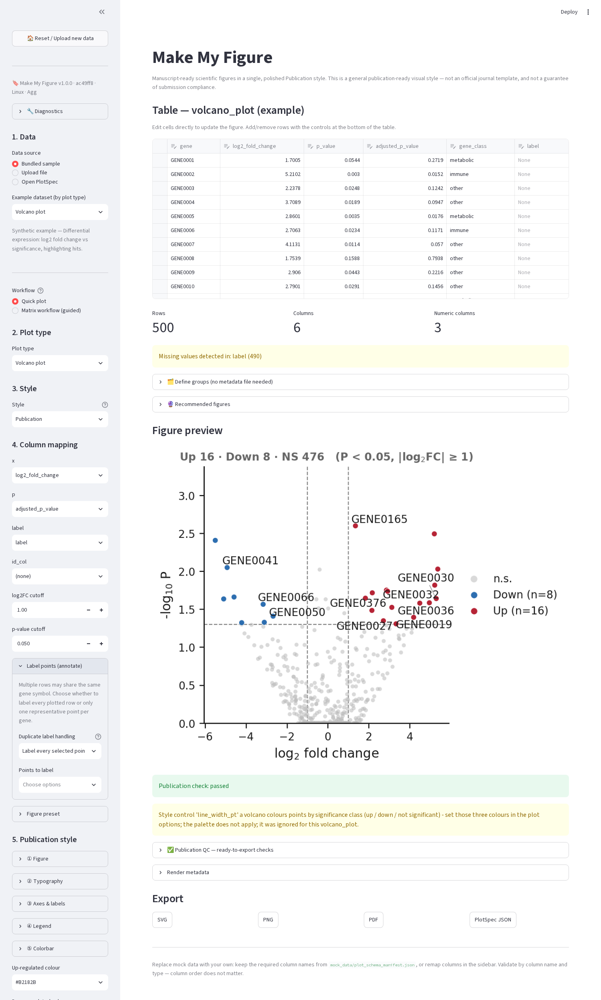

### 50. Duplicate feature labels (volcano and MA)

Several rows may share one symbol (peptides of a protein, probes of a gene). **Duplicate label handling:** *Label every selected point* (`all`), *one representative per label* (`unique`), or *representative + count* (`count`). The **representative** is chosen by rule: smallest p-value, smallest adjusted p, largest absolute effect, highest absolute statistic, or first row. Row identity is never collapsed in the data — only in what is labelled.

### 51. Other label controls (volcano/MA)

In *3. Options*: **Show labels** (master switch); **Label mode** (e.g. `top_fdr`); **Top N labels**, **Top N up**, **Top N down** (how many extreme features get labels); **Label by** (which column supplies the text, e.g. `symbol`); **Arrows to points** (leader lines); **Label background box**; **Duplicate labels** / **Representative point** / **Append (n=…) count** (§50). Label collisions are resolved automatically with `adjustText`.

### 52. Manual annotation layer

A PlotSpec may carry an `annotations` list — text, arrow, callout, box, region, bracket, hline, vline — with coordinates in data, axes or figure space, colour, font size, line width, alpha and z-order. They are applied to every plot type on render and exported with the figure. There is no in-app drawing editor for generated plots; imported Figure Builder panels accept annotations through the builder. Positions are data-specific and travel only in a **full** preset (with a warning that they may need moving).

## Part XIV — Figure presets


### 53. What a preset is

A **Figure preset** is the reusable part of a figure's configuration, saved without the data. A **PlotSpec** is the exact record of one figure including the table name and its columns. Presets are files (`*.mmfpreset.json`, format `make_my_figure.figure_preset`, version 1) kept in a per-user library that both apps share.

Two kinds:

- **Figure style only** — typography tokens, palette, layout geometry (width preset, tick angles, paddings, margins, legend location, colorbar geometry), export defaults (formats, size, DPI), statistical *display* settings (annotation content/placement), and the plot's **visual** options. Portable to any dataset of the same plot type; universal parts (fonts, palette, layout) also apply to other plot types.
- **Full figure configuration** — all of the above **plus** column roles, analytical options (thresholds, bins, clustering method…), axis labels, the statistics test block, and manual annotations. Applies only to the same plot type.

Never in a preset: the table name, worksheet provenance, row values, click-selected points and their offsets.

### 54. Which options are visual

Every plot option declares a **scope** in the registry. Visual (style) examples: box vs violin, histogram bars/line, panel arrangement, colormap, node colours, error-bar type, tick angle, show/hide fit statistics. Analytical (full only) examples: volcano/MA/Manhattan thresholds, bin width and count, clustering distance/linkage, `k`, axis limits, input form, `top_n`, correlation cutoffs. The default for a new option is analytical, so a threshold cannot leak into a lab style by omission. The plot catalogue (Part X) lists both sets for each plot.

### 55. Saving

**Desktop:** *Figure preset* group → **Save preset…** → name → *Figure style only* or *Full figure configuration* → **Save**. **Browser:** *Figure preset* expander → *Save preset* form → name → *Save* radio → **Save**; a **Download the saved preset** button appears. The preset is written to the library and listed for its plot type.


### 56. Applying

Choose a preset for the current plot type (universal presets are listed for every type) → **Apply**. The controls move to the preset's values — including tick angles, legend location, margins, colorbar geometry, options and (full presets) column roles — and the figure re-renders. The status line reports how many settings applied and how many did not apply to this plot type.


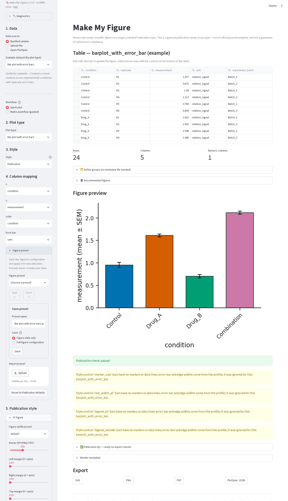

### 57. Compatibility, remapping, warnings

- A **full** preset saved for another plot type is refused (its roles and thresholds mean nothing elsewhere).
- A **style** preset saved for another plot type applies its universal parts and lists the plot-specific options it dropped.
- A full preset whose columns the new table lacks reports each missing role — *"wanted 'x_marker' … nothing was substituted"* — and leaves that role for you to set in *Map columns*. Statistics columns the table lacks are cleared and reported the same way.
- Manual annotations from a full preset are restored at their saved positions with a warning.

### 58. Import, export, delete, reset, sharing

**Import…** adds a `.mmfpreset.json` (or an old PlotSpec / sidecar, converted to a full preset) to the library. **Export…** writes the selected preset to a file for a colleague. **Delete** removes it from the library. **Reset to Publication defaults** returns every style control to the defaults without touching the library. To share a lab style, export `Lab_Default_Heatmap.mmfpreset.json` and have colleagues import it.

### 59. Storage location and versioning

| OS | Library folder |
|---|---|
| Windows | `%APPDATA%\MakeMyFigure\presets` |
| macOS | `~/Library/Application Support/MakeMyFigure/presets` |
| Linux | `$XDG_DATA_HOME/make_my_figure/presets` (default `~/.local/share/make_my_figure/presets`) |

The environment variable `MAKE_MY_FIGURE_PRESETS` overrides the folder (portable installs, shared network folders, tests). Files carry `format_version`; a preset from a newer version is refused with a clear message rather than misread. Foreign JSON files in the folder are ignored.

### 60. Lab workflow

1. Finalise a heatmap (colormap, fonts, colorbar placement, cell borders, double-column width).
2. **Save preset…** → *Lab Heatmap* → *Figure style only*.
3. Months later, load a new matrix, choose *Clustered heatmap*, **Apply** *Lab Heatmap*.
4. Adjust only what is data-specific: feature/value columns, clustering method, title.
5. Export; the PlotSpec of the new figure records everything, including that the preset's values are in effect.

**Worked example with bundled data (dataset A → preset → dataset B).** You can repeat this with the two apps' bundled examples; it is also executed by the release validation script (`scripts/validate_documented_workflows.py`, results in `docs/manuals/audit/v1.1.0_documentation_validation.csv`).

1. *Dataset A:* **File → Open example → Box / violin with points** (desktop) or *Bundled sample → Box / violin with points* (browser). Set **Palette** to *colorblind_safe*, **Marker size** to 30 and, in *3. Options*, **Point size** to 20.
2. **Save preset…** → *Lab box style* → *Figure style only*. The file `Lab_box_style.mmfpreset.json` appears in the preset library (Section 59); it contains the palette, the marker size and the point size but no column names and no data rows.
3. *Dataset B:* open your own CSV with a different group column and value column (any two-column long table), choose *Box / violin with points*, map `x` and `y` yourself.
4. **Apply** *Lab box style*. The palette, marker size and point size move to the saved values; your `x`/`y` mapping is untouched because a style preset never carries roles. The status line reports how many settings applied.
5. Export. The new PlotSpec records the applied values, so the figure is reproducible without the preset file.

If you had saved a **full** configuration in step 2 instead, step 4 would also try to restore the roles `x = group` and `y = value`; when dataset B has no columns with those names the status line lists each unresolved role ("wanted 'x' … nothing was substituted") and you map them in *Map columns*.

**Categorical colours after applying a preset.** A preset stores the *palette*, not a table of category → colour pairs. Categories of dataset B receive the palette colours in the order in which they appear in dataset B (Section 47), so the first category in B gets the first palette colour even if a category of the same name was second in A. To pin a category to a colour, order the categories in the table (or in the grouping step) identically in both datasets. The exceptions are plots whose colours are options rather than palette entries — volcano and MA class colours (`color_up`, `color_down`, `color_ns`), Manhattan threshold-line colour, network node/edge colours, paired-slopegraph point/line colours: these are style options and are carried by the preset exactly.

## Part XV — PlotSpec, figure packages and reproducibility

### 61. What a PlotSpec records

`plot_type`, `input_table`, `mapping` (roles + options + click selections), `journal_style`, `output` (formats, width/height mm, DPI), `layout` (labels, geometry, legend, margins), `style` (token overrides), `statistics` (test, comparison, correction, annotation, columns), `annotations`, `column_annotations` (heatmap group strips), `source` (workbook name and hash, worksheet name/index/type, header row, Matrix Workflow provenance, and since v1.1.1 `source_table_sha256`, a content digest of the table). The sidecar adds `render_metadata`: rows and columns used, plot-specific facts (bins, n per group, clusters…), the publication check, layout QC, software versions for statistics, and the Publication disclaimer.

### 62. Reload

**Desktop:** *File → Open PlotSpec… (specification only; needs the data file)* — pick the JSON; the app looks for the data table by name next to it (or the only data file in that folder) and otherwise asks; when the PlotSpec carries a content digest and the table differs, a warning says so. Every control is restored through the same path a preset uses. **Browser:** *Data source → Open PlotSpec* — upload the JSON and the data table. The figure is **reconstructable under a recorded software environment**: same code, same data, same figure. Different machines may differ in fonts and text metrics; that is expected and not a reproducibility failure.

A PlotSpec is **not** portable on its own: it names the table, it does not contain it. To move a figure to another folder, computer or laboratory use a **figure package** (§63a).

### 63. Related records

`name.stats_spec.json` (every statistical result), `name.figure_spec.json` (a composite: panels with their PlotSpecs, layout, draft legend), MatrixSpec / SampleMetadataSpec / PreprocessingSpec (as JSON inside a figure package; as identifiers and a method sentence in the PlotSpec `source` block).

### 63a. Figure packages (`.mmfpackage`)

**What it is.** One portable file containing everything needed to reopen the figure: the PlotSpec (or, for a composite, the FigureSpec and every panel's PlotSpec), a frozen lossless copy of the exact table(s) the plot used (`data/*.mmftable.json`; doubles, missing values, strings, category order and row/column order are reproduced bit for bit), the original CSV/TSV/XLSX when it was available, the StatsSpec with its results, the MatrixSpec / SampleMetadataSpec / PreprocessingSpec when the plot came from the Matrix Workflow (with **both** the original and the derived matrix), imported panel images, PNG/SVG/PDF previews, the software environment, and `manifest.json` listing every file with its SHA-256.

**Save.** *5. Export → Save Figure Package (.mmfpackage)* or *File → Save Reproducible Figure Package…* (Ctrl+Shift+S). A dialog states that **figure packages include the data required to reproduce the figure**, lists the tables and records that will be included and the estimated size, then asks where to save. In the Figure Builder, **Save Figure Package…** packages the composite. **Export all as ZIP** contains the figure files, the PlotSpec/StatsSpec JSON and the package.

**Open.** Landing page **Open Figure Package**, *File → Open Figure Package…* (Ctrl+Shift+P), drag-and-drop, or *Recent files* (📦). The application validates the container, checks the manifest against its schema, verifies every checksum, loads the frozen tables and specifications and renders the figure in the normal editor — you never locate the original data. The status bar reports *integrity verified*. Statistics are recomputed from the frozen data and compared with the stored StatsSpec; a preprocessing chain is replayed on the frozen source and compared with the frozen derived matrix; differences are reported, the frozen values are never replaced. Composite packages open in the Figure Builder with the recorded layout and every panel's data.

**If something is wrong.** A package whose files were edited fails with *Package integrity check failed: data differ from the values recorded when the package was created* and is not rendered. Missing files, an invalid manifest, a corrupt container or a newer format version give a plain message, never a traceback. Packages are treated as untrusted input (no path traversal, links, oversized or over-compressed entries; nothing is executed).

**Privacy.** A package contains data. Share it only with people who may see those data.

**Three artifacts.** PlotSpec = recipe for one plot, source data required. Figure preset = reusable configuration, no data. Figure package = portable reproducibility bundle, frozen data + specifications.

## Part XVI — Figure Builder

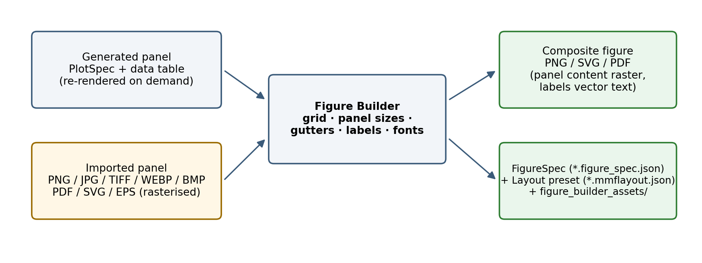

### 64. Opening it and adding panels

Render a plot, then **Save current plot as panel** (5. Export / 6. Multi-panel figure group); the counter shows *N panels saved*. **Add to Figure Builder** on a recommendation card does the same for that recommended plot. Then **Open Figure Builder…**.


### 65. Importing external panels

**Import panel from file…**: PNG, JPG/JPEG, TIF/TIFF, WEBP, BMP directly; PDF, SVG and EPS when the optional `import-panels` extra is installed (`pip install -e ".[import-panels]"`: PyMuPDF and cairosvg) — those are **rasterised at 300 dpi** on import. The file is copied into a managed assets folder and recorded (original name, dimensions, DPI, checksum, page). Imported panels have their own controls: fit mode (contain / fill / crop / stretch), crop fractions, rotate (0/90/180/270), flip, auto-trim, background, border, and annotations in normalised coordinates. Publication-readiness warnings flag low resolution or stretching.

### 66. Layout controls

| Control | Effect |
|---|---|
| Figure name | title used in the draft legend and file names |
| Columns / Rows | grid (Auto derives one from the panel count) |
| Figure width (mm) | overall width; 89 mm ≈ single column, 180 mm ≈ double |
| Horizontal / Vertical gutter | spacing between cells (fractions) |
| Panel labels | A B C / a b c / 1 2 3, bold, top-left of each panel |
| Export DPI | raster DPI for the embedded panel content |
| Selected panel size — Width / Height (inches) | the panel's cell size; proportions are preserved (never stretched); Height *auto* follows the panel's own ratio |
| Move up / Move down / Remove / Duplicate | order = label order |
| Fonts (points, applied to all panels) | text, axis labels, tick numbers, legend, panel letters |

There is **no** free x/y positioning, z-order or snap grid: the builder is a grid with per-cell sizes and width/height ratios derived from the widest/tallest panel per column/row.

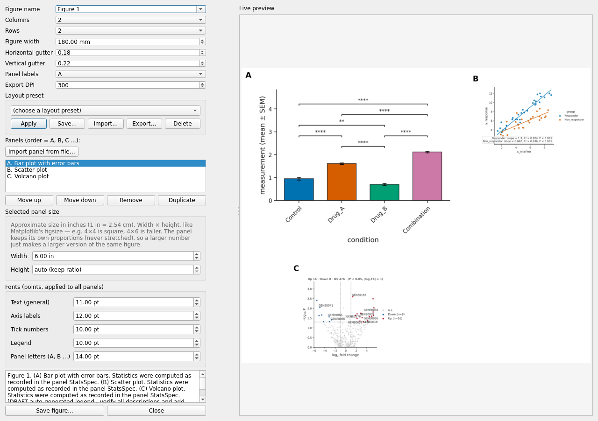

### 67. Layout presets

**Layout preset** group: **Save…** (grid, gutters, width, label style, fonts, per-panel sizes — no panel content), **Apply** to the current panels (sizes are applied positionally; a count mismatch is reported), **Import…** (a `.mmflayout.json`, or a `.figure_spec.json` whose geometry is taken and panels left behind), **Export…**, **Delete**. Files use format `make_my_figure.figure_layout_preset` in the same library folder as figure presets.

### 68. Export and FigureSpec

**Save figure…** writes PNG (and SVG and PDF alongside) at the export DPI, plus `name.figure_spec.json` (panels with PlotSpecs, stats specs, sizes, imported-asset records, layout, auto-drafted legend text — verify the draft before use). Imported assets are copied to `figure_builder_assets/` next to the figure. The FigureSpec records the panels' table *identities*, not their values. **Save Figure Package…** writes one `.mmfpackage` with the FigureSpec, every panel's PlotSpec/StatsSpec, the exact tables and the imported images; **Open Figure Package** (landing page or File menu) rebuilds the composite in the Figure Builder with its layout (§63a).

**Warning:** the composite embeds each panel as a **raster** image at the export DPI; only panel letters and titles are vector text, even in the SVG/PDF. For fully vector output export single plots directly.

### 69. Browser Figure Builder

Inside the guided Matrix workflow, step **⑤ Figure Builder** lists the panels generated in that session, takes a **Columns** value and **Compose multi-panel figure** offers PNG/SVG/PDF downloads; **Clear Figure Builder** empties it. Per-panel sizing, imports and layout presets are desktop-only.

## Part XVII — Exporting

### 70. Formats

| Format | Raster/vector | DPI | Text | Transparency | Size | Recommended use |
|---|---|---|---|---|---|---|
| **SVG** | vector | — | editable (`svg.fonttype: none`) | background is part of the figure | small for line/point plots; large for dense heatmaps | further editing in Illustrator/Inkscape; journals accepting SVG |
| **PDF** | vector | — | editable, fonts embedded as Type 42 | as SVG | as SVG | manuscript submission, print proofs |
| **EPS** | vector | — | Type 42 | no | as PDF | legacy submission systems |
| **PNG** | raster | 150–600 (Raster DPI) | rasterised | white background | grows with DPI² | slides, quick sharing, journals requiring raster |
| **TIFF** | raster, LZW-compressed | as PNG | rasterised | white | larger than PNG | journals requiring TIFF |

All exports use a tight bounding box that also includes the axis labels and title, so a long axis label is never clipped. Desktop buttons: **Export SVG / PNG / PDF** (figure file only), **Export PlotSpec JSON (specification only)**, **Save Figure Package (.mmfpackage)**, **Export all as ZIP** (SVG, PNG, PDF, `name.plot_spec.json`, `name.stats_spec.json` when statistics ran, and `name.mmfpackage`; TIFF/EPS are available through the core API). Browser: **SVG / PNG / PDF / PlotSpec JSON / Figure Package** downloads (plus **StatsSpec JSON** when statistics ran). The Figure Builder exports PNG + SVG + PDF + `name.figure_spec.json` with panel content embedded as raster at the export DPI, and **Save Figure Package…** for the portable composite.

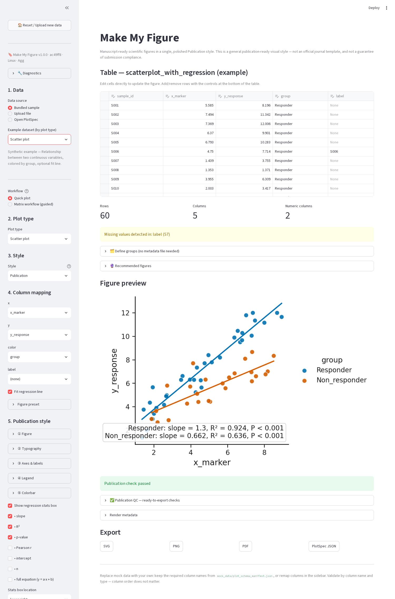

### 71. Practical notes

- Exporting the same figure twice from the same PlotSpec and code gives the same content; file bytes may differ by timestamps.
- Choose the **Figure width** preset to match the journal column before exporting; fonts are then at their true point sizes.
- Very large PNGs (600 dpi, double column) can exceed 20 MB; 300 dpi is the usual requirement.

## Part XVIII — Multi-sheet Excel workbooks

### 72. Workflow

1. **Upload** a `.xlsx`/`.xlsm`/`.xls` (desktop: Open data file… or drag-and-drop; browser: Upload file).
2. The **📑 Worksheet** box lists **every** sheet in workbook order, including empty and notes sheets, and marks hidden ones. The active sheet loads first.
3. **Inspect**: each sheet shows a detected type and reason — `differential_results` (fold-change + p/FDR columns), `matrix`, `metadata`, `enrichment`, `documentation` (mostly text or blank), `generic`, `empty`, `unknown`. This is advisory: any sheet can be plotted.
4. **Switch** sheets in the box; mapping controls rebuild for the new columns, and the header-row choice (browser) applies per sheet.
5. **Provenance**: the PlotSpec `source` block records the workbook name, file hash, sheet name/index/type and header row; export file names start with the worksheet name (`<Sheet>_<plot_type>.png`).

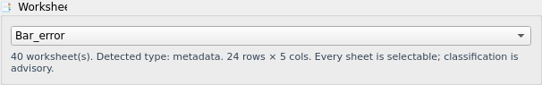

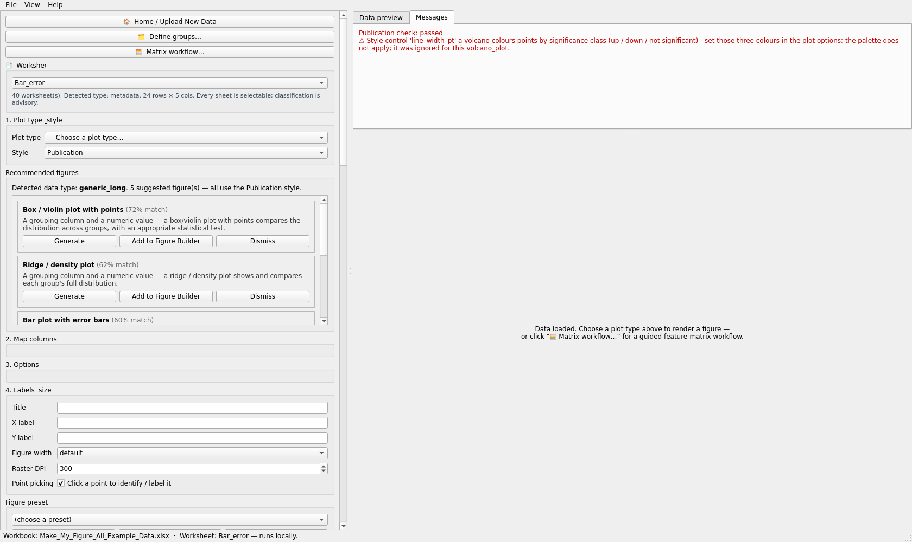


**Several DE comparison sheets** in one workbook: plot each as a volcano from its own sheet; the exported PlotSpecs differ only in the sheet name and can be opened side by side in the Figure Builder.

## Part XIX — Differential results

### 73. Input

One row per feature with a **feature ID** (gene, protein, peptide), a **log fold change** (`logFC`, `log2FoldChange`), a **p-value** (`P.Value`, `pvalue`), optionally an **adjusted p / FDR** (`adj.P.Val`, `padj`) and an **average abundance** (`AveExpr`, `baseMean`, `logCPM`). These headers are recognised (edgeR, limma, DESeq2 conventions) and prefilled; you confirm them in *Map columns*.

### 74. Plots

- **Volcano** — x = log fold change, y = −log10 p (or FDR when **P column is FDR/adjusted** is ticked). **log2FC cutoff** and **p-value / FDR cutoff** draw the threshold lines and colour classes (up / down / not significant). Labels: top-N by extremity, a pasted list, or click-picked points; duplicate-label policy as in Part XIII.
- **MA** — x = average abundance, y = log fold change, coloured by significance at the **p_cutoff**.

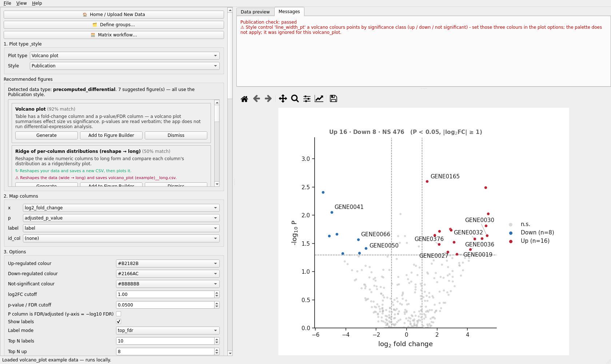

### 75. Raw p versus FDR

The y axis plots whatever column you mapped to `p`. Tick **P column is FDR/adjusted** so the axis label says FDR and the cutoff is interpreted on the adjusted scale. Nothing is recomputed: **Make My Figure does not replace specialist differential-expression inference** (DESeq2, edgeR, limma). It reads the values you provide. The Matrix Workflow's *differential summary* is a per-feature t/Mann-Whitney/ANOVA screen on a normalised matrix, labelled as such.

## Part XX — Performance and large datasets

- Rendering runs in background workers on the desktop; continuous controls are debounced so dragging a slider triggers one render.
- **Heatmap / clustering**: rows are capped at **`max_features` = 2 000** by default (adjustable 50–50 000), chosen by variance; highlighted rows survive the cap. Integer annotation columns are dropped from the value matrix and reported.
- **Volcano / MA with ~50 000 rows**: rendering is fast; labelling is the cost — keep top-N labels modest (tens), use the duplicate-label policy `unique`, and prefer PNG for previews.
- **Networks**: filter with `min_weight` / `corr_cutoff` / `top_n_edges` / `min_degree` before layout; use `seed` for reproducible layouts.
- **Browser app**: each control change re-runs the script; large tables make every interaction slower — pre-filter, or use the desktop app.
- **Windows** first launch of the packaged app is slow while the bundle is unpacked and scanned; later launches are quicker. See `docs/WINDOWS_PERFORMANCE.md`.

No timing figures are quoted here because none were benchmarked for this manual.

## Part XXI — Cross-platform notes

| | macOS | Windows | Linux | WSL |
|---|---|---|---|---|
| Native desktop | packaged `.dmg` or source | `.exe` installer / zip or source | AppImage / tar.gz or source (needs Qt libs) | source; needs WSLg or an X server |
| Browser app | source | source | source | source (open the URL from Windows) |
| Fonts | Arial/Helvetica present | Arial present | DejaVu Sans fallback | DejaVu Sans |
| Paths | `~/Library/Application Support/MakeMyFigure/presets` | `%APPDATA%\MakeMyFigure\presets` | `~/.local/share/make_my_figure/presets` | as Linux |
| Known | unsigned bundle needs right-click → Open | SmartScreen prompt; slower first launch | missing `libxkbcommon` etc. on minimal images | no display → use the browser app |

Figures rendered on different platforms differ slightly in font metrics and spacing; the style is the same, the pixels are not guaranteed identical. Emoji in button labels depend on an installed emoji font.

## Part XXII — Troubleshooting

Each entry: **Problem · Likely cause · Diagnose · Fix**.

- **App does not start (desktop).** Qt binding missing or unloadable. Run `python -c "import PySide6.QtWidgets"`; the app prints the exact `apt install` list on Linux. Fix: `pip install -e ".[desktop]"`; install the Qt system libraries; or use the browser app.
- **`Python not found` / `py` not recognised (Windows).** Python not on PATH. Reinstall Python ticking *Add to PATH*, or use the full path to `python.exe`.
- **`libxkbcommon.so.0: cannot open shared object file`.** Minimal Linux/WSL image. Install the listed Qt libraries.
- **PowerShell refuses to activate the venv.** Execution policy. `Set-ExecutionPolicy -Scope Process RemoteSigned`, then activate.
- **WSL: no window appears.** No display. Use WSLg (Windows 11) or the browser app.
- **Banner shows an old commit / features missing.** An installed package shadows the checkout. `python -m pip install -e .` in the checkout; confirm with the banner.
- **`ModuleNotFoundError: pandas` although a venv seems active.** Stale venv label or wrong interpreter first on PATH. Deactivate everything; create and activate a fresh venv in the project folder.
- **`numpy.dtype size changed` on macOS.** Two environments stacked. One fresh venv.
- **pip fails compiling a PySide6 template.** Old interpreter. Use Python 3.10+ and `pip install --no-compile`.
- **Wrong worksheet plotted.** Active sheet loaded by default. Choose the sheet in **📑 Worksheet**; check the `source` block of the PlotSpec.
- **Plot selector blank / "Choose a plot type…".** By design after upload: pick a plot type or a recommendation.
- **Figure does not change when I move a control.** The control does not apply to this plot (a notice says so), or the Publication style group is unticked (desktop). Tick the group; check Messages.
- **Statistics slow.** Many groups × many comparisons with post-hoc; reduce comparisons (vs control) or groups.
- **Stale figure after an error.** The app clears the figure on error and shows the message; fix the mapping and re-render.
- **Preset "cannot be applied".** A full preset for another plot type. Save a style preset for cross-type reuse, or open the matching plot type.
- **Preset applied but a column role is empty.** The new table lacks that column; the app listed it — choose one in *Map columns*.
- **Missing font.** The requested family is not installed; Matplotlib falls back to DejaVu Sans. Install the font or choose one installed.
- **PDF looks different from the screen.** Font substitution or DPI; the vector export is authoritative. Check fonts and the width preset.
- **Labels overlap.** Reduce top-N, enable `unique` duplicate policy, enlarge the figure width, or reposition (browser offsets / PlotSpec).
- **Large heatmap slow.** Rows above `max_features` are trimmed by variance; lower `max_features` or pre-filter.
- **Figure Builder panel clipped or blurry.** Panel too small for its content or raster DPI too low; increase its width or the Export DPI; import vector files with the `import-panels` extra.
- **Excel header wrong.** Title rows above the header, or merged/stacked headers. Browser: choose the header row / two stacked rows, tick forward fill; desktop: remove the title rows first.
- **"Survival probabilities as event column" error.** You mapped an already-computed curve as a 0/1 event column. Set **Input form → precomputed** and pick the S(t) columns.

## Part XXIII — Reproducible lab workflows

**1. Same scatter style across experiments.** Finalise one scatter (fonts, palette, fit statistics shown, legend outside right). Save preset *Lab scatter* (style). For every later experiment: load, choose *Scatter plot*, map x/y/colour, **Apply** *Lab scatter*, export. Only the mapping and title are ever set by hand.

**2. Reusable heatmap preset.** As §60: *Lab Heatmap* (style) carries colormap, cell borders, colorbar position and fonts; the clustering method and value columns remain per dataset.

**3. DE result → volcano → preset → Figure Builder.** Load the DE table (or the DE sheet of a workbook), confirm the detected columns, set thresholds and class colours, label top genes, save *Lab volcano* (full, to keep thresholds). **Save current plot as panel** for each comparison, then compose in the Figure Builder with a 1 × 3 grid; save the layout preset *Three volcanoes*.

**4. Matrix → QC → transformation → PCA/heatmap.** Matrix Workflow: map, confirm raw scale, groups from metadata, `log2` → `median_scale` → `row_zscore` steps, **Run diagnostics**, save the before/after report, **Open in plot editor** for the heatmap and PCA; the PlotSpecs carry the preprocessing identifiers and method sentence, and **Save Figure Package** stores the MatrixSpec, SampleMetadataSpec, PreprocessingSpec, the original and the derived matrix with the plot.

**6. Sharing a reproducible figure with another laboratory.** Finalise the plot → **Save Figure Package** → send the one `.mmfpackage` file → the collaborator opens Make My Figure → **Open Figure Package** → integrity is verified → the figure opens with the frozen data and configuration → they inspect, edit and re-export. No original data file, worksheet or sidecar folder is needed.

**5. Multi-sheet workbook → several comparisons → separate exports.** Upload once; for each DE sheet choose it, apply *Lab volcano*, export — file names start with the sheet name and each PlotSpec's `source` names the sheet.

## Part XXIV — Files generated by Make My Figure

```
<Sheet>_<plot_type>.png / .svg / .pdf / .tiff / .eps   the figure(s); the stem is the worksheet
                                                       name (or the file stem) plus the plot type
<stem>.plot_spec.json                                  PlotSpec + render metadata (Export PlotSpec JSON, ZIP, browser)
<stem>.stats_spec.json                                 every statistical result (ZIP and browser, when statistics ran)
<stem>.mmfpackage                                      figure package: specification + frozen data + records + previews
                                                       + manifest with SHA-256 per file (Save Figure Package; also in the ZIP)
Figure_1.png / .svg / .pdf                             Figure Builder composite
Figure_1.figure_spec.json                              FigureSpec (panels, PlotSpecs, layout, draft legend; table identities only)
Figure_1.mmfpackage                                    composite figure package (FigureSpec + panel specs + tables + images)
figure_builder_assets/                                 copies of imported panel files
<table> (grouped)  /  <table>__diff.csv                grouped table / differential screen (Define groups)
<report folder>/before_after_contact_sheet.pdf, .png   Matrix Workflow before/after QC report
                 + one vector file per QC plot
<name>.csv, <name>.md                                  statistics table and method report (you name them)
<preset library>/*.mmfpreset.json                      Figure presets (per-user folder, Part XIV)
<preset library>/*.mmflayout.json                      Figure Builder layout presets
```

## Part XXV — Limitations

- Publication is a general style, not an official journal template; it does not guarantee acceptance.
- Statistical design and method choice remain the researcher's responsibility; suggestions are advisory; Dunnett's test is not implemented.
- No DE inference; DE values are read verbatim. The Matrix Workflow differential summary is a screen.
- Very large matrices are trimmed by variance (`max_features`); very large networks need filtering.
- Figure Builder composites rasterise panel content; no free positioning or z-order; the browser builder is columns-only.
- Desktop: no header-row selector, no drag-to-move for labels; browser: no font-family control, no EPS/TIFF buttons.
- Colour choices are from curated lists (no colour picker); per-category manual colour maps only for network nodes.
- The recommendation engine is rule-based.
- No transformation is ever applied silently; conversely nothing is auto-normalised for you.
- Cross-platform font differences; no byte-identical guarantee.
- Packaged v1.1.0 installers are built from the same tagged source as this manual; the two cosmetic Qt defects below are present in them as well.
- Statistics annotation is not available on the line/time-course plot.

## Part XXVI — Glossary

- **PlotSpec** — the JSON record of one figure: plot type, table, roles, options, style, layout, statistics, annotations, provenance.
- **StatsSpec** — the JSON record of the statistical results drawn on / computed for a figure.
- **MatrixSpec** — the confirmed structure of a feature × sample matrix (feature id, value columns, value scale, policies).
- **PreprocessingSpec / PreprocessingStep** — the ordered, confirmed transformation steps applied to a matrix, with QC before/after.
- **SampleMetadataSpec** — the sample → group (and other attribute) assignment used by the Matrix Workflow.
- **FigureSpec** — the JSON record of a multi-panel composite (panels, PlotSpecs, layout, legend draft).
- **Figure preset** — reusable configuration without data: style-only or full configuration.
- **Figure package** — one portable `.mmfpackage` file: PlotSpec/FigureSpec + frozen data + StatsSpec/Matrix/Preprocessing records + assets + previews + checksums; reopens without the original files.
- **Layout preset** — reusable Figure Builder geometry without panel content.
- **Derived matrix** — a new table produced by preprocessing or grouping; the source table is unchanged.
- **Publication style** — the single visual style profile (tokens for fonts, widths, palette).
- **Mapping** — the assignment of table columns to plot roles (and the plot's options).
- **Recommendation** — an advisory plot suggestion with score and reason from the table's shape.
- **Annotation identity** — a picked point is remembered by row identity (volcano/MA) or label text (other plots) so labels survive re-rendering.

## Part XXVII — Quick reference

**Input format → workflow**

| Format | Workflow |
|---|---|
| CSV/TSV/TXT long table | Quick plot: map x/y/group |
| Excel single sheet | as CSV; merged headers recovered |
| Excel multi-sheet | choose the worksheet; each has its own header row and provenance |
| Feature × sample matrix | Quick plot (heatmap/PCA) or Matrix Workflow (QC, preprocessing, groups) |
| Wide columns of unequal length | Histogram (Input form → wide) or Define groups → grouped table |
| Precomputed DE table | Volcano / MA |
| Subject-level survival | Kaplan-Meier (subject_level) · Precomputed S(t) | Kaplan-Meier (precomputed) |

**Data type → recommended plots** — see Part VI §25.

**Plot → required columns** — see Part X (each section's *Column mapping*).

**Statistics → required data**

| Method | Data |
|---|---|
| t-tests, Mann-Whitney | numeric value + group column with two levels (paired: + subject id) |
| ANOVA / Kruskal / Dunn | numeric value + group (≥ 3 levels); two-way: + subgroup; RM: + subject |
| Chi-square / Fisher | two categorical columns |
| Pearson / Spearman / regression / GLM | two numeric columns (GLM: several predictors) |
| Log-rank / Cox | time, 0/1 event, group (subject-level) |

**Export format → use** — see Part XVII §70.

**Specification → purpose**

| File | Purpose |
|---|---|
| `.plot_spec.json` | the recipe of one figure (needs the source data) |
| `.stats_spec.json` | every statistic behind it |
| `.figure_spec.json` | the recipe of a composite (needs the panel tables) |
| `.mmfpackage` | reopen a figure or composite anywhere: recipe + frozen data |
| `.mmfpreset.json` | reuse a configuration on new data |
| `.mmflayout.json` | reuse a composite layout |

**Preset type → purpose**

| Preset | Carries | Use when |
|---|---|---|
| Figure style only | fonts, palette, geometry, legend/colorbar, export, visual options | "make all our figures of this kind look like this" |
| Full figure configuration | + roles, thresholds, labels, statistics, annotations | repeat the same analysis on the next dataset |
| Layout preset | grid, sizes, gutters, labels, fonts | reuse a multi-panel arrangement |
