## Part X — Plot catalogue

The 38 plot types below are the complete registry on this commit, enumerated from code (`plots/registry.py`) — not a historical list. Each figure was rendered from its bundled synthetic example with Publication defaults. Colour and control facts come from the same capability scan that the test suite enforces, so a control listed here is one the renderer actually reads.

### Bar plot with error bars

*Registry key:* `barplot_with_error_bar`

**Purpose:** Compare a mean (or median) per category with an error bar.  
**When to use:** few categories, replicate measurements; consider a box or strip plot when you want to show every point

**Required / optional input:** one table with the roles below; the bundled example has columns `condition`, `replicate`, `measurement`, `unit`, `experiment_batch`.

**Column mapping:** `x`, `y`, `color`; example mapping `{"x": "condition", "y": "measurement", "color": "condition"}`.

**Statistics supported:** yes — pairwise brackets or above-bar labels.

**Colour controls:** Publication palette (publication / colorblind_safe / high_contrast / grayscale).

**Annotation controls:** manual annotation layer via PlotSpec; statistical annotation (stars / p / effect).

**Axis controls:** title, x/y labels, tick angles, label/title padding, margins (layout engine).

**Legend / colorbar controls:** no legend drawn.

**Plot-specific controls (visual, carried in a style preset):** `error` — Error bar, `x_tick_rotation` — X-axis label angle.  
**Analytical / data-dependent options (full preset only):** none.

**Recommended export:** SVG or PDF for vector; PNG/TIFF at 300–600 dpi for raster.

**Figure preset support:** style and full presets (verified in the registry-wide preset QC).

**Example data:** `examples/by_plot_type/bar_error/` (synthetic).

**Known limitations:** none specific beyond the general limitations in Part XXV.

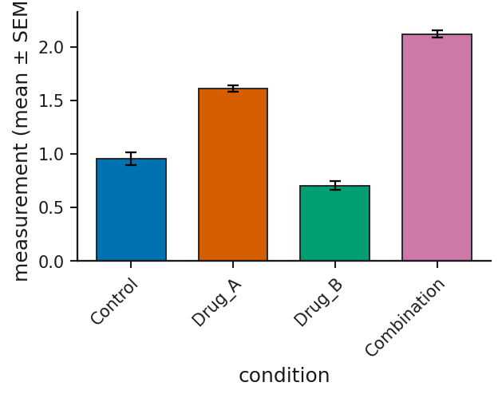

### Grouped bar plot with error bars

*Registry key:* `grouped_barplot_with_error_bar`

**Purpose:** Compare means across categories split by a second factor.  
**When to use:** two crossed factors with replicates

**Required / optional input:** one table with the roles below; the bundled example has columns `genotype`, `treatment`, `replicate`, `expression`, `gene`, `unit`.

**Column mapping:** `x`, `group`, `y`; example mapping `{"x": "genotype", "group": "treatment", "y": "expression"}`.

**Statistics supported:** yes — comparisons within each x category.

**Colour controls:** Publication palette (publication / colorblind_safe / high_contrast / grayscale).

**Annotation controls:** manual annotation layer via PlotSpec; statistical annotation (stars / p / effect).

**Axis controls:** title, x/y labels, tick angles, label/title padding, margins (layout engine).

**Legend / colorbar controls:** legend location (inside/outside), legend size.

**Plot-specific controls (visual, carried in a style preset):** `error` — Error bar, `x_tick_rotation` — X-axis label angle.  
**Analytical / data-dependent options (full preset only):** none.

**Recommended export:** SVG or PDF for vector; PNG/TIFF at 300–600 dpi for raster.

**Figure preset support:** style and full presets (verified in the registry-wide preset QC).

**Example data:** `examples/by_plot_type/grouped_bar/` (synthetic).

**Known limitations:** none specific beyond the general limitations in Part XXV.

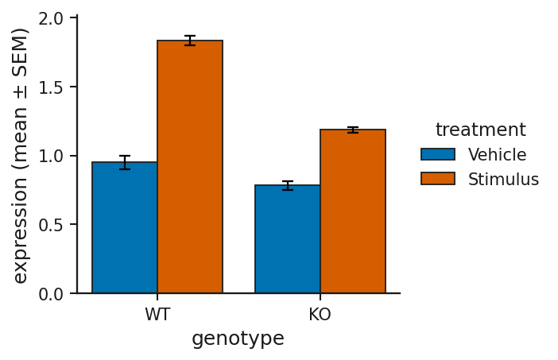

### Clustered heatmap

*Registry key:* `heatmap_clustered_matrix`

**Purpose:** Show a feature × sample matrix as colour, optionally clustered on both axes.  
**When to use:** expression, intensity, or any normalised matrix; z-score rows for pattern contrast

**Required / optional input:** one table with the roles below; the bundled example has columns `gene`, `Ctrl_1`, `Ctrl_2`, `Ctrl_3`, `Ctrl_4`, `DrugA_1`, `DrugA_2`, `DrugA_3` ….

**Column mapping:** `row_id`; example mapping `{"row_id": "gene"}`.

**Statistics supported:** no on-figure statistical annotation (the Statistics panel still runs for the mapped columns where a test applies).

**Colour controls:** Publication palette (publication / colorblind_safe / high_contrast / grayscale); continuous colormap (sequential/diverging from the palette; `colormap` option where present); plot options: `color_scale`, `colormap`, `cell_border_color`, `group_separator_color`, `colorbar_location`, `colorbar_pad`, `colorbar_shrink`.

**Annotation controls:** manual annotation layer via PlotSpec.

**Axis controls:** title, x/y labels, tick angles, label/title padding, margins (layout engine).

**Legend / colorbar controls:** legend location (inside/outside), legend size; colorbar location / pad / size.

**Plot-specific controls (visual, carried in a style preset):** `color_scale` — Color scale, `colormap` — Colormap, `y_label_rotation` — Y-label angle, `group_separators` — Group separator lines, `cell_border_color` — Cell grid color, `cell_border_width` — Cell grid width (0 = off), `group_separator_color` — Group separator color, `group_separator_width` — Group separator width, `colorbar_location` — Colorbar location, `colorbar_pad` — Colorbar pad, `colorbar_shrink` — Colorbar size, `row_label_fontsize` — Row label font (0=auto), `col_label_fontsize` — Column label font (0=auto), `y_label_pad` — Y-axis label padding.  
**Analytical / data-dependent options (full preset only):** `cluster_rows` — Cluster rows, `cluster_columns` — Cluster columns, `scale` — Scale, `distance_metric` — Distance, `linkage_method` — Linkage, `cluster_k_rows` — Row clusters (k, 0=off), `cluster_k_columns` — Column clusters (k, 0=off), `sort_by_cluster` — Sort by cluster, `max_features` — Max features (rows) for clustering.

**Recommended export:** SVG or PDF for vector; PNG/TIFF at 300–600 dpi for raster. Heat-map cells and dense point clouds are still vector in SVG/PDF but large; PNG is often the practical choice.

**Figure preset support:** style and full presets (verified in the registry-wide preset QC).

**Example data:** `examples/by_plot_type/heatmap/` (synthetic).

**Known limitations:** Rows are capped at `max_features` (default 2 000, selected by variance) for responsiveness..

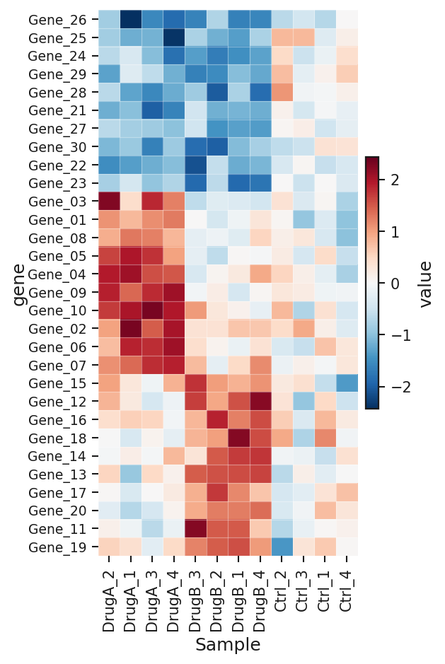

### Volcano plot

*Registry key:* `volcano_plot`

**Purpose:** Effect size against significance for every feature of a differential-expression table.  
**When to use:** any precomputed DE result (edgeR, limma, DESeq2, proteomics)

**Required / optional input:** one table with the roles below; the bundled example has columns `gene`, `log2_fold_change`, `p_value`, `adjusted_p_value`, `gene_class`, `label`.

**Column mapping:** `x`, `p`, `label`, `id_col`; example mapping `{"x": "log2_fold_change", "p": "adjusted_p_value", "label": "label"}`.

**Statistics supported:** no on-figure statistical annotation (the Statistics panel still runs for the mapped columns where a test applies).

**Colour controls:** plot options: `color_up`, `color_down`, `color_ns`.

**Annotation controls:** point picking, label selection, duplicate-label policy.

**Axis controls:** title, x/y labels, tick angles, label/title padding, margins (layout engine), marker size.

**Legend / colorbar controls:** legend location (inside/outside), legend size.

**Plot-specific controls (visual, carried in a style preset):** `show_legend` — Show Up / Down / n.s. legend, `color_up` — Up-regulated colour, `color_down` — Down-regulated colour, `color_ns` — Not-significant colour, `annotate` — Show labels, `show_arrows` — Arrows to points, `label_box` — Label background box, `duplicate_label_policy` — Duplicate labels, `duplicate_label_representative_rule` — Representative point, `duplicate_label_show_count` — Append (n=…) count.  
**Analytical / data-dependent options (full preset only):** `lfc_cutoff` — log2FC cutoff, `p_cutoff` — p-value / FDR cutoff, `use_fdr` — P column is FDR/adjusted (y-axis = −log10 FDR), `label_mode` — Label mode, `top_n` — Top N labels, `top_n_up` — Top N up, `top_n_down` — Top N down, `label_by` — Label by.

**Recommended export:** SVG or PDF for vector; PNG/TIFF at 300–600 dpi for raster.

**Figure preset support:** style and full presets (verified in the registry-wide preset QC).

**Example data:** `examples/by_plot_type/volcano/` (synthetic).

**Known limitations:** The palette does not apply — points are coloured by significance class (up / down / not significant options). Thresholds travel only in a full preset..

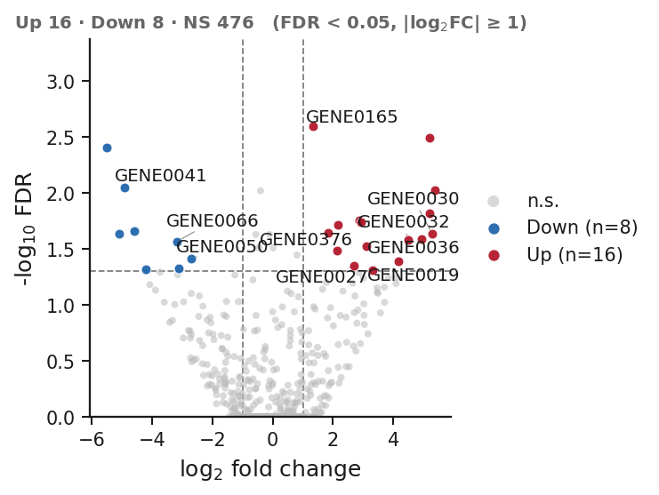

### Scatter plot

*Registry key:* `scatterplot_with_regression`

**Purpose:** Two numeric variables per observation, optionally coloured by group, with a fitted line and its statistics.  
**When to use:** relationships, method comparison, dose vs response before fitting a model

**Required / optional input:** one table with the roles below; the bundled example has columns `sample_id`, `x_marker`, `y_response`, `group`, `label`.

**Column mapping:** `x`, `y`, `color`, `label`; example mapping `{"x": "x_marker", "y": "y_response", "color": "group"}`.

**Statistics supported:** yes — correlation / regression statistics box.

**Colour controls:** Publication palette (publication / colorblind_safe / high_contrast / grayscale).

**Annotation controls:** point picking, label selection, duplicate-label policy; statistical annotation (stars / p / effect).

**Axis controls:** title, x/y labels, tick angles, label/title padding, margins (layout engine), marker size, line width.

**Legend / colorbar controls:** legend location (inside/outside), legend size.

**Plot-specific controls (visual, carried in a style preset):** `show_fit_stats` — Show regression stats box, `show_slope` —   • slope, `show_r2` —   • R², `show_p` —   • p-value, `show_r` —   • Pearson r, `show_intercept` —   • intercept, `show_n` —   • n, `show_equation` —   • full equation (y = a·x + b), `fit_stats_loc` — Stats box location.  
**Analytical / data-dependent options (full preset only):** `fit_line` — Fit regression line.

**Recommended export:** SVG or PDF for vector; PNG/TIFF at 300–600 dpi for raster.

**Figure preset support:** style and full presets (verified in the registry-wide preset QC).

**Example data:** `examples/by_plot_type/scatter/` (synthetic).

**Known limitations:** none specific beyond the general limitations in Part XXV.

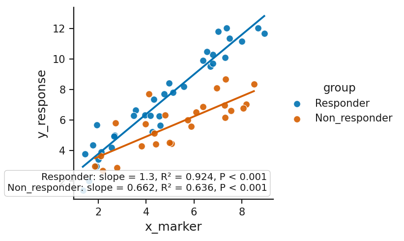

### Box / violin plot with points

*Registry key:* `boxplot_or_violin_with_points`

**Purpose:** Distribution per category as a box or violin, with the individual points.  
**When to use:** replicate measurements across conditions; the default recommendation for grouped observations

**Required / optional input:** one table with the roles below; the bundled example has columns `sample_id`, `group`, `value`, `batch`, `sex`.

**Column mapping:** `x`, `y`; example mapping `{"x": "group", "y": "value"}`.

**Statistics supported:** yes — pairwise brackets or above-bar labels.

**Colour controls:** Publication palette (publication / colorblind_safe / high_contrast / grayscale).

**Annotation controls:** manual annotation layer via PlotSpec; statistical annotation (stars / p / effect).

**Axis controls:** title, x/y labels, tick angles, label/title padding, margins (layout engine), line width.

**Legend / colorbar controls:** no legend drawn.

**Plot-specific controls (visual, carried in a style preset):** `point_size` — Point size (pt²), `kind` — Kind, `points` — Overlay points, `x_tick_rotation` — X-axis label angle.  
**Analytical / data-dependent options (full preset only):** none.

**Recommended export:** SVG or PDF for vector; PNG/TIFF at 300–600 dpi for raster.

**Figure preset support:** style and full presets (verified in the registry-wide preset QC).

**Example data:** `examples/by_plot_type/box_violin/` (synthetic).

**Known limitations:** none specific beyond the general limitations in Part XXV.

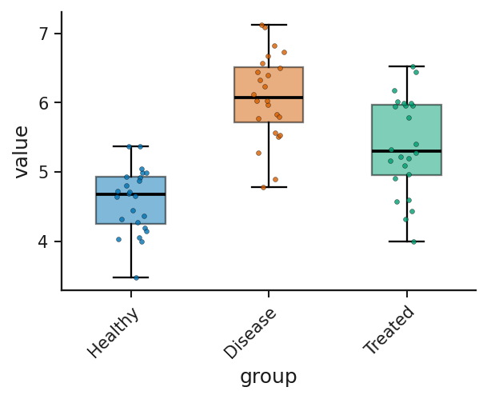

### Line / time-course with error band

*Registry key:* `lineplot_timecourse_with_error_band`

**Purpose:** Mean over an ordered x (time, dose, contraction number) per series with an SEM/SD/CI band.  
**When to use:** time courses, fatigue protocols, force–frequency curves

**Required / optional input:** one table with the roles below; the bundled example has columns `time_hours`, `treatment`, `replicate`, `signal`, `unit`.

**Column mapping:** `x`, `y`, `color`, `style_by`; example mapping `{"x": "time_hours", "y": "signal", "color": "treatment"}`.

**Statistics supported:** no on-figure statistical annotation (the Statistics panel still runs for the mapped columns where a test applies).

**Colour controls:** Publication palette (publication / colorblind_safe / high_contrast / grayscale).

**Annotation controls:** manual annotation layer via PlotSpec.

**Axis controls:** title, x/y labels, tick angles, label/title padding, margins (layout engine), line width.

**Legend / colorbar controls:** legend location (inside/outside), legend size.

**Plot-specific controls (visual, carried in a style preset):** `error` — Error band.  
**Analytical / data-dependent options (full preset only):** none.

**Recommended export:** SVG or PDF for vector; PNG/TIFF at 300–600 dpi for raster.

**Figure preset support:** style and full presets (verified in the registry-wide preset QC).

**Example data:** `examples/by_plot_type/line_timecourse/` (synthetic).

**Known limitations:** No statistical annotation on this plot type..

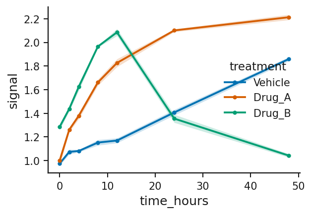

### Ridge / density plot

*Registry key:* `ridge_or_density_plot`

**Purpose:** Smoothed density per group, stacked (ridgeline) or overlaid.  
**When to use:** comparing distribution shapes across several groups

**Required / optional input:** one table with the roles below; the bundled example has columns `cell_id`, `sample_id`, `condition`, `pseudotime`, `score`.

**Column mapping:** `x`, `group`; example mapping `{"x": "pseudotime", "group": "condition"}`.

**Statistics supported:** no on-figure statistical annotation (the Statistics panel still runs for the mapped columns where a test applies).

**Colour controls:** Publication palette (publication / colorblind_safe / high_contrast / grayscale).

**Annotation controls:** manual annotation layer via PlotSpec.

**Axis controls:** title, x/y labels, tick angles, label/title padding, margins (layout engine), line width.

**Legend / colorbar controls:** legend location (inside/outside), legend size.

**Plot-specific controls (visual, carried in a style preset):** `density_mode` — Density mode, `overlap` — Ridge overlap.  
**Analytical / data-dependent options (full preset only):** none.

**Recommended export:** SVG or PDF for vector; PNG/TIFF at 300–600 dpi for raster.

**Figure preset support:** style and full presets (verified in the registry-wide preset QC).

**Example data:** `examples/by_plot_type/ridge/` (synthetic).

**Known limitations:** A kernel density estimate can merge two modes into one shoulder; use the histogram when shape matters..

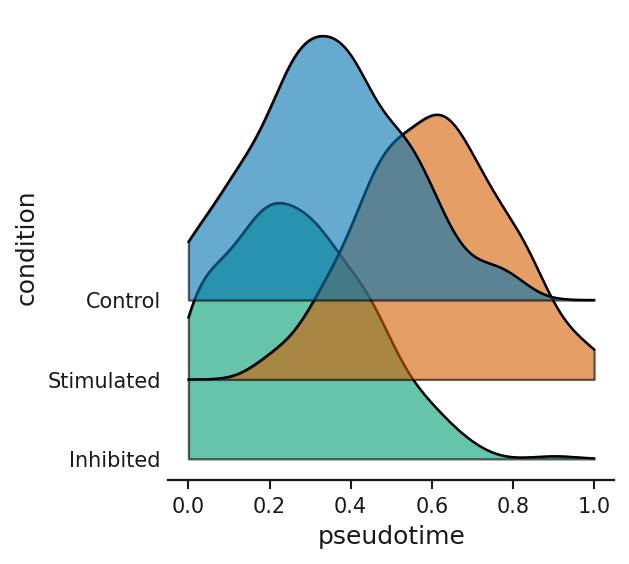

### Histogram (binned distribution)

*Registry key:* `histogram_distribution`

**Purpose:** Binned counts of one measurement, one panel per group or overlaid, bars and/or a frequency polygon.  
**When to use:** distribution shape when modes, gaps and tails matter — bins never smooth

**Required / optional input:** one table with the roles below; the bundled example has columns `cell_id`, `group`, `replicate`, `measurement`.

**Column mapping:** `x`, `group`, `value_columns` (multi-select); example mapping `{"x": "measurement", "group": "group"}`.

**Statistics supported:** no on-figure statistical annotation (the Statistics panel still runs for the mapped columns where a test applies).

**Colour controls:** Publication palette (publication / colorblind_safe / high_contrast / grayscale).

**Annotation controls:** manual annotation layer via PlotSpec.

**Axis controls:** title, x/y labels, tick angles, label/title padding, margins (layout engine), marker size, line width.

**Legend / colorbar controls:** legend location (inside/outside), legend size.

**Plot-specific controls (visual, carried in a style preset):** `panel_mode` — Arrangement, `draw_style` — Draw as, `normalize` — Y axis shows, `cumulative` — Cumulative, `show_mean` — Mark the mean, `show_median` — Mark the median, `bar_alpha` — Fill opacity, `log_y` — Logarithmic Y axis, `share_axes` — Panels share both axes, `x_tick_rotation` — X-axis label angle.  
**Analytical / data-dependent options (full preset only):** `input_form` — Input form, `bins` — Number of bins, `bin_width` — Bin width, `x_min` — X-axis minimum, `x_max` — X-axis maximum, `y_min` — Y-axis minimum, `y_max` — Y-axis maximum.

**Recommended export:** SVG or PDF for vector; PNG/TIFF at 300–600 dpi for raster.

**Figure preset support:** style and full presets (verified in the registry-wide preset QC).

**Example data:** `examples/by_plot_type/histogram/` (synthetic).

**Known limitations:** Bins are shared across groups by design; an overlay of raw counts with unequal group sizes warns you to use percent..

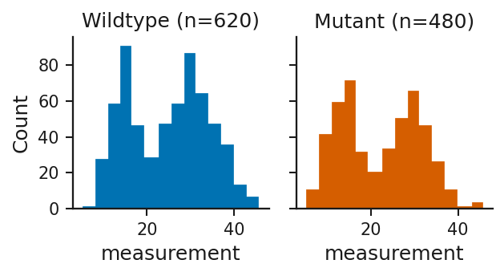

### Enrichment dot plot

*Registry key:* `enrichment_dotplot`

**Purpose:** Enriched terms ranked by enrichment, dot size = count, colour = significance.  
**When to use:** GO / pathway enrichment results

**Required / optional input:** one table with the roles below; the bundled example has columns `term`, `category`, `gene_ratio`, `gene_count`, `fdr`, `neg_log10_fdr`.

**Column mapping:** `y`, `x`, `size`, `color`; example mapping `{"y": "term", "x": "gene_ratio", "size": "gene_count", "color": "neg_log10_fdr"}`.

**Statistics supported:** no on-figure statistical annotation (the Statistics panel still runs for the mapped columns where a test applies).

**Colour controls:** Publication palette (publication / colorblind_safe / high_contrast / grayscale); continuous colormap (sequential/diverging from the palette; `colormap` option where present).

**Annotation controls:** manual annotation layer via PlotSpec.

**Axis controls:** title, x/y labels, tick angles, label/title padding, margins (layout engine).

**Legend / colorbar controls:** legend location (inside/outside), legend size; colorbar location / pad / size.

**Plot-specific controls (visual, carried in a style preset):** none.  
**Analytical / data-dependent options (full preset only):** `top_n` — Top N terms.

**Recommended export:** SVG or PDF for vector; PNG/TIFF at 300–600 dpi for raster.

**Figure preset support:** style and full presets (verified in the registry-wide preset QC).

**Example data:** `examples/by_plot_type/enrichment/` (synthetic).

**Known limitations:** none specific beyond the general limitations in Part XXV.

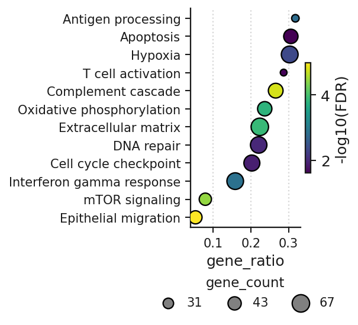

### Kaplan-Meier survival curve

*Registry key:* `kaplan_meier_survival_curve`

**Purpose:** Survival probability over time per group, from subject-level events or a precomputed curve.  
**When to use:** time-to-event data

**Required / optional input:** one table with the roles below; the bundled example has columns `sample_id`, `group`, `time_months`, `event`, `censor_reason`.

**Column mapping:** `time`, `event`, `group`, `survival_columns` (multi-select); example mapping `{"time": "time_months", "event": "event", "group": "group"}`.

**Statistics supported:** yes — log-rank / Cox in a corner panel (subject-level input only).

**Colour controls:** Publication palette (publication / colorblind_safe / high_contrast / grayscale).

**Annotation controls:** manual annotation layer via PlotSpec; statistical annotation (stars / p / effect).

**Axis controls:** title, x/y labels, tick angles, label/title padding, margins (layout engine), line width.

**Legend / colorbar controls:** legend location (inside/outside), legend size.

**Plot-specific controls (visual, carried in a style preset):** `y_scale` — Y-axis scale, `reference_line` — Reference line (y-axis units, blank for none), `curve_style` — Curve style (line: precomputed curves only), `y_ticks` — Y ticks.  
**Analytical / data-dependent options (full preset only):** `input_form` — Input form, `x_min` — X-axis minimum (blank for auto), `x_max` — X-axis maximum (blank for auto).

**Recommended export:** SVG or PDF for vector; PNG/TIFF at 300–600 dpi for raster.

**Figure preset support:** style and full presets (verified in the registry-wide preset QC).

**Example data:** `examples/by_plot_type/kaplan_meier/` (synthetic).

**Known limitations:** A precomputed curve cannot yield a log-rank test (no numbers at risk); the app refuses rather than invents one..

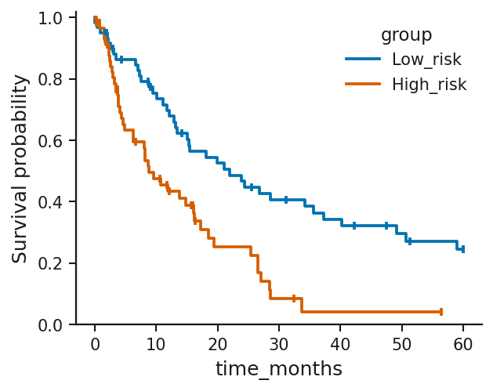

### Stacked composition bar plot

*Registry key:* `stacked_bar_composition`

**Purpose:** Composition of categories within each x as stacked bars (counts or proportions).  
**When to use:** cell-type or class composition per sample

**Required / optional input:** one table with the roles below; the bundled example has columns `sample_id`, `group`, `cell_type`, `fraction`.

**Column mapping:** `x`, `stack`, `y`, `facet_or_sort_by`; example mapping `{"x": "sample_id", "stack": "cell_type", "y": "fraction", "facet_or_sort_by": "group"}`.

**Statistics supported:** yes — chi-square / Fisher in a corner panel.

**Colour controls:** Publication palette (publication / colorblind_safe / high_contrast / grayscale).

**Annotation controls:** manual annotation layer via PlotSpec; statistical annotation (stars / p / effect).

**Axis controls:** title, x/y labels, tick angles, label/title padding, margins (layout engine).

**Legend / colorbar controls:** legend location (inside/outside), legend size.

**Plot-specific controls (visual, carried in a style preset):** `x_tick_rotation` — X-axis label angle.  
**Analytical / data-dependent options (full preset only):** none.

**Recommended export:** SVG or PDF for vector; PNG/TIFF at 300–600 dpi for raster.

**Figure preset support:** style and full presets (verified in the registry-wide preset QC).

**Example data:** `examples/by_plot_type/stacked/` (synthetic).

**Known limitations:** none specific beyond the general limitations in Part XXV.

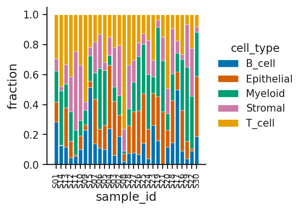

### Waterfall plot

*Registry key:* `waterfall_plot`

**Purpose:** Sorted per-subject responses as bars around zero.  
**When to use:** best response per patient, screen hits

**Required / optional input:** one table with the roles below; the bundled example has columns `patient_id`, `treatment_arm`, `best_percent_change`, `response_category`, `duration_months`.

**Column mapping:** `x`, `y`, `color`; example mapping `{"x": "patient_id", "y": "best_percent_change", "color": "response_category"}`.

**Statistics supported:** no on-figure statistical annotation (the Statistics panel still runs for the mapped columns where a test applies).

**Colour controls:** Publication palette (publication / colorblind_safe / high_contrast / grayscale).

**Annotation controls:** manual annotation layer via PlotSpec.

**Axis controls:** title, x/y labels, tick angles, label/title padding, margins (layout engine).

**Legend / colorbar controls:** legend location (inside/outside), legend size.

**Plot-specific controls (visual, carried in a style preset):** `sort` — Sort.  
**Analytical / data-dependent options (full preset only):** none.

**Recommended export:** SVG or PDF for vector; PNG/TIFF at 300–600 dpi for raster.

**Figure preset support:** style and full presets (verified in the registry-wide preset QC).

**Example data:** `examples/by_plot_type/waterfall/` (synthetic).

**Known limitations:** none specific beyond the general limitations in Part XXV.

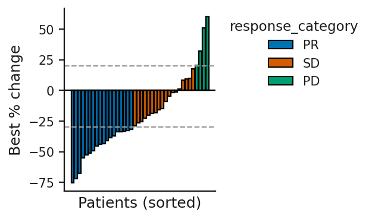

### PCA scatter (matrix + metadata)

*Registry key:* `pca_scatter_from_matrix`

**Purpose:** Principal-component scores of samples from a matrix, coloured and shaped from a metadata table.  
**When to use:** sample structure, batch effects, outliers

**Required / optional input:** one table with the roles below; the bundled example has columns `gene`, `S01`, `S02`, `S03`, `S04`, `S05`, `S06`, `S07` ….

**Column mapping:** `matrix_row_id`; example mapping `{"matrix_row_id": "gene"}` — plus PCA metadata roles `color`, `shape` from the metadata table.

**Statistics supported:** no on-figure statistical annotation (the Statistics panel still runs for the mapped columns where a test applies).

**Colour controls:** Publication palette (publication / colorblind_safe / high_contrast / grayscale).

**Annotation controls:** manual annotation layer via PlotSpec.

**Axis controls:** title, x/y labels, tick angles, label/title padding, margins (layout engine), marker size.

**Legend / colorbar controls:** legend location (inside/outside), legend size.

**Plot-specific controls (visual, carried in a style preset):** none.  
**Analytical / data-dependent options (full preset only):** none.

**Recommended export:** SVG or PDF for vector; PNG/TIFF at 300–600 dpi for raster.

**Figure preset support:** style and full presets (verified in the registry-wide preset QC).

**Example data:** `examples/by_plot_type/pca/` (synthetic).

**Known limitations:** none specific beyond the general limitations in Part XXV.

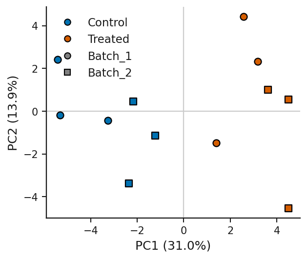

### Oncoprint mutation heatmap

*Registry key:* `oncoprint_mutation_heatmap`

**Purpose:** Samples × genes grid of alteration classes.  
**When to use:** mutation / alteration matrices in long form

**Required / optional input:** one table with the roles below; the bundled example has columns `patient_id`, `gene`, `alteration_type`, `variant_annotation`, `variant_allele_fraction`.

**Column mapping:** `sample`, `row`, `fill`; example mapping `{"sample": "patient_id", "row": "gene", "fill": "alteration_type"}`.

**Statistics supported:** no on-figure statistical annotation (the Statistics panel still runs for the mapped columns where a test applies).

**Colour controls:** Publication palette (publication / colorblind_safe / high_contrast / grayscale).

**Annotation controls:** manual annotation layer via PlotSpec.

**Axis controls:** title, x/y labels, tick angles, label/title padding, margins (layout engine).

**Legend / colorbar controls:** legend location (inside/outside), legend size.

**Plot-specific controls (visual, carried in a style preset):** `show_sample_labels` — Show sample labels (auto: <= 12 samples).  
**Analytical / data-dependent options (full preset only):** `order` — Row / column order.

**Recommended export:** SVG or PDF for vector; PNG/TIFF at 300–600 dpi for raster.

**Figure preset support:** style and full presets (verified in the registry-wide preset QC).

**Example data:** `examples/by_plot_type/oncoprint/` (synthetic).

**Known limitations:** none specific beyond the general limitations in Part XXV.

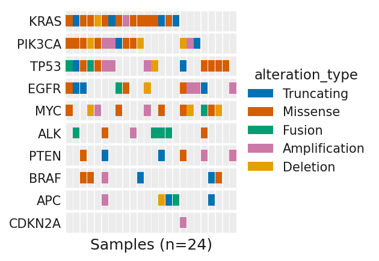

### Lollipop mutation plot

*Registry key:* `lollipop_mutation_plot`

**Purpose:** Positions along a protein with lollipops sized by count and coloured by class.  
**When to use:** mutation positions along a sequence

**Required / optional input:** one table with the roles below; the bundled example has columns `gene`, `protein_position`, `amino_acid_change`, `mutation_type`, `sample_count`, `domain`.

**Column mapping:** `x`, `y`, `color`, `label`; example mapping `{"x": "protein_position", "y": "sample_count", "color": "mutation_type", "label": "amino_acid_change"}`.

**Statistics supported:** no on-figure statistical annotation (the Statistics panel still runs for the mapped columns where a test applies).

**Colour controls:** Publication palette (publication / colorblind_safe / high_contrast / grayscale).

**Annotation controls:** manual annotation layer via PlotSpec.

**Axis controls:** title, x/y labels, tick angles, label/title padding, margins (layout engine), line width.

**Legend / colorbar controls:** legend location (inside/outside), legend size.

**Plot-specific controls (visual, carried in a style preset):** `show_labels` — Show mutation labels, `legend_loc` — Legend position, `marker_scale` — Marker scale, `y_margin` — Top y-margin, `label_font_size` — Label font size (0=auto).  
**Analytical / data-dependent options (full preset only):** `label_top_n` — Label top N mutations.

**Recommended export:** SVG or PDF for vector; PNG/TIFF at 300–600 dpi for raster.

**Figure preset support:** style and full presets (verified in the registry-wide preset QC).

**Example data:** `examples/by_plot_type/lollipop/` (synthetic).

**Known limitations:** none specific beyond the general limitations in Part XXV.

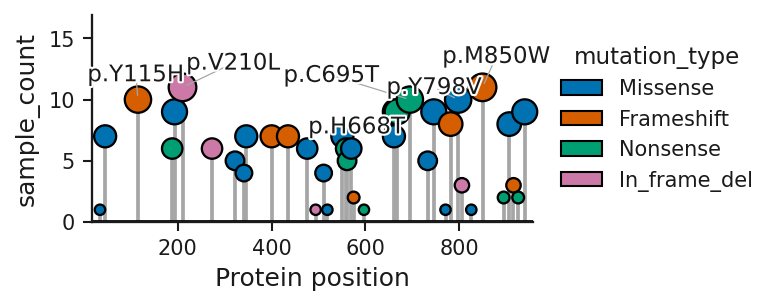

### ROC curve

*Registry key:* `roc_curve`

**Purpose:** True- vs false-positive rate for one or two scores with AUC.  
**When to use:** classifier or biomarker evaluation

**Required / optional input:** one table with the roles below; the bundled example has columns `sample_id`, `true_label`, `score_model_a`, `score_model_b`, `cohort`.

**Column mapping:** `label`, `score`, `score2`; example mapping `{"label": "true_label", "score": "score_model_a", "score2": "score_model_b"}`.

**Statistics supported:** no on-figure statistical annotation (the Statistics panel still runs for the mapped columns where a test applies).

**Colour controls:** Publication palette (publication / colorblind_safe / high_contrast / grayscale).

**Annotation controls:** manual annotation layer via PlotSpec.

**Axis controls:** title, x/y labels, tick angles, label/title padding, margins (layout engine), line width.

**Legend / colorbar controls:** legend location (inside/outside), legend size.

**Plot-specific controls (visual, carried in a style preset):** none.  
**Analytical / data-dependent options (full preset only):** none.

**Recommended export:** SVG or PDF for vector; PNG/TIFF at 300–600 dpi for raster.

**Figure preset support:** style and full presets (verified in the registry-wide preset QC).

**Example data:** `examples/by_plot_type/roc/` (synthetic).

**Known limitations:** none specific beyond the general limitations in Part XXV.

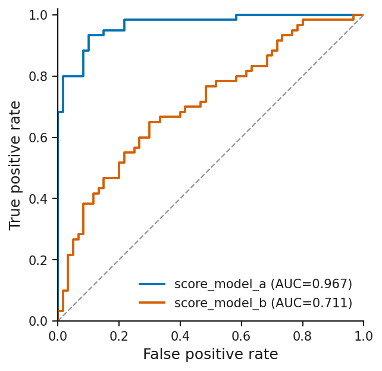

### Forest plot

*Registry key:* `forest_plot`

**Purpose:** Point estimates with confidence intervals per row and a reference line.  
**When to use:** hazard/odds ratios, subgroup effects, meta-analysis

**Required / optional input:** one table with the roles below; the bundled example has columns `study`, `subgroup`, `hazard_ratio`, `ci_low`, `ci_high`, `p_value`, `n`.

**Column mapping:** `label`, `estimate`, `lower`, `upper`; example mapping `{"label": "subgroup", "estimate": "hazard_ratio", "lower": "ci_low", "upper": "ci_high"}`.

**Statistics supported:** no on-figure statistical annotation (the Statistics panel still runs for the mapped columns where a test applies).

**Colour controls:** Publication palette (publication / colorblind_safe / high_contrast / grayscale).

**Annotation controls:** manual annotation layer via PlotSpec.

**Axis controls:** title, x/y labels, tick angles, label/title padding, margins (layout engine), line width.

**Legend / colorbar controls:** no legend drawn.

**Plot-specific controls (visual, carried in a style preset):** `reference` — Reference line, `log_scale` — Log x-axis.  
**Analytical / data-dependent options (full preset only):** none.

**Recommended export:** SVG or PDF for vector; PNG/TIFF at 300–600 dpi for raster.

**Figure preset support:** style and full presets (verified in the registry-wide preset QC).

**Example data:** `examples/by_plot_type/forest/` (synthetic).

**Known limitations:** none specific beyond the general limitations in Part XXV.

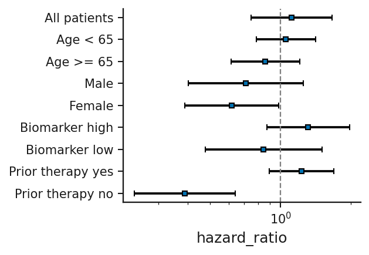

### Dot / strip plot

*Registry key:* `dot_strip_plot`

**Purpose:** Every observation per category with a summary marker.  
**When to use:** small-n replicate data

**Required / optional input:** one table with the roles below; the bundled example has columns `group`, `value`, `cohort`.

**Column mapping:** `x`, `y`, `color`; example mapping `{"x": "group", "y": "value"}`.

**Statistics supported:** no on-figure statistical annotation (the Statistics panel still runs for the mapped columns where a test applies).

**Colour controls:** Publication palette (publication / colorblind_safe / high_contrast / grayscale).

**Annotation controls:** manual annotation layer via PlotSpec.

**Axis controls:** title, x/y labels, tick angles, label/title padding, margins (layout engine), marker size, line width.

**Legend / colorbar controls:** legend location (inside/outside), legend size.

**Plot-specific controls (visual, carried in a style preset):** `summary` — Summary overlay, `jitter` — Jitter points, `x_tick_rotation` — X-axis label angle.  
**Analytical / data-dependent options (full preset only):** none.

**Recommended export:** SVG or PDF for vector; PNG/TIFF at 300–600 dpi for raster.

**Figure preset support:** style and full presets (verified in the registry-wide preset QC).

**Example data:** `examples/by_plot_type/dot_strip/` (synthetic).

**Known limitations:** none specific beyond the general limitations in Part XXV.

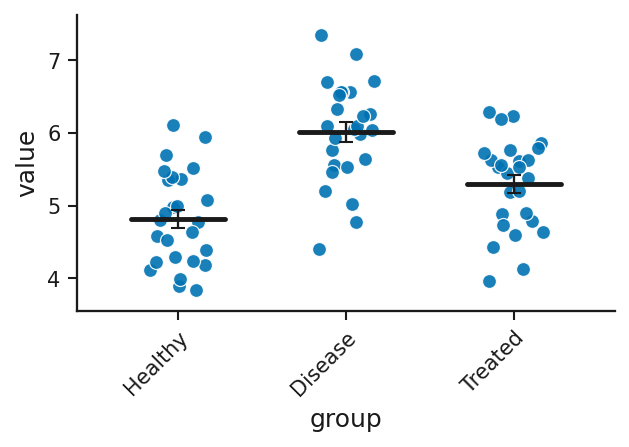

### Beeswarm plot

*Registry key:* `beeswarm_plot`

**Purpose:** Every observation per category, spread to avoid overlap.  
**When to use:** small- to medium-n distributions

**Required / optional input:** one table with the roles below; the bundled example has columns `group`, `value`, `sex`.

**Column mapping:** `x`, `y`, `color`; example mapping `{"x": "group", "y": "value"}`.

**Statistics supported:** no on-figure statistical annotation (the Statistics panel still runs for the mapped columns where a test applies).

**Colour controls:** Publication palette (publication / colorblind_safe / high_contrast / grayscale).

**Annotation controls:** manual annotation layer via PlotSpec.

**Axis controls:** title, x/y labels, tick angles, label/title padding, margins (layout engine), marker size, line width.

**Legend / colorbar controls:** legend location (inside/outside), legend size.

**Plot-specific controls (visual, carried in a style preset):** `summary` — Summary overlay, `x_tick_rotation` — X-axis label angle.  
**Analytical / data-dependent options (full preset only):** none.

**Recommended export:** SVG or PDF for vector; PNG/TIFF at 300–600 dpi for raster.

**Figure preset support:** style and full presets (verified in the registry-wide preset QC).

**Example data:** `examples/by_plot_type/beeswarm/` (synthetic).

**Known limitations:** none specific beyond the general limitations in Part XXV.

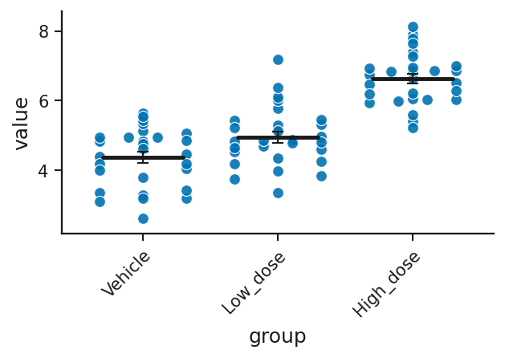

### Paired dot plot / slopegraph

*Registry key:* `paired_slopegraph`

**Purpose:** Each subject's paired values joined by a line across conditions.  
**When to use:** before/after or matched designs

**Required / optional input:** one table with the roles below; the bundled example has columns `subject`, `condition`, `value`, `arm`.

**Column mapping:** `subject`, `condition`, `value`, `color`; example mapping `{"subject": "subject", "condition": "condition", "value": "value"}`.

**Statistics supported:** no on-figure statistical annotation (the Statistics panel still runs for the mapped columns where a test applies).

**Colour controls:** Publication palette (publication / colorblind_safe / high_contrast / grayscale); plot options: `point_color`, `line_color`.

**Annotation controls:** manual annotation layer via PlotSpec.

**Axis controls:** title, x/y labels, tick angles, label/title padding, margins (layout engine), marker size, line width.

**Legend / colorbar controls:** legend location (inside/outside), legend size.

**Plot-specific controls (visual, carried in a style preset):** `point_color` — Point color, `line_color` — Line color, `point_size` — Point size, `line_width` — Line width, `line_alpha` — Line alpha.  
**Analytical / data-dependent options (full preset only):** none.

**Recommended export:** SVG or PDF for vector; PNG/TIFF at 300–600 dpi for raster.

**Figure preset support:** style and full presets (verified in the registry-wide preset QC).

**Example data:** `examples/by_plot_type/paired_slope/` (synthetic).

**Known limitations:** none specific beyond the general limitations in Part XXV.

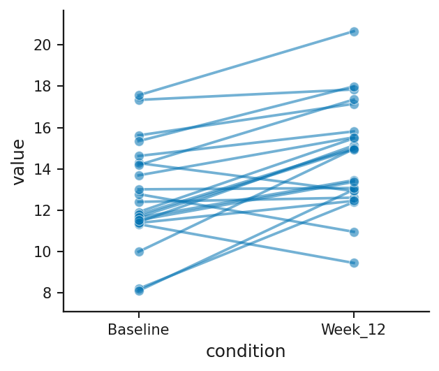

### Raincloud plot

*Registry key:* `raincloud_plot`

**Purpose:** Half-violin, box and jittered points per category.  
**When to use:** distribution + summary + raw data in one

**Required / optional input:** one table with the roles below; the bundled example has columns `group`, `value`, `batch`.

**Column mapping:** `x`, `y`; example mapping `{"x": "group", "y": "value"}`.

**Statistics supported:** no on-figure statistical annotation (the Statistics panel still runs for the mapped columns where a test applies).

**Colour controls:** Publication palette (publication / colorblind_safe / high_contrast / grayscale).

**Annotation controls:** manual annotation layer via PlotSpec.

**Axis controls:** title, x/y labels, tick angles, label/title padding, margins (layout engine), marker size, line width.

**Legend / colorbar controls:** no legend drawn.

**Plot-specific controls (visual, carried in a style preset):** `x_tick_rotation` — X-axis label angle.  
**Analytical / data-dependent options (full preset only):** none.

**Recommended export:** SVG or PDF for vector; PNG/TIFF at 300–600 dpi for raster.

**Figure preset support:** style and full presets (verified in the registry-wide preset QC).

**Example data:** `examples/by_plot_type/raincloud/` (synthetic).

**Known limitations:** none specific beyond the general limitations in Part XXV.

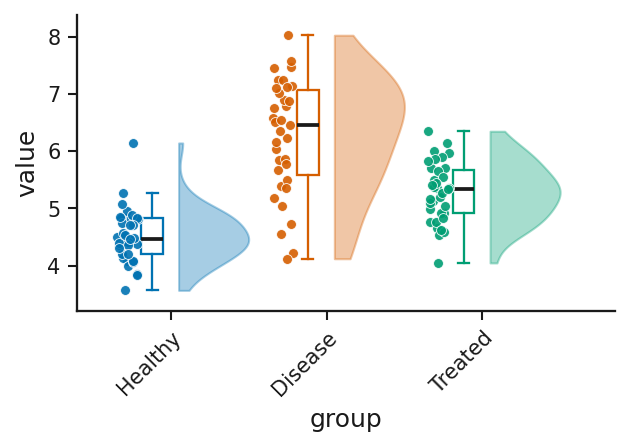

### Hierarchical clustering dendrogram

*Registry key:* `hierarchical_dendrogram`

**Purpose:** Tree of hierarchical clustering of the matrix rows or columns.  
**When to use:** similarity structure among samples or features

**Required / optional input:** one table with the roles below; the bundled example has columns `gene`, `Tumor_1`, `Tumor_2`, `Tumor_3`, `Tumor_4`, `Tumor_5`, `Normal_1`, `Normal_2` ….

**Column mapping:** `row_id`; example mapping `{"row_id": "gene"}`.

**Statistics supported:** no on-figure statistical annotation (the Statistics panel still runs for the mapped columns where a test applies).

**Colour controls:** Publication palette (publication / colorblind_safe / high_contrast / grayscale).

**Annotation controls:** manual annotation layer via PlotSpec.

**Axis controls:** title, x/y labels, tick angles, label/title padding, margins (layout engine).

**Legend / colorbar controls:** no legend drawn.

**Plot-specific controls (visual, carried in a style preset):** `orientation` — Orientation.  
**Analytical / data-dependent options (full preset only):** `method` — Linkage method, `cluster` — Cluster.

**Recommended export:** SVG or PDF for vector; PNG/TIFF at 300–600 dpi for raster.

**Figure preset support:** style and full presets (verified in the registry-wide preset QC).

**Example data:** `examples/by_plot_type/dendrogram/` (synthetic).

**Known limitations:** none specific beyond the general limitations in Part XXV.

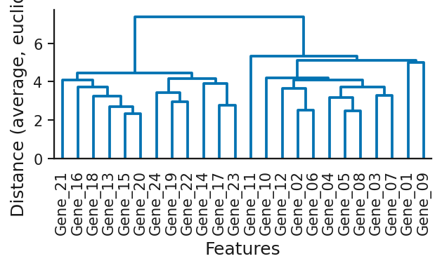

### MA plot (differential expression)

*Registry key:* `ma_plot`

**Purpose:** Log fold change against average abundance per feature.  
**When to use:** DE tables; intensity-dependent bias

**Required / optional input:** one table with the roles below; the bundled example has columns `AveExpr`, `logFC`, `adj.P.Val`, `gene`.

**Column mapping:** `x`, `y`, `p`, `label`, `id_col`; example mapping `{"x": "AveExpr", "y": "logFC", "p": "adj.P.Val", "label": "gene"}`.

**Statistics supported:** no on-figure statistical annotation (the Statistics panel still runs for the mapped columns where a test applies).

**Colour controls:** Publication palette (publication / colorblind_safe / high_contrast / grayscale); plot options: `color_ns`.

**Annotation controls:** point picking, label selection, duplicate-label policy.

**Axis controls:** title, x/y labels, tick angles, label/title padding, margins (layout engine), marker size.

**Legend / colorbar controls:** legend location (inside/outside), legend size.

**Plot-specific controls (visual, carried in a style preset):** `color_ns` — Not-significant colour, `duplicate_label_policy` — Duplicate labels, `duplicate_label_representative_rule` — Representative point, `duplicate_label_show_count` — Append (n=…) count.  
**Analytical / data-dependent options (full preset only):** `p_cutoff` — Significance cutoff, `lfc_cutoff` — |log2FC| cutoff (0 = none), `label_top_n` — Label top N hits.

**Recommended export:** SVG or PDF for vector; PNG/TIFF at 300–600 dpi for raster.

**Figure preset support:** style and full presets (verified in the registry-wide preset QC).

**Example data:** `examples/by_plot_type/ma_plot/` (synthetic).

**Known limitations:** none specific beyond the general limitations in Part XXV.

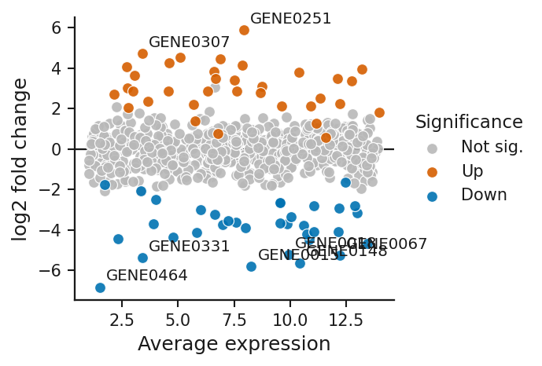

### Manhattan plot (GWAS)

*Registry key:* `manhattan_plot`

**Purpose:** −log10 p by genomic position, coloured by chromosome, with significance lines.  
**When to use:** GWAS / association results

**Required / optional input:** one table with the roles below; the bundled example has columns `chromosome`, `position`, `p_value`, `snp`.

**Column mapping:** `chrom`, `pos`, `p`, `snp`; example mapping `{"chrom": "chromosome", "pos": "position", "p": "p_value", "snp": "snp"}`.

**Statistics supported:** no on-figure statistical annotation (the Statistics panel still runs for the mapped columns where a test applies).

**Colour controls:** Publication palette (publication / colorblind_safe / high_contrast / grayscale); plot options: `cutoff_line_color`.

**Annotation controls:** manual annotation layer via PlotSpec.

**Axis controls:** title, x/y labels, tick angles, label/title padding, margins (layout engine), marker size, line width.

**Legend / colorbar controls:** legend location (inside/outside), legend size.

**Plot-specific controls (visual, carried in a style preset):** `x_tick_rotation` — X-axis label angle, `show_cutoff_line` — Genome-wide cutoff line, `cutoff_line_color` — Cutoff line color, `cutoff_line_style` — Cutoff line style, `cutoff_line_width` — Cutoff line width, `show_suggestive_line` — Suggestive line.  
**Analytical / data-dependent options (full preset only):** `genome_wide_threshold` — Cutoff threshold (p).

**Recommended export:** SVG or PDF for vector; PNG/TIFF at 300–600 dpi for raster. Heat-map cells and dense point clouds are still vector in SVG/PDF but large; PNG is often the practical choice.

**Figure preset support:** style and full presets (verified in the registry-wide preset QC).

**Example data:** `examples/by_plot_type/manhattan/` (synthetic).

**Known limitations:** none specific beyond the general limitations in Part XXV.

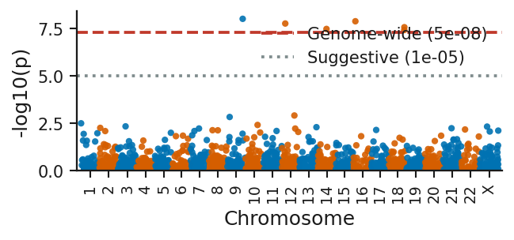

### Q-Q plot (p-value / quantile)

*Registry key:* `qq_plot`

**Purpose:** Observed vs expected p-value quantiles (or sample quantiles).  
**When to use:** checking p-value inflation or normality

**Required / optional input:** one table with the roles below; the bundled example has columns `p_value`.

**Column mapping:** `p`; example mapping `{"p": "p_value"}`.

**Statistics supported:** no on-figure statistical annotation (the Statistics panel still runs for the mapped columns where a test applies).

**Colour controls:** Publication palette (publication / colorblind_safe / high_contrast / grayscale).

**Annotation controls:** manual annotation layer via PlotSpec.

**Axis controls:** title, x/y labels, tick angles, label/title padding, margins (layout engine), marker size, line width.

**Legend / colorbar controls:** no legend drawn.

**Plot-specific controls (visual, carried in a style preset):** none.  
**Analytical / data-dependent options (full preset only):** `mode` — Mode.

**Recommended export:** SVG or PDF for vector; PNG/TIFF at 300–600 dpi for raster.

**Figure preset support:** style and full presets (verified in the registry-wide preset QC).

**Example data:** `examples/by_plot_type/qq/` (synthetic).

**Known limitations:** none specific beyond the general limitations in Part XXV.

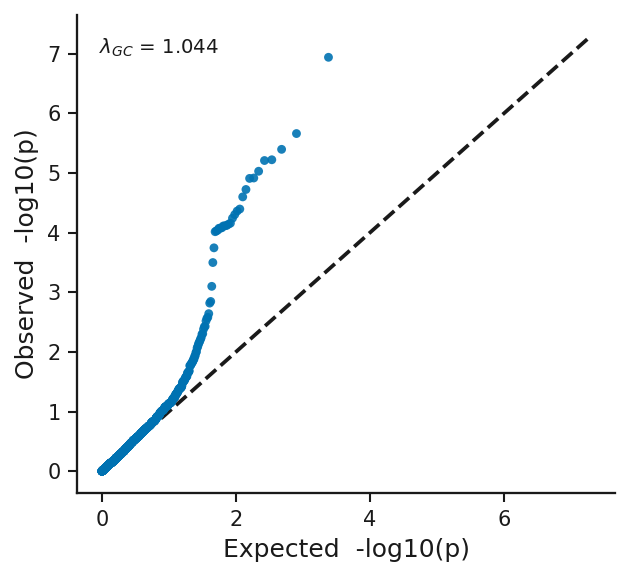

### Bland-Altman (method agreement)

*Registry key:* `bland_altman_plot`

**Purpose:** Difference vs mean of two measurement methods with bias and limits of agreement.  
**When to use:** method agreement

**Required / optional input:** one table with the roles below; the bundled example has columns `sample_id`, `device_A`, `device_B`.

**Column mapping:** `method_a`, `method_b`, `label`; example mapping `{"method_a": "device_A", "method_b": "device_B"}`.

**Statistics supported:** no on-figure statistical annotation (the Statistics panel still runs for the mapped columns where a test applies).

**Colour controls:** Publication palette (publication / colorblind_safe / high_contrast / grayscale).

**Annotation controls:** manual annotation layer via PlotSpec.

**Axis controls:** title, x/y labels, tick angles, label/title padding, margins (layout engine), marker size, line width.

**Legend / colorbar controls:** no legend drawn.

**Plot-specific controls (visual, carried in a style preset):** `show_ci` — Shade 95% CI of bias.  
**Analytical / data-dependent options (full preset only):** none.

**Recommended export:** SVG or PDF for vector; PNG/TIFF at 300–600 dpi for raster.

**Figure preset support:** style and full presets (verified in the registry-wide preset QC).

**Example data:** `examples/by_plot_type/bland_altman/` (synthetic).

**Known limitations:** none specific beyond the general limitations in Part XXV.

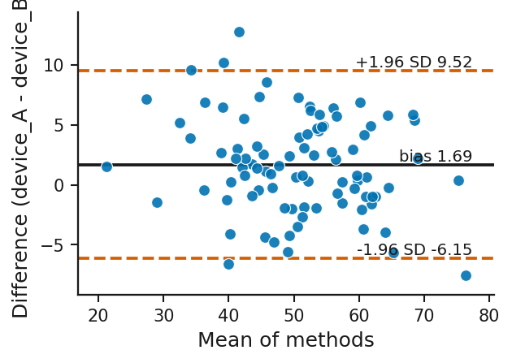

### Precision-recall curve

*Registry key:* `precision_recall_curve`

**Purpose:** Precision vs recall for one or two scores.  
**When to use:** imbalanced classification

**Required / optional input:** one table with the roles below; the bundled example has columns `sample_id`, `true_label`, `score_model_a`, `score_model_b`, `cohort`.

**Column mapping:** `label`, `score`, `score2`; example mapping `{"label": "true_label", "score": "score_model_a", "score2": "score_model_b"}`.

**Statistics supported:** no on-figure statistical annotation (the Statistics panel still runs for the mapped columns where a test applies).

**Colour controls:** Publication palette (publication / colorblind_safe / high_contrast / grayscale).

**Annotation controls:** manual annotation layer via PlotSpec.

**Axis controls:** title, x/y labels, tick angles, label/title padding, margins (layout engine), line width.

**Legend / colorbar controls:** legend location (inside/outside), legend size.

**Plot-specific controls (visual, carried in a style preset):** none.  
**Analytical / data-dependent options (full preset only):** none.

**Recommended export:** SVG or PDF for vector; PNG/TIFF at 300–600 dpi for raster.

**Figure preset support:** style and full presets (verified in the registry-wide preset QC).

**Example data:** `examples/by_plot_type/precision_recall/` (synthetic).

**Known limitations:** none specific beyond the general limitations in Part XXV.

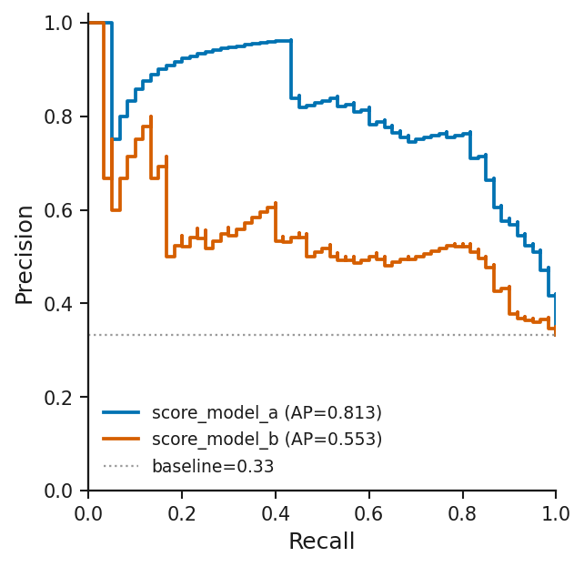

### Confusion matrix

*Registry key:* `confusion_matrix`

**Purpose:** Counts (or normalised rates) of true vs predicted classes.  
**When to use:** classifier evaluation

**Required / optional input:** one table with the roles below; the bundled example has columns `sample_id`, `true_label`, `predicted_label`.

**Column mapping:** `true`, `predicted`; example mapping `{"true": "true_label", "predicted": "predicted_label"}`.

**Statistics supported:** no on-figure statistical annotation (the Statistics panel still runs for the mapped columns where a test applies).

**Colour controls:** Publication palette (publication / colorblind_safe / high_contrast / grayscale); continuous colormap (sequential/diverging from the palette; `colormap` option where present).

**Annotation controls:** manual annotation layer via PlotSpec.

**Axis controls:** title, x/y labels, tick angles, label/title padding, margins (layout engine).

**Legend / colorbar controls:** no legend drawn; colorbar location / pad / size.

**Plot-specific controls (visual, carried in a style preset):** `normalize` — Normalize.  
**Analytical / data-dependent options (full preset only):** none.

**Recommended export:** SVG or PDF for vector; PNG/TIFF at 300–600 dpi for raster.

**Figure preset support:** style and full presets (verified in the registry-wide preset QC).

**Example data:** `examples/by_plot_type/confusion_matrix/` (synthetic).

**Known limitations:** none specific beyond the general limitations in Part XXV.

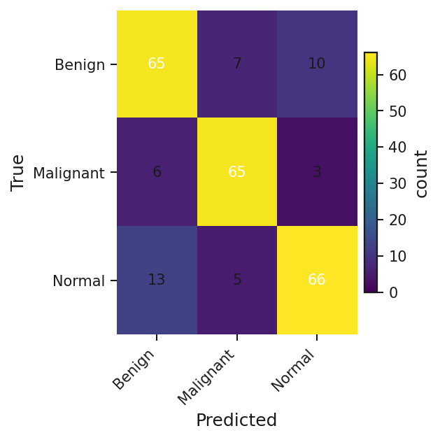

### Calibration plot

*Registry key:* `calibration_plot`

**Purpose:** Predicted probability vs observed frequency in bins.  
**When to use:** probability calibration

**Required / optional input:** one table with the roles below; the bundled example has columns `sample_id`, `true_label`, `predicted_prob`.

**Column mapping:** `label`, `prob`; example mapping `{"label": "true_label", "prob": "predicted_prob"}`.

**Statistics supported:** no on-figure statistical annotation (the Statistics panel still runs for the mapped columns where a test applies).

**Colour controls:** Publication palette (publication / colorblind_safe / high_contrast / grayscale).

**Annotation controls:** manual annotation layer via PlotSpec.

**Axis controls:** title, x/y labels, tick angles, label/title padding, margins (layout engine), marker size, line width.

**Legend / colorbar controls:** legend location (inside/outside), legend size.

**Plot-specific controls (visual, carried in a style preset):** none.  
**Analytical / data-dependent options (full preset only):** `n_bins` — Number of bins.

**Recommended export:** SVG or PDF for vector; PNG/TIFF at 300–600 dpi for raster.

**Figure preset support:** style and full presets (verified in the registry-wide preset QC).

**Example data:** `examples/by_plot_type/calibration/` (synthetic).

**Known limitations:** none specific beyond the general limitations in Part XXV.

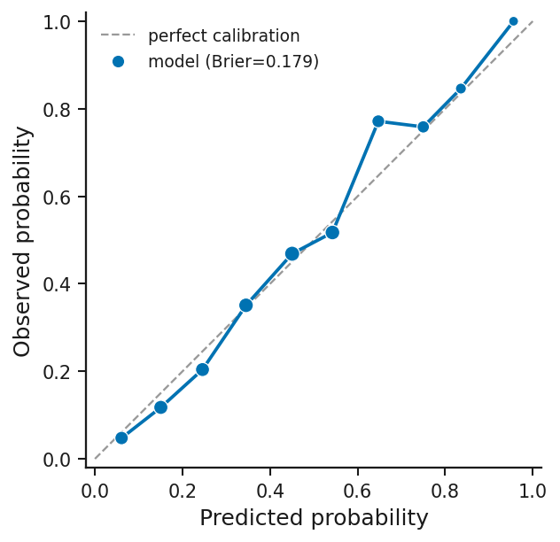

### Dose-response curve

*Registry key:* `dose_response_curve`

**Purpose:** Response vs dose per group with an optional four-parameter logistic fit.  
**When to use:** IC50/EC50-style experiments

**Required / optional input:** one table with the roles below; the bundled example has columns `drug`, `concentration_uM`, `viability_pct`.

**Column mapping:** `dose`, `response`, `group`; example mapping `{"dose": "concentration_uM", "response": "viability_pct", "group": "drug"}`.

**Statistics supported:** no on-figure statistical annotation (the Statistics panel still runs for the mapped columns where a test applies).

**Colour controls:** Publication palette (publication / colorblind_safe / high_contrast / grayscale).

**Annotation controls:** manual annotation layer via PlotSpec.

**Axis controls:** title, x/y labels, tick angles, label/title padding, margins (layout engine), marker size, line width.

**Legend / colorbar controls:** legend location (inside/outside), legend size.

**Plot-specific controls (visual, carried in a style preset):** none.  
**Analytical / data-dependent options (full preset only):** `fit` — Fit 4PL curve.

**Recommended export:** SVG or PDF for vector; PNG/TIFF at 300–600 dpi for raster.

**Figure preset support:** style and full presets (verified in the registry-wide preset QC).

**Example data:** `examples/by_plot_type/dose_response/` (synthetic).

**Known limitations:** The 4PL fit is a display fit; report parameters from a dedicated tool for inference..

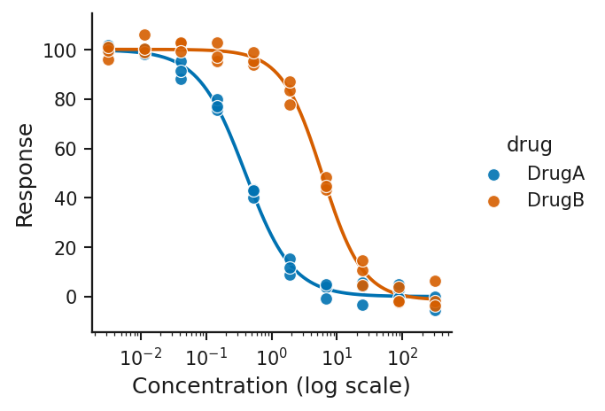

### UpSet plot (set intersections)

*Registry key:* `upset_plot`

**Purpose:** Set intersections as a matrix with intersection-size bars.  
**When to use:** overlaps among several sets

**Required / optional input:** one table with the roles below; the bundled example has columns `gene`, `DEG_up`, `DEG_down`, `Promoter_peak`, `Conserved`.

**Column mapping:**  — set columns are given as the `sets` list.

**Statistics supported:** no on-figure statistical annotation (the Statistics panel still runs for the mapped columns where a test applies).

**Colour controls:** Publication palette (publication / colorblind_safe / high_contrast / grayscale).

**Annotation controls:** manual annotation layer via PlotSpec.

**Axis controls:** title, x/y labels, tick angles, label/title padding, margins (layout engine), marker size, line width.

**Legend / colorbar controls:** no legend drawn.

**Plot-specific controls (visual, carried in a style preset):** none.  
**Analytical / data-dependent options (full preset only):** none.

**Recommended export:** SVG or PDF for vector; PNG/TIFF at 300–600 dpi for raster.

**Figure preset support:** style and full presets (verified in the registry-wide preset QC).

**Example data:** `examples/by_plot_type/upset/` (synthetic).

**Known limitations:** none specific beyond the general limitations in Part XXV.

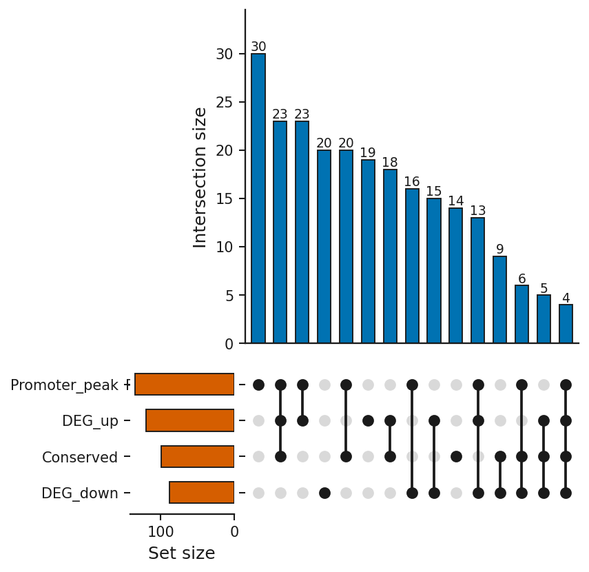

### Swimmer plot

*Registry key:* `swimmer_plot`

**Purpose:** One horizontal bar per subject with events marked along time.  
**When to use:** treatment timelines

**Required / optional input:** one table with the roles below; the bundled example has columns `patient_id`, `start_month`, `end_month`, `duration_month`, `response`, `event_type`.

**Column mapping:** `subject`, `start`, `end`, `duration`, `event`, `group`; example mapping `{"subject": "patient_id", "start": "start_month", "end": "end_month", "event": "event_type", "group": "response"}`.

**Statistics supported:** no on-figure statistical annotation (the Statistics panel still runs for the mapped columns where a test applies).

**Colour controls:** Publication palette (publication / colorblind_safe / high_contrast / grayscale).

**Annotation controls:** manual annotation layer via PlotSpec.

**Axis controls:** title, x/y labels, tick angles, label/title padding, margins (layout engine), marker size.

**Legend / colorbar controls:** legend location (inside/outside), legend size.

**Plot-specific controls (visual, carried in a style preset):** `right_pad_frac` — Right-side headroom.  
**Analytical / data-dependent options (full preset only):** none.

**Recommended export:** SVG or PDF for vector; PNG/TIFF at 300–600 dpi for raster.

**Figure preset support:** style and full presets (verified in the registry-wide preset QC).

**Example data:** `examples/by_plot_type/swimmer/` (synthetic).

**Known limitations:** none specific beyond the general limitations in Part XXV.

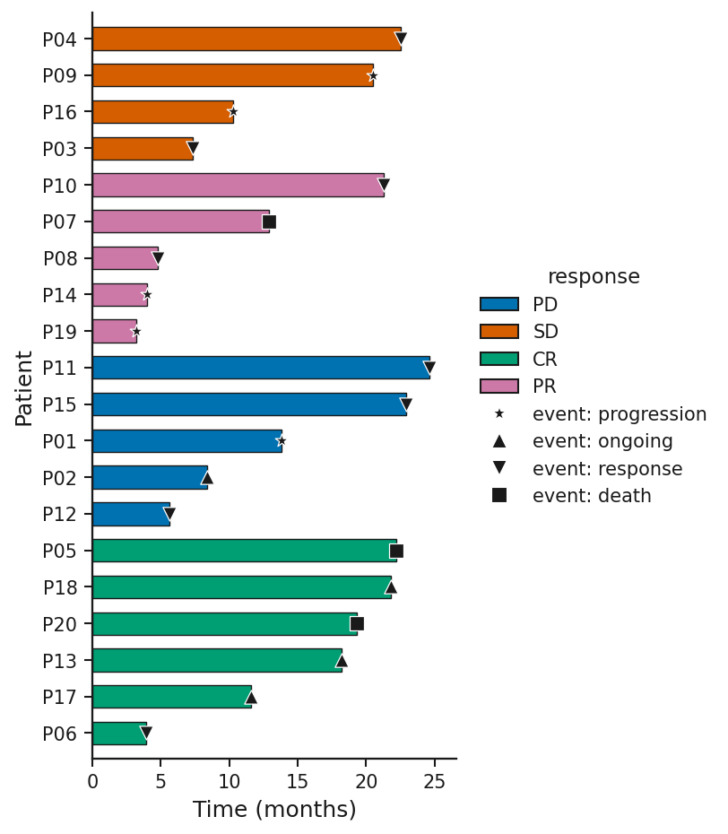

### Spider plot (longitudinal change)

*Registry key:* `spider_plot`

**Purpose:** Change from baseline per subject over time.  
**When to use:** longitudinal response

**Required / optional input:** one table with the roles below; the bundled example has columns `patient_id`, `week`, `pct_change`, `arm`.

**Column mapping:** `subject`, `time`, `value`, `group`; example mapping `{"subject": "patient_id", "time": "week", "value": "pct_change", "group": "arm"}`.

**Statistics supported:** no on-figure statistical annotation (the Statistics panel still runs for the mapped columns where a test applies).

**Colour controls:** Publication palette (publication / colorblind_safe / high_contrast / grayscale).

**Annotation controls:** manual annotation layer via PlotSpec.

**Axis controls:** title, x/y labels, tick angles, label/title padding, margins (layout engine), marker size, line width.

**Legend / colorbar controls:** legend location (inside/outside), legend size.

**Plot-specific controls (visual, carried in a style preset):** `reference` — Reference line (y).  
**Analytical / data-dependent options (full preset only):** none.

**Recommended export:** SVG or PDF for vector; PNG/TIFF at 300–600 dpi for raster.

**Figure preset support:** style and full presets (verified in the registry-wide preset QC).

**Example data:** `examples/by_plot_type/spider/` (synthetic).

**Known limitations:** none specific beyond the general limitations in Part XXV.

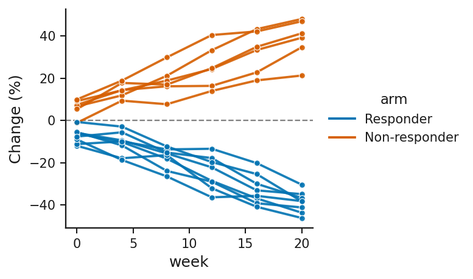

### Sankey / alluvial flow (two-stage)

*Registry key:* `sankey_plot`

**Purpose:** Flows between two stages as proportional bands.  
**When to use:** transitions, allocations

**Required / optional input:** one table with the roles below; the bundled example has columns `baseline_response`, `outcome`, `n_patients`.

**Column mapping:** `source`, `target`, `value`; example mapping `{"source": "baseline_response", "target": "outcome", "value": "n_patients"}`.

**Statistics supported:** no on-figure statistical annotation (the Statistics panel still runs for the mapped columns where a test applies).

**Colour controls:** Publication palette (publication / colorblind_safe / high_contrast / grayscale).

**Annotation controls:** manual annotation layer via PlotSpec.

**Axis controls:** title, x/y labels, tick angles, label/title padding, margins (layout engine).

**Legend / colorbar controls:** no legend drawn.

**Plot-specific controls (visual, carried in a style preset):** none.  
**Analytical / data-dependent options (full preset only):** none.

**Recommended export:** SVG or PDF for vector; PNG/TIFF at 300–600 dpi for raster.

**Figure preset support:** style and full presets (verified in the registry-wide preset QC).

**Example data:** `examples/by_plot_type/sankey/` (synthetic).

**Known limitations:** none specific beyond the general limitations in Part XXV.

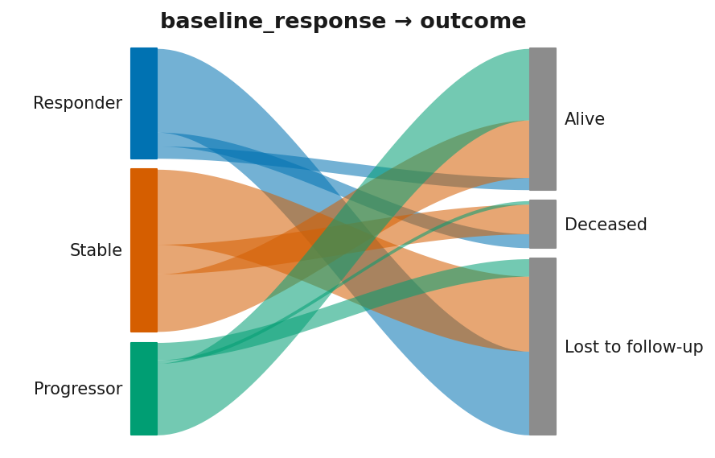

### UMAP / t-SNE embedding scatter

*Registry key:* `embedding_scatter`

**Purpose:** Precomputed 2-D embedding coordinates coloured by a label or a continuous value.  
**When to use:** UMAP / t-SNE results computed elsewhere

**Required / optional input:** one table with the roles below; the bundled example has columns `UMAP_1`, `UMAP_2`, `cell_type`, `batch`, `n_genes`.

**Column mapping:** `x`, `y`, `color`, `shape`, `label`; example mapping `{"x": "UMAP_1", "y": "UMAP_2", "color": "cell_type"}`.

**Statistics supported:** no on-figure statistical annotation (the Statistics panel still runs for the mapped columns where a test applies).

**Colour controls:** Publication palette (publication / colorblind_safe / high_contrast / grayscale); continuous colormap (sequential/diverging from the palette; `colormap` option where present).

**Annotation controls:** point picking, label selection, duplicate-label policy.

**Axis controls:** title, x/y labels, tick angles, label/title padding, margins (layout engine), marker size.

**Legend / colorbar controls:** legend location (inside/outside), legend size; colorbar location / pad / size.

**Plot-specific controls (visual, carried in a style preset):** none.  
**Analytical / data-dependent options (full preset only):** none.

**Recommended export:** SVG or PDF for vector; PNG/TIFF at 300–600 dpi for raster. Heat-map cells and dense point clouds are still vector in SVG/PDF but large; PNG is often the practical choice.

**Figure preset support:** style and full presets (verified in the registry-wide preset QC).

**Example data:** `examples/by_plot_type/embedding/` (synthetic).

**Known limitations:** Coordinates must be precomputed; the app does not run UMAP or t-SNE..

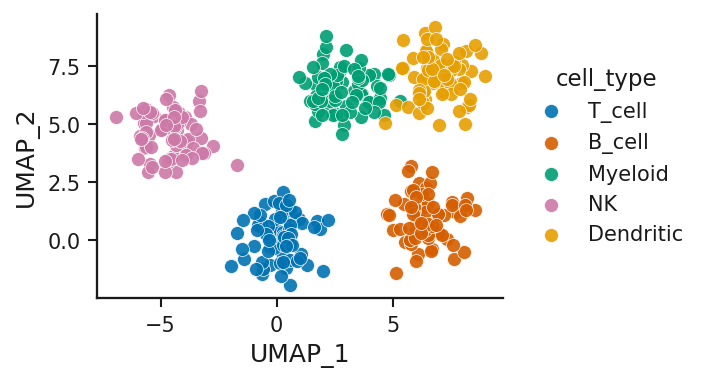

### Hierarchical clustering (heatmap + clusters)

*Registry key:* `hierarchical_clustering`

**Purpose:** Clustered heatmap with k clusters marked and a dendrogram.  
**When to use:** grouping features/samples into k clusters

**Required / optional input:** one table with the roles below; the bundled example has columns `gene`, `Ctrl_1`, `Ctrl_2`, `Ctrl_3`, `Ctrl_4`, `TreatA_1`, `TreatA_2`, `TreatA_3` ….

**Column mapping:** `row_id`; example mapping `{"row_id": "gene"}`.

**Statistics supported:** no on-figure statistical annotation (the Statistics panel still runs for the mapped columns where a test applies).

**Colour controls:** Publication palette (publication / colorblind_safe / high_contrast / grayscale); continuous colormap (sequential/diverging from the palette; `colormap` option where present); plot options: `colormap`, `colorbar_location`, `colorbar_pad`, `colorbar_shrink`.

**Annotation controls:** manual annotation layer via PlotSpec.

**Axis controls:** title, x/y labels, tick angles, label/title padding, margins (layout engine).

**Legend / colorbar controls:** legend location (inside/outside), legend size; colorbar location / pad / size.

**Plot-specific controls (visual, carried in a style preset):** `colormap` — Colormap, `y_label_rotation` — Y-label angle, `cluster_legend_title` — Show cluster legend title, `show_dendrogram` — Show dendrogram tree, `colorbar_location` — Colorbar location, `colorbar_pad` — Colorbar pad, `colorbar_shrink` — Colorbar size, `row_label_fontsize` — Row label font (0=auto), `col_label_fontsize` — Column label font (0=auto), `y_label_pad` — Y-axis label padding.  
**Analytical / data-dependent options (full preset only):** `cluster` — Cluster, `k` — Number of clusters k, `scale` — Scale, `distance_metric` — Distance, `linkage_method` — Linkage, `max_features` — Max features (rows) for clustering.

**Recommended export:** SVG or PDF for vector; PNG/TIFF at 300–600 dpi for raster. Heat-map cells and dense point clouds are still vector in SVG/PDF but large; PNG is often the practical choice.

**Figure preset support:** style and full presets (verified in the registry-wide preset QC).

**Example data:** `examples/by_plot_type/hier_clustering/` (synthetic).

**Known limitations:** Rows are capped at `max_features` (default 2 000)..

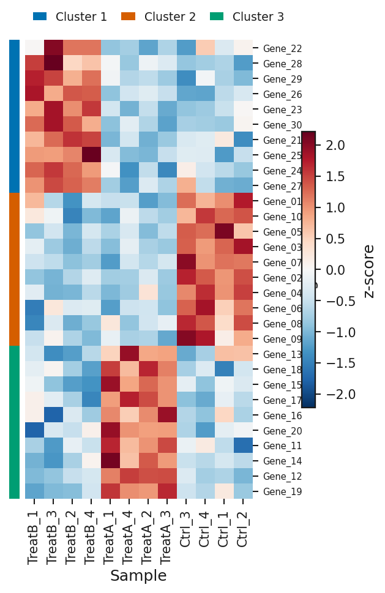

### Network graph

*Registry key:* `network_graph`

**Purpose:** Nodes and edges from an edge list with layout, community detection and colour/size mappings.  
**When to use:** interaction or correlation networks

**Required / optional input:** one table with the roles below; the bundled example has columns `source`, `target`, `weight`, `interaction_type`.

**Column mapping:** `source`, `target`, `weight`, `interaction_type`; example mapping `{"source": "source", "target": "target", "weight": "weight"}`.

**Statistics supported:** no on-figure statistical annotation (the Statistics panel still runs for the mapped columns where a test applies).

**Colour controls:** Publication palette (publication / colorblind_safe / high_contrast / grayscale); continuous colormap (sequential/diverging from the palette; `colormap` option where present); plot options: `color_by`, `node_color`, `node_cmap`, `edge_color_by`, `edge_color`, `edge_color_positive`, `edge_color_negative`, `label_color`.

**Annotation controls:** manual annotation layer via PlotSpec.

**Axis controls:** title, x/y labels, tick angles, label/title padding, margins (layout engine).

**Legend / colorbar controls:** legend location (inside/outside), legend size; colorbar location / pad / size.

**Plot-specific controls (visual, carried in a style preset):** `layout` — Layout, `node_color` — Node color (when 'none'), `node_cmap` — Node colormap (when 'value'), `node_size` — Fixed node size (when 'fixed'), `edge_color` — Edge color (single), `edge_color_positive` — Edge color +corr, `edge_color_negative` — Edge color -corr, `edge_width` — Fixed edge width (when 'fixed'), `node_labels` — Show node labels, `label_color` — Label color, `label_font_size` — Label font size (0=auto), `show_legend` — Show legend (grouped).  
**Analytical / data-dependent options (full preset only):** `seed` — Layout seed, `color_by` — Color nodes by, `size_by` — Size nodes by, `edge_color_by` — Color edges by category, `edge_width_by` — Edge width by, `min_weight` — Min edge weight, `corr_cutoff` — |correlation| cutoff, `top_n_edges` — Top N edges (0=all), `min_degree` — Min node degree, `remove_isolates` — Remove isolated nodes, `detect_communities` — Detect communities (heuristic).

**Recommended export:** SVG or PDF for vector; PNG/TIFF at 300–600 dpi for raster.

**Figure preset support:** style and full presets (verified in the registry-wide preset QC).

**Example data:** `examples/by_plot_type/network/` (synthetic).

**Known limitations:** Layouts with a random component are reproducible only with the `seed` option; large networks are slow..

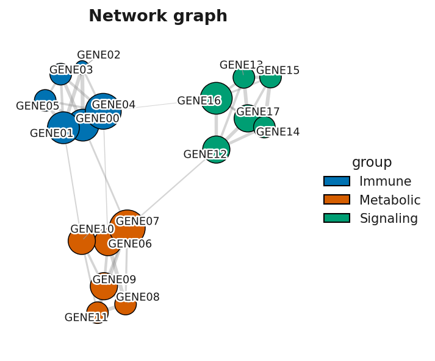
