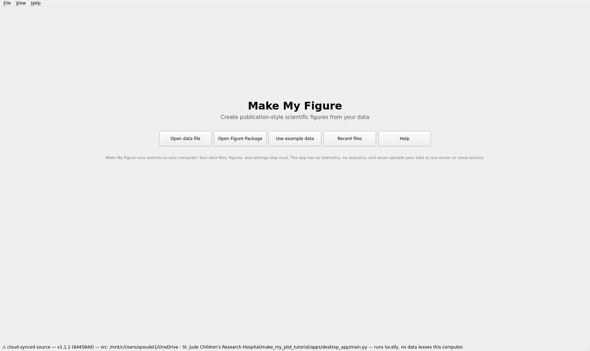
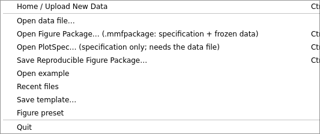
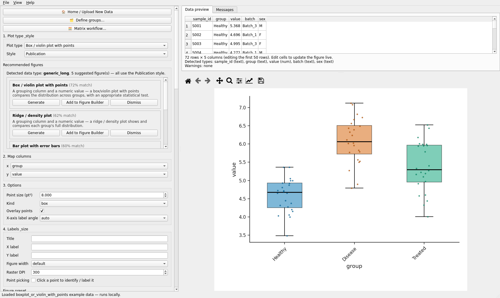
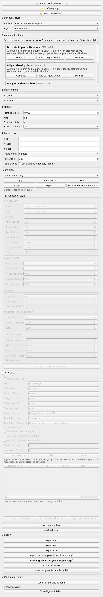
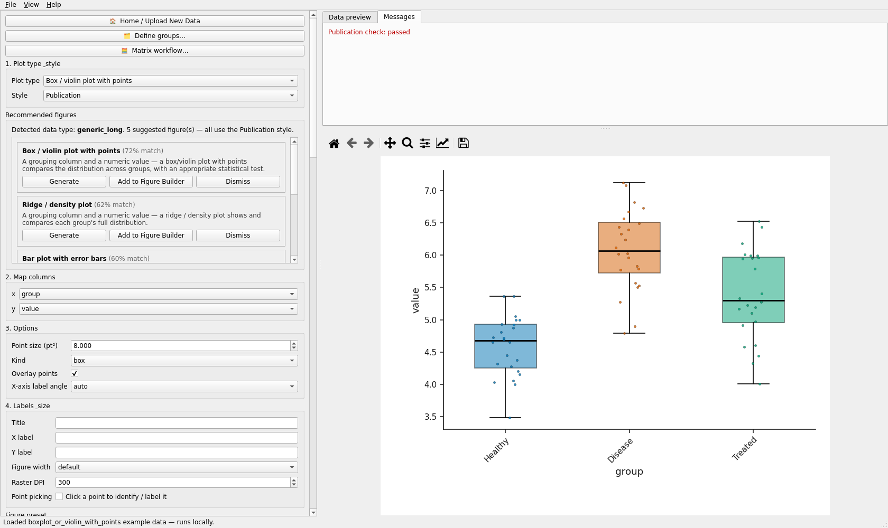

# Getting started with the desktop application

Validated run: `automation/tutorials/getting_started.py`. Screenshots: `screenshots/getting_started/`.

## Launch

* Installed application: start **Make My Figure** from the Start menu (Windows), Applications
  (macOS) or the AppImage / binary (Linux).
* From source, in the repository folder: `python -m apps.desktop_app.main`.

The window title is **Make My Figure**. Everything runs on your computer; no data are sent
anywhere (the start screen says so, and the status bar repeats "runs locally" after each load).

## The start screen

Five buttons in one row:

| button | what it does |
|---|---|
| **Open data file** | choose a `.csv`, `.tsv` or `.xlsx` table (multi-sheet workbooks ask which sheet) |
| **Open Figure Package** | reopen a `.mmfpackage` file: specification plus frozen data, verified before drawing |
| **Use example data** | pick one of the bundled synthetic examples, one per plot type |
| **Recent files** | tables and packages opened before |
| **Help** | the Help window with tabs *Plot types*, *Files & reproducibility*, *Format your data*, *Privacy*, *Publication style disclaimer* |

You can also drag a file onto the window at any time.

## Menus

* **File**: Home / Upload New Data - Open data file... - Open Figure Package... (.mmfpackage:
  specification + frozen data) - Open PlotSpec... (specification only; needs the data file) -
  Save Reproducible Figure Package... - Open example (submenu, one entry per plot type) -
  Recent files - Save template... - Figure preset (submenu) - Quit.
* **View**: Reset Layout - Maximize Figure Panel - Show Data Preview - Pop Out Figure - Pop Out
  Data Table - Pop Out Controls - Dock All Panels.
* **Help**: Help... - About Make My Figure - Copy debug info - Diagnose toolbar.

## The main layout, once a table is open

Load an example (*File > Open example > Box / violin plot with points*) to see the workspace.

Left: a scrolling **control column**, top to bottom:

1. three buttons - **Home / Upload New Data**, **Define groups...**, **Matrix workflow...**
2. **Worksheet** (only for Excel workbooks with several sheets)
3. **1. Plot type & style** - the *Plot type* list (39 plot types) and *Style* (Publication)
4. **Recommended figures** - cards proposed from the table's column types
5. **2. Map columns** - one row per role of the chosen plot type; each row is a drop-down of your columns
6. **3. Options** - the plot type's own switches and numbers
7. **4. Labels & size** - Title, X label, Y label, Figure width (default / single / onehalf / double), Raster DPI, Point picking
8. **Figure preset** - Apply, Save preset..., Delete, Import..., Export..., Reset to Publication defaults
9. **5. Publication style** - ① Figure margins, ② Typography, ③ Axes & labels, ④ Legend, ⑤ Colorbar
10. **6. Statistics** - a switchable panel (tick the box in its title to enable it)
11. **Update preview** and **Publication QC**
12. **5. Export** - Export SVG / PNG / PDF, Export PlotSpec JSON (specification only), **Save Figure Package (.mmfpackage)**, Export all as ZIP, Save template (example table)
13. **6. Multi-panel figure** - Save current plot as panel, Open Figure Builder...

The whole column at once: 

Right, top: two tabs - **Data preview** (the table; the first 50 rows are editable and the
figure follows edits) and **Messages** (validation text, warnings, detected DE columns).
Under the table one line states the detected type of every column.

Right, bottom: the **live figure preview** with the Matplotlib toolbar (home, back, forward,
pan, zoom, subplot settings, edit, save). The figure redraws after every change; **Update
preview** forces a redraw.

The panels can be popped out (View menu) and docked back; **View > Reset Layout** restores the
default arrangement.

## Two labels you may see slightly differently

The group titles are written "1. Plot type & style" and "4. Labels & size" in the application.
Qt treats the ampersand as a keyboard-shortcut marker, so on some platforms the title shows as
"Plot type _style" or with an underlined letter. The tutorials use the intended names.

## Next

[Your table does not need perfect column names](../01_Data_and_Column_Mapping/your_table_does_not_need_perfect_column_names.md).
