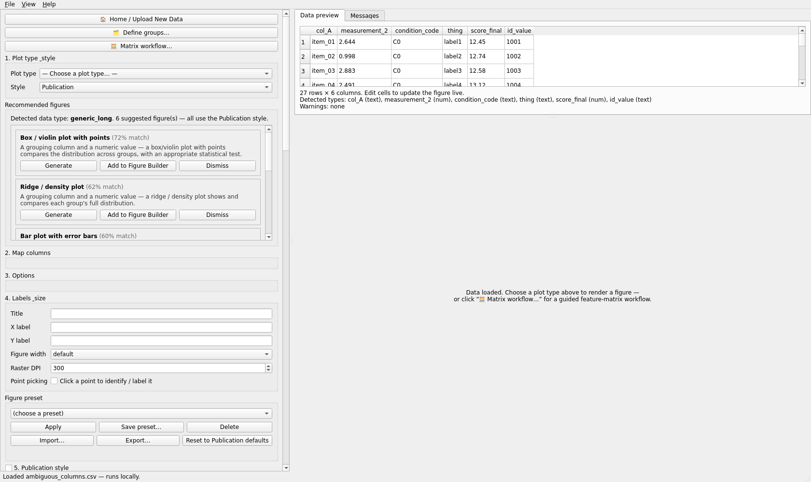
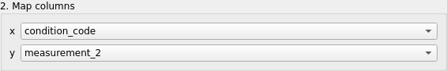
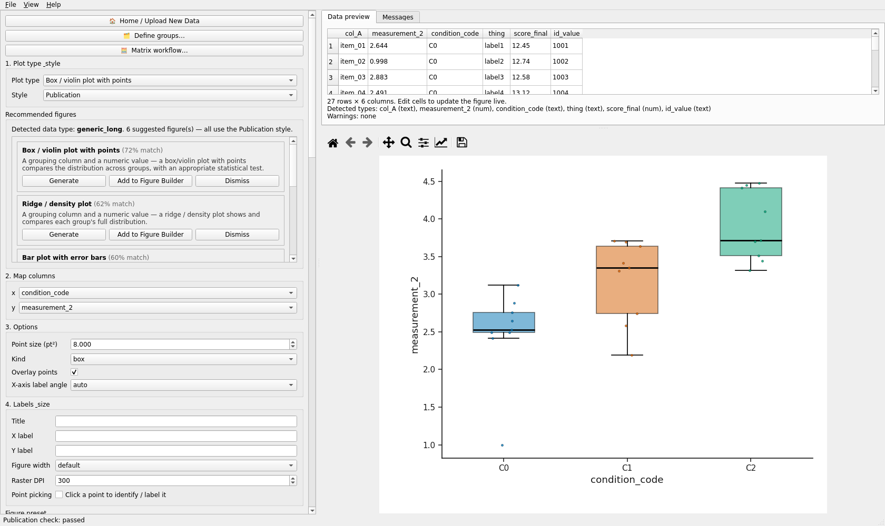
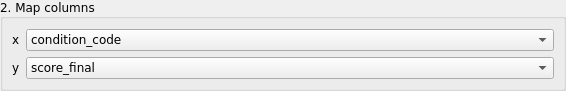
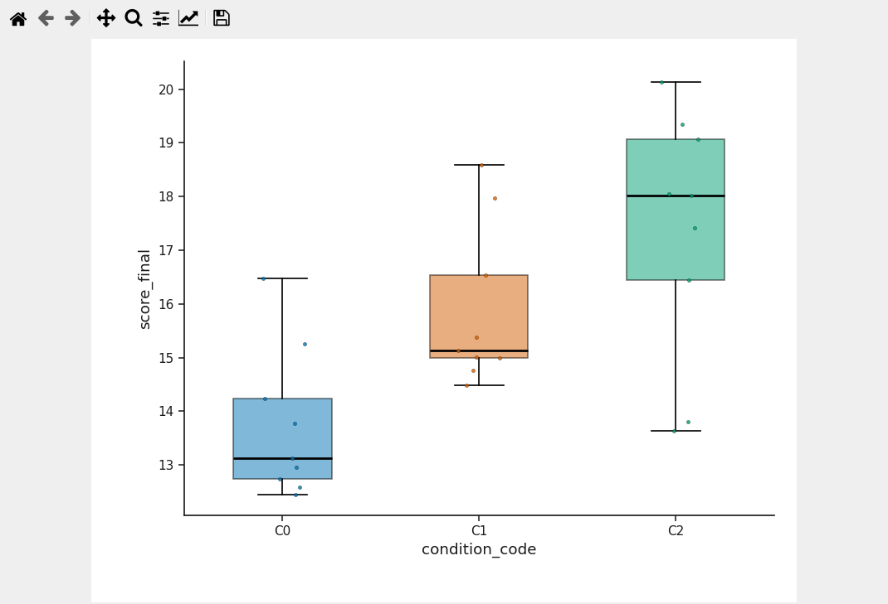
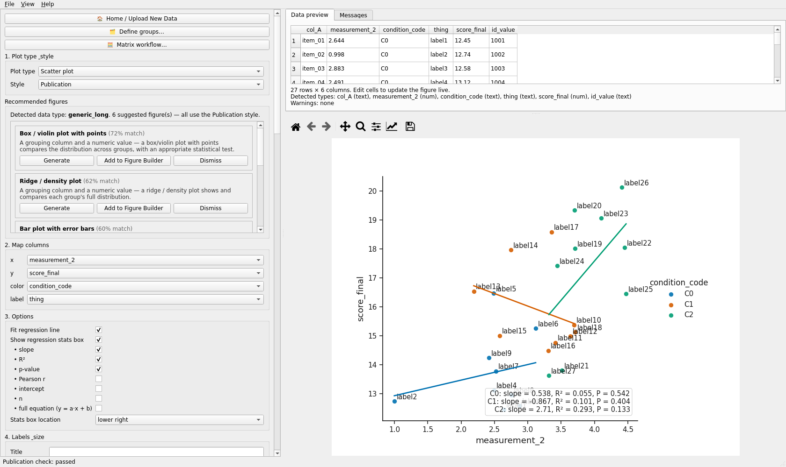
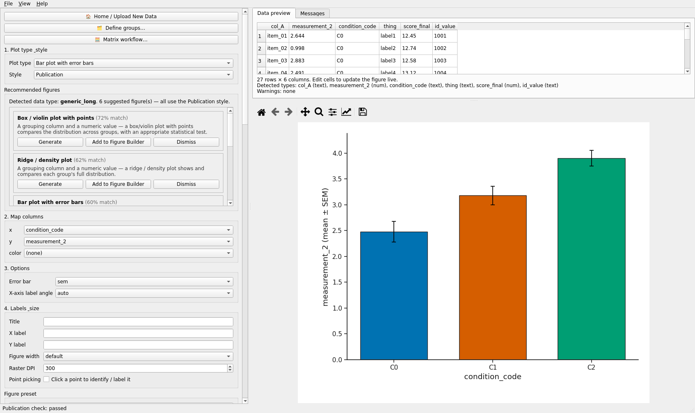
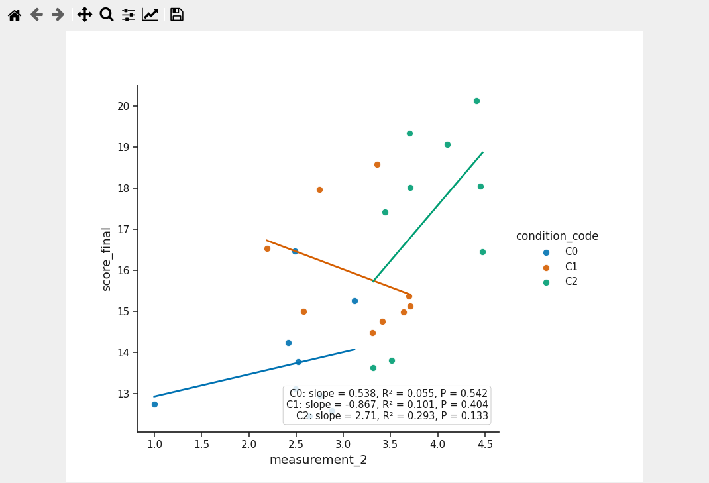

# Your table does not need perfect column names

Make My Figure reads any ordinary CSV, TSV or Excel table. It inspects the columns, proposes
which figures fit and which column should play which role, and draws a preview. None of that
is binding: under **2. Map columns** you assign any compatible column to any role, and the
figure follows. This tutorial shows the proposal, a case where it is not what you want, the
correction, and three different figures from the same file.

Validated run: `automation/tutorials/mapping_ambiguous.py` (see `audit/validation_report.md`).
Screenshots: `screenshots/mapping_ambiguous/`.

## The dataset

`datasets/ambiguous_columns.csv` - 27 rows, six deliberately unhelpful column names
(simulated data, no meaning):

| column | what it actually holds |
|---|---|
| `col_A` | an item identifier (`item_01` ...) |
| `measurement_2` | a numeric readout |
| `condition_code` | the experimental group, coded `C0`, `C1`, `C2` |
| `thing` | a short text label per row |
| `score_final` | a second numeric readout |
| `id_value` | an integer identifier (1001 ...) |

## A. Open the table and read what the application detected

1. On the start screen click **Open data file** and choose `ambiguous_columns.csv`
   (dropping the file onto the window also works).
2. The **Data preview** tab shows the table. Under it the application writes the detected
   type of every column. For this file it says:

   > Detected types: col_A (text), measurement_2 (num), condition_code (text), thing (text), score_final (num), id_value (text)

   Note that `id_value` is treated as text although it holds integers: columns whose name looks
   like an identifier are never used as measurements. This is the first place to check when a
   numeric column does not appear as a choice for a numeric role.

3. **Recommended figures** (left column) reads:

   > Detected data type: generic_long. 6 suggested figure(s) - all use the Publication style.

   with cards for *Box / violin plot with points (72% match)*, *Ridge / density plot (62%)*,
   *Bar plot with error bars (60%)* and others. Each card has **Generate**, **Add to Figure
   Builder** and **Dismiss**. These are suggestions from the column types; nothing has been
   drawn yet, and the plot type box still shows *- Choose a plot type... -*.

## B. The proposal for a group comparison

Under **1. Plot type & style** choose **Box / violin plot with points**. The application
fills **2. Map columns** with its best guess:

| row | proposed column |
|---|---|
| **x** | `condition_code` |
| **y** | `measurement_2` |

and draws the figure at once. The guess used the only three-level text column as the grouping
and the first numeric column as the value.

## C. When the proposal is not what you want

Suppose the readout you care about is `score_final`, not `measurement_2`. Open the **y**
drop-down and pick `score_final`. The preview redraws immediately (or click **Update preview**).
Nothing else changes: the grouping stays `condition_code`, the options stay as they were.

Rule: **the row label is the role; the drop-down is your column.** The names in the drop-down
are your own headers, exactly as they appear in the file. `(none)` clears an optional role.

## D. A second figure from the same table: scatter with regression

Change the plot type to **Scatter plot**. The application proposes `x = measurement_2`,
`y = score_final` (the two numeric columns, in file order) and leaves **color** and **label**
at `(none)`. Assign the remaining roles yourself:

| row | column |
|---|---|
| **x** | `measurement_2` |
| **y** | `score_final` |
| **color** | `condition_code` |
| **label** | `thing` |

The scatter now shows one regression line per group with a stats box (slope, R², P per group),
coloured by `condition_code`, with each point labelled by `thing`. **3. Options** for this plot
type offers *Fit regression line*, *Show regression stats box* and its parts (slope, R²,
p-value, Pearson r, intercept, n, full equation) and *Stats box location*.

## E. A third figure: bar plot with error bars

Choose **Bar plot with error bars**, set **x** to `condition_code` and **y** to
`measurement_2`. The **error** option defaults to `sem`; SD and 95 % CI are the other choices.

## F. Export

Under **5. Export** click **Export PNG** or **Export SVG**; the file dialog proposes a name
built from the table name and the plot type. The exported figure is exactly the preview.

## What to remember

* The application proposes; you decide. Every role is a drop-down of your own columns.
* One table, three figures. Change the plot type and re-map; nothing about the file changes.
* Identifier-looking columns (`id_value`) are typed as text on purpose. Rename such a column
  (or use a different one) if it really is a measurement.
* Nothing leaves your computer: the status bar says "runs locally".

## Common mistakes

* Reading the proposal as a verdict. It is a guess from column types; check every row.
* Expecting the drop-down to show friendly names. It shows your headers, so `measurement_2`
  stays `measurement_2` until you set an axis label under **4. Labels & size**.
* Choosing a plot type the table cannot feed. The Messages tab then says which required
  roles are missing and offers *Load ... example data*; map the missing rows instead.

Video: `VIDEO_URL_MAPPING` (see `videos/video_links.json`); script in
`video_scripts/mapping_ambiguous.md`.
