# Showing individual observations and controlling jitter

High-impact biology figures show a summary (box, violin or bar) **and** every biological
observation on top of it, with the comparison written on the figure. This chapter builds that
figure step by step on one dataset and then changes only how the observations are drawn. The
numbers never change; the presentation does.

Validated run: `automation/tutorials/observations_jitter.py` (20 checks PASS). Screenshots:
`screenshots/observations_jitter/`. Same-data renders for the contrast panels:
`showcase/1_group_comparison/` (integrity record `audit/showcase_data_integrity.csv`).

> These controls exist on the tutorial branch (presets branch merged). On the released
> application (v1.1.1 candidate) the Box / violin plot offers only *Kind*, *Point size* and
> *Overlay points*; see `audit/MISSING_SHOWCASE_CAPABILITIES.md`.

## 1. Load the group-comparison data

`datasets/showcase_group_comparison.csv` (simulated): 40 animals in four groups of unequal size.

| column | role | values |
|---|---|---|
| `group` | **x** | Control (n = 7), Treatment A (9), Treatment B (11), Treatment C (13) |
| `cytokine_pg_ml` | **y** | 7.4 to 26.1 |
| `animal_id`, `sex` | unused | M001 ..., F / M |

**Open data file** > `showcase_group_comparison.csv`. The header reads *Detected data type:
generic_long*.

## 2. Assign group and value

Choose **Box / violin plot with points**. The proposal is already `x = group`,
`y = cytokine_pg_ml`. Set *Y label* to "Cytokine (pg/ml)" and clear *X label* under
**4. Labels & size**.

## 3. The default figure

The application draws boxes with every observation on top; point size and opacity are
*adaptive* (0 means "choose from the number of observations").

**3. Options** for this plot type, as labelled in the application:

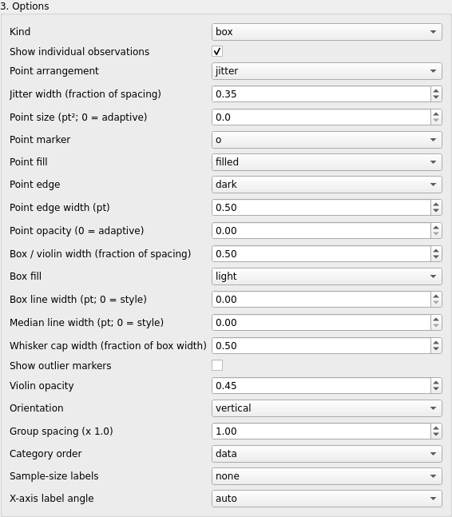

| control | choices / range | default |
|---|---|---|
| Kind | box, violin, box+violin, summary | box |
| Show individual observations | on / off | on |
| Point arrangement | jitter, centered, beeswarm | jitter |
| Jitter width (fraction of spacing) | 0 - 0.9 | 0.35 |
| Point size (pt²; 0 = adaptive) | 0 - 120 | 0 |
| Point marker | o, s, ^, D, v | o |
| Point fill | filled, open | filled |
| Point edge | dark, same, none | dark |
| Point edge width (pt) | 0 - 3 | 0.5 |
| Point opacity (0 = adaptive) | 0 - 1 | 0 |
| Box / violin width (fraction of spacing) | 0.2 - 0.9 | 0.5 |
| Box fill | light, filled, outline | light |
| Box line width, Median line width (pt; 0 = style) | 0 - 4 / 0 - 5 | 0 |
| Whisker cap width (fraction of box width) | 0 - 1 | 0.5 |
| Show outlier markers | on / off | off |
| Violin opacity | 0.05 - 1 | 0.45 |
| Orientation | vertical, horizontal | vertical |
| Group spacing (x 1.0) | 0.5 - 2 | 1.0 |
| Category order | data, alphabetical, median_ascending, median_descending | data |
| Sample-size labels | none, below, above, legend | none |
| X-axis label angle | auto, horizontal, 45, vertical | auto |

## 4. Switch the observations off and on

Untick **Show individual observations**: only the boxes remain. Tick it again.

## 5. Jitter width

*Jitter width* 0.10 packs the points into a narrow column; 0.35 (the default) spreads them
across a third of the group spacing.

| 0.10 | 0.35 |
|---|---|
| 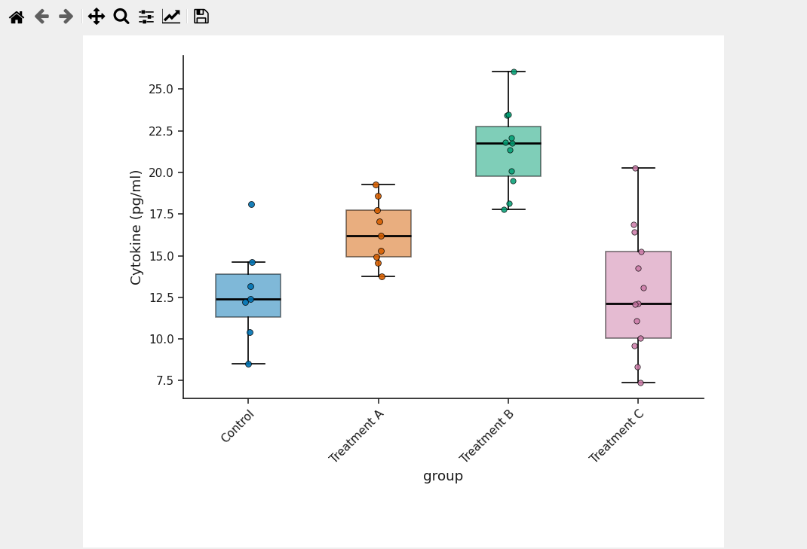 |  |

## 6. Marker size

*Point size* 60 pt² makes every animal visible from across a room. 0 lets the application
scale the size to the number of observations per group.

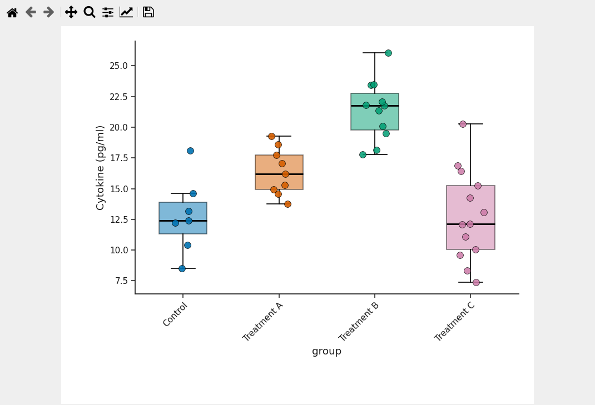

## 7. Marker style

*Point fill* open + *Point edge* same + *Point edge width* 1.2 gives open circles in the
group colour; *Point fill* filled + *Point edge* dark + 1.0 gives filled circles with a dark
rim. Both are common in published group comparisons.

| open circles | filled, dark edge |
|---|---|
| 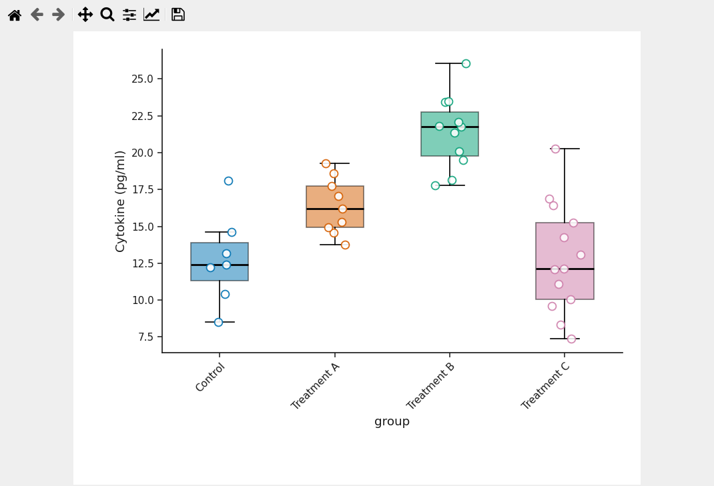 | 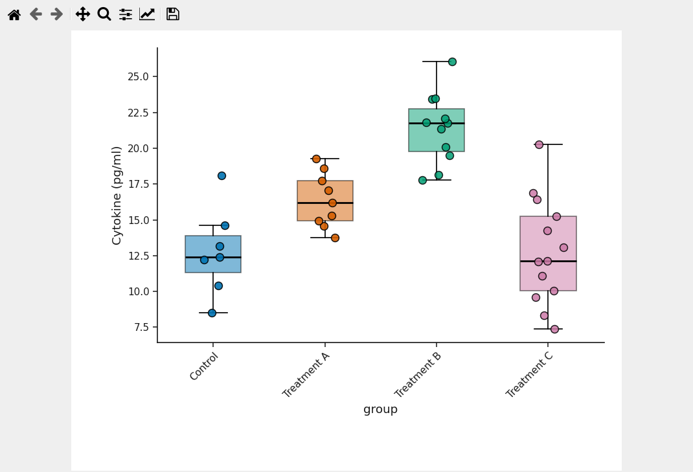 |

*Point arrangement* beeswarm places points without overlap; centered stacks them on the
group centre.

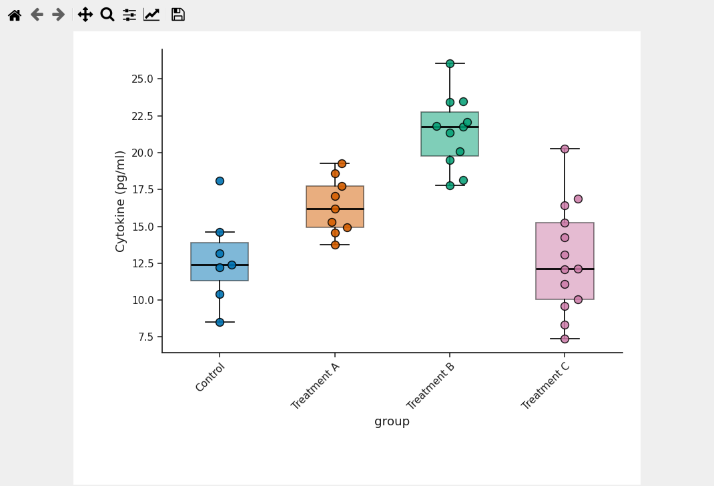

## 8. Colours, box appearance, sample sizes

Group colours come from the Publication palette (**5. Publication style**); *Box fill*
outline leaves only the box outline in the group colour, and *Sample-size labels* below
writes n under each group.

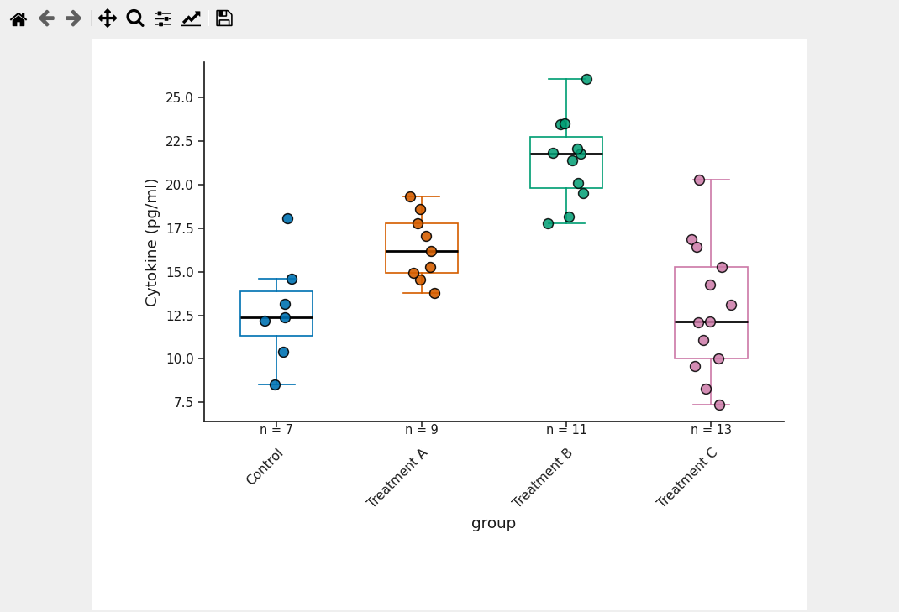

## 9. Add the statistical comparison

**6. Statistics** (tick the title box, then *Enable statistics*): Welch's t-test, *Compare all
groups (pairwise)*, *Group column* group, Holm-Bonferroni, *P-value only*, **Run statistics**.
Brackets start above the highest point or whisker of the compared groups and stack without
colliding.

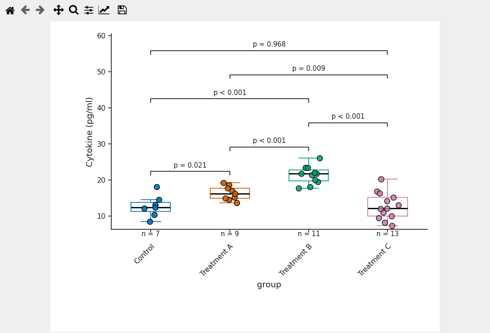

Recorded in the validated run: Control vs Treatment B adjusted P = 0.00018; Treatment A vs
Treatment B adjusted P = 0.00018; Control vs Treatment C adjusted P = 0.97.

## 10. Apply a publication preset

In **Figure preset**, tick **Show experimental presets**; the status line reads *0 presets for
this plot type. 10 experimental presets (preview required).* Select **Box + observations
(outline)** and click **Preview & apply...**. The dialog shows *Current settings* and *With this
preset* drawn on your own data, the list of settings that would change (here
`style.marker_alpha`, `mapping.point_edge_width`, `mapping.point_size`), the provenance of the
preset, and the line *Checked: no data, column role, statistical test, threshold or
transformation changes.* Click **Apply**.

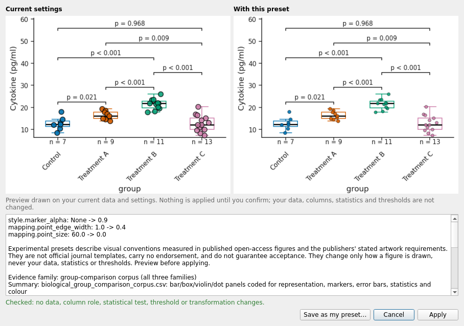

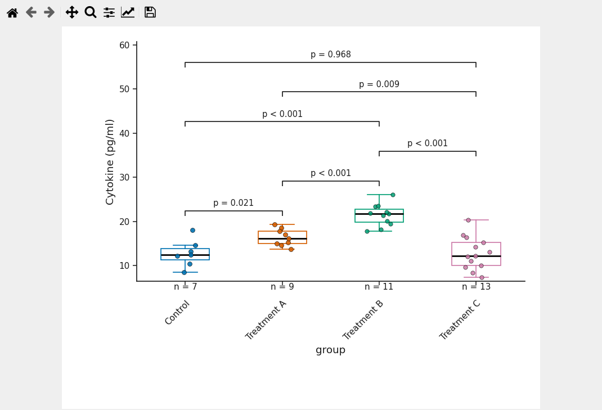

The statistics table is unchanged after the preset (checked in the run).

## 11. Keep adjusting - a preset is a starting configuration

After the preset, *Point size* 40 and *Jitter width* 0.25 are still yours to set; the preset
does not lock anything.

## 12. Export

**Export PDF**, **Export SVG**, **Export PNG** under **5. Export**.

## The same observations, six treatments (renderer output, presentation typography)

| | | |
|---|---|---|
| 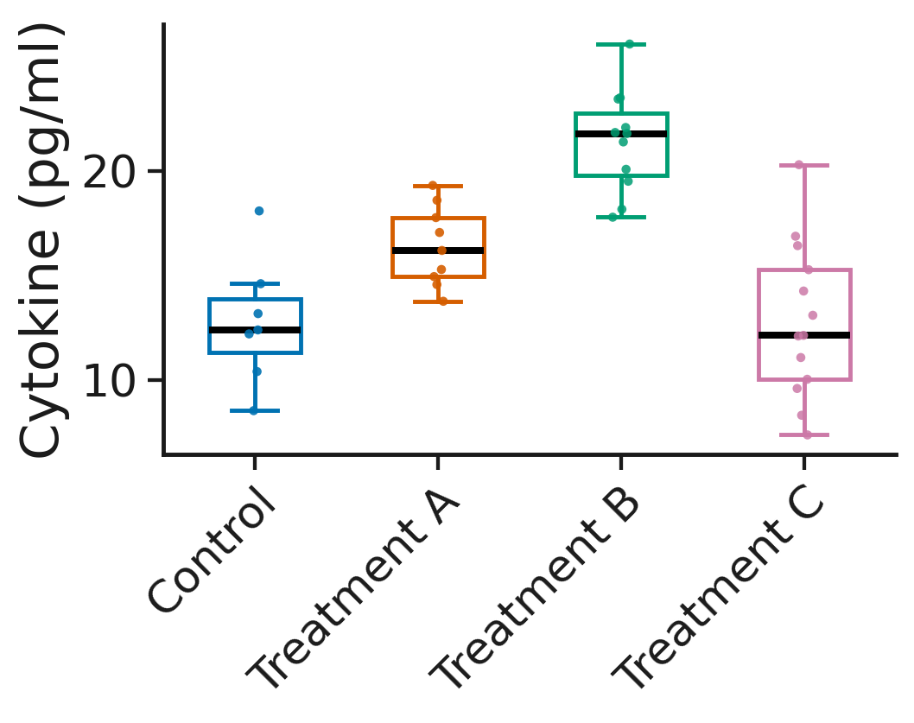 small, narrow jitter | 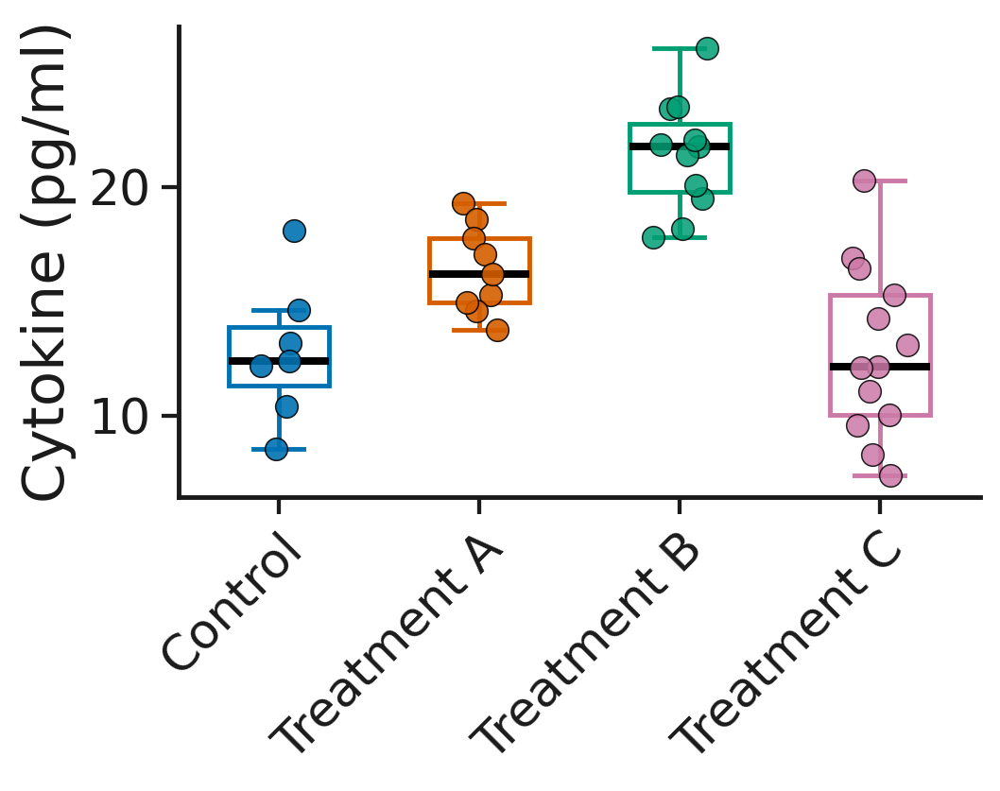 large, moderate jitter | 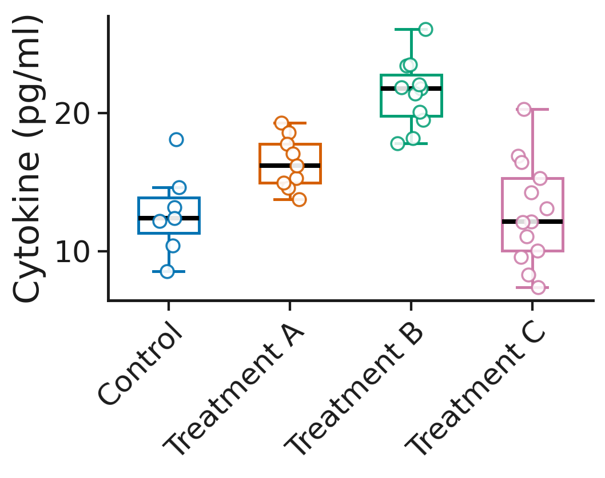 open circles |
|  filled, dark edge | 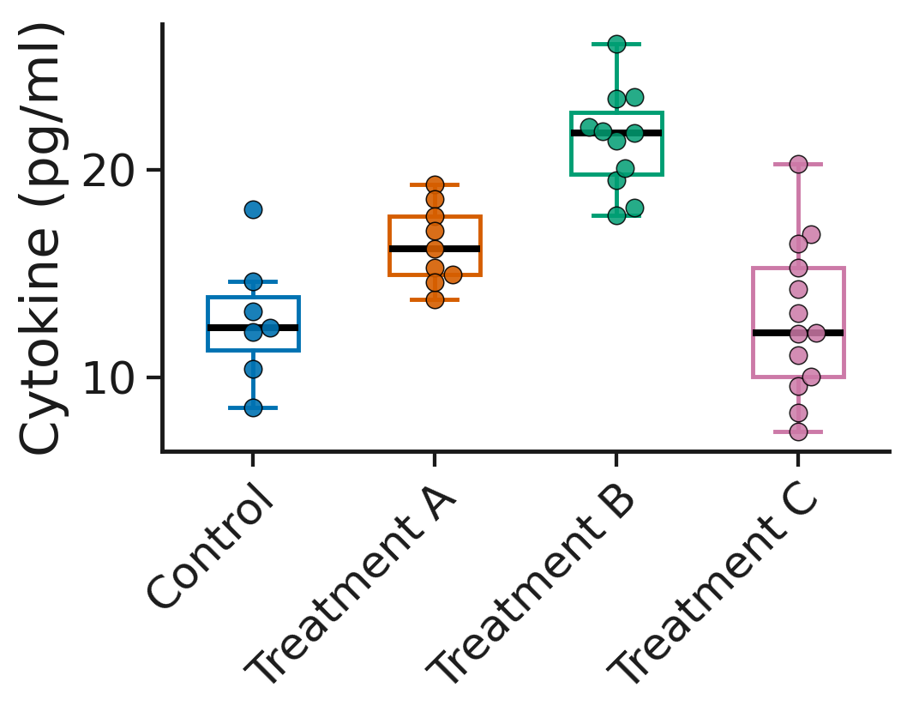 beeswarm | 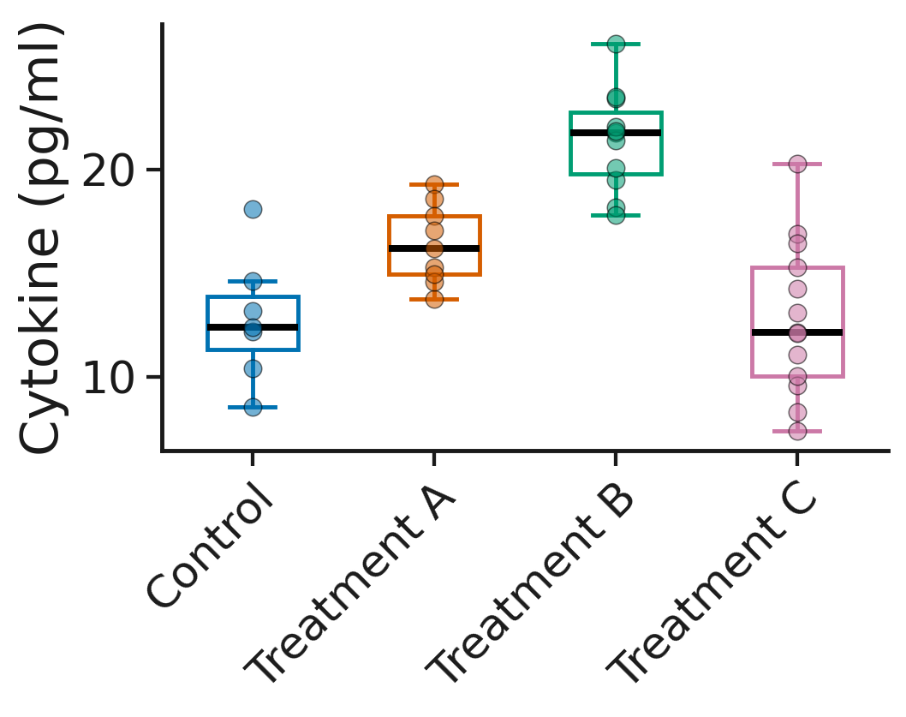 centred, no jitter, translucent |

## Common mistakes

* Reading adaptive size (0) as "no points"; it is a size chosen from n.
* Jitter wide enough that points of neighbouring groups touch; keep *Jitter width* below the
  box width.
* Hiding the underlying observations behind an opaque violin; lower *Violin opacity* or use
  *Box fill* outline.
* Running all pairwise tests without a correction.

Video: `VIDEO_URL_BOX_VIOLIN` (script `video_scripts/group_comparison_box.md`, updated to show
this transformation live).
