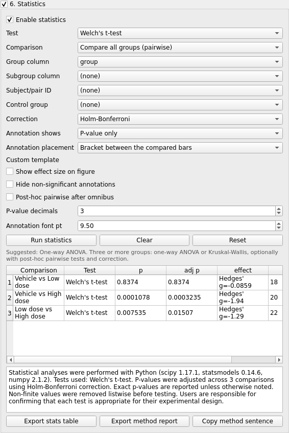
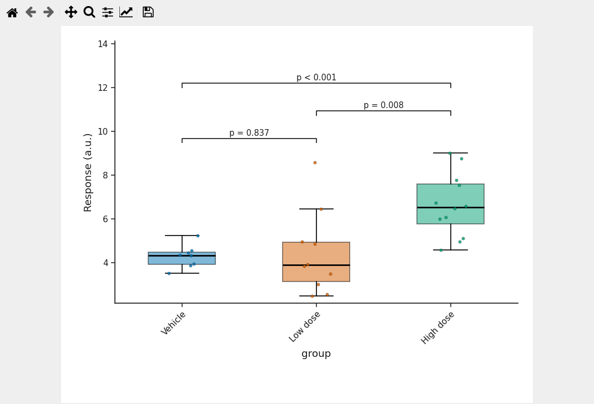

# Statistics on the figure

The **6. Statistics** panel runs a test on the columns you mapped, prints the result on the
figure (brackets, stars, P values or a text line) and writes the table and the method sentence
you need for a manuscript. It does not decide whether a test is appropriate for your design;
it suggests, and you choose.

Validated runs: `group_comparison_box`, `scatter_regression`, `kaplan_meier` (see
`audit/validation_report.md`).

## Switching the panel on

The panel is a group box with a checkbox in its title. Until that box is ticked the whole
panel is grey. Inside, **Enable statistics** is a second switch. Both must be on.

## The controls

| control | choices (as shown) |
|---|---|
| Test | Auto-suggest, Student's t-test, Welch's t-test, Mann-Whitney U test, Paired t-test, Wilcoxon signed-rank test, One-way ANOVA, Two-way ANOVA, Repeated-measures ANOVA, Kruskal-Wallis test, Dunn's test (post-hoc), Chi-square test, Fisher's exact test, Log-rank test, Cox proportional-hazards (HR), Pearson correlation, Spearman correlation, Linear regression, GLM regression (multi-predictor) |
| Comparison | Automatic, Compare all groups (pairwise), Compare to control, Compare within each x category, Selected pairs, Omnibus only |
| Group column, Subgroup column, Subject/pair ID, Control group | your columns / group values |
| Correction | Benjamini-Hochberg FDR, Bonferroni, Holm-Bonferroni, None |
| Annotation shows | Stars only, P-value only, Adjusted p-value only, P-value + stars, Statistic only, Effect size only, P-value + statistic, P-value + effect size, Full compact, Custom (checkboxes), Custom template |
| Annotation placement | e.g. Bracket between the compared bars |
| checkboxes | Show effect size on figure, Hide non-significant annotations, Post-hoc pairwise after omnibus |
| P-value decimals, Annotation font pt | 3, 9.5 |

Buttons: **Run statistics**, **Clear**, **Reset**; after a run: **Export stats table**,
**Export method report**, **Copy method sentence**.

Under the buttons the panel prints a suggestion derived from the data, for example
"Suggested: One-way ANOVA. Three or more groups: one-way ANOVA or Kruskal-Wallis, optionally
with post-hoc pairwise tests and correction".

## Which plots take which tests

| plot | tests that apply |
|---|---|
| Bar, box / violin, dot / strip, beeswarm, raincloud | t-tests, Mann-Whitney, paired t / Wilcoxon (with Subject/pair ID), one-way ANOVA, Kruskal-Wallis, Dunn |
| Grouped bar | two-way ANOVA, or pairwise within each x category |
| Line / time-course | pairwise per time point; repeated measures need a Subject/pair ID |
| Scatter | Pearson, Spearman, linear regression (per colour group when **color** is set) |
| Kaplan-Meier | log-rank, Cox hazard ratio |
| Stacked composition, oncoprint | chi-square, Fisher's exact |
| Volcano, MA | none - P values are read from the table |
| Heatmap, PCA, network, chord, Sankey, forest, lollipop | none |

## Worked example (three groups)

From the box / violin tutorial: Welch's t-test, Compare all groups (pairwise), Group column
`group`, Holm-Bonferroni, P-value only, bracket placement. Result table:

| Comparison | Test | p | adj p | effect | n |
|---|---|---|---|---|---|
| Vehicle vs Low dose | Welch's t-test | 0.8374 | 0.8374 | Hedges' g = -0.086 | 18 |
| Vehicle vs High dose | Welch's t-test | 0.0001078 | 0.0003235 | Hedges' g = -1.94 | 20 |
| Low dose vs High dose | Welch's t-test | 0.007535 | 0.01507 | Hedges' g = -1.29 | 22 |

Method sentence produced by the panel: "Statistical analyses were performed with Python (scipy
1.17.1, statsmodels 0.14.6, numpy 2.1.2). Tests used: Welch's t-test. P-values were adjusted
across 3 comparisons using Holm-Bonferroni correction. Exact p-values are reported unless
otherwise noted. Non-finite values were removed listwise before testing. Users are responsible
for confirming that each test is appropriate for their experimental design."

## StatsSpec

The settings and results are stored as a StatsSpec next to the PlotSpec: in the exported
PlotSpec JSON sidecar, and in the figure package (`stats_spec.json`), so a reopened package
shows the same brackets without re-running anything.

## Common mistakes

* Ticking *Enable statistics* while the group title box is still unticked.
* Pairwise tests on many groups with *Correction = None*.
* A paired test without a *Subject/pair ID*.
* Taking the suggestion as advice about your design. It is derived from the number of groups
  and the column types only.

Video: `VIDEO_URL_STATISTICS`; script `video_scripts/statistics.md`.
