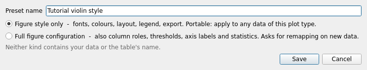
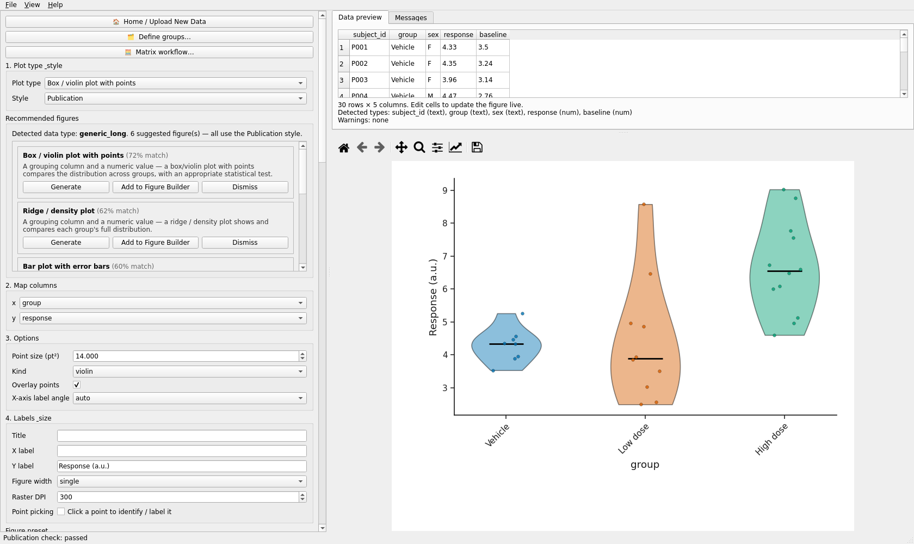
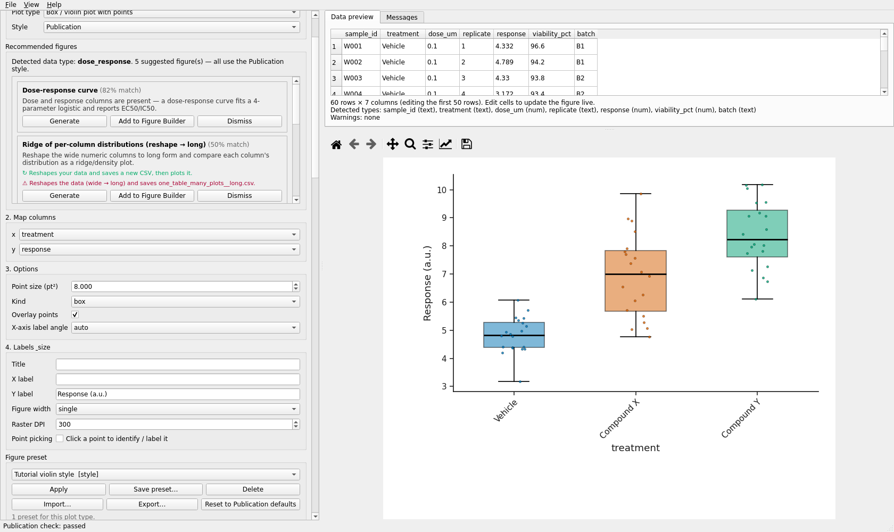
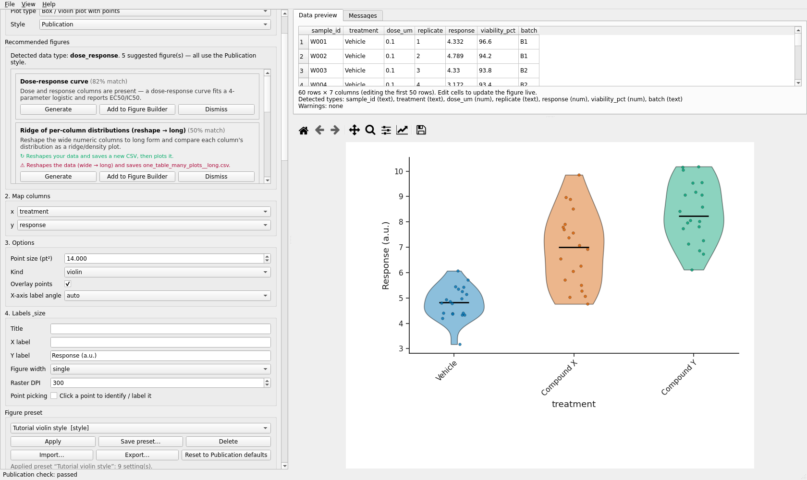

# Figure presets: the style travels, the data stay

A **Figure Preset** stores how a figure looks. Save it from one figure, apply it to another
dataset, and the new figure takes the appearance while keeping its own values. It is not a
PlotSpec: a PlotSpec describes one figure (which columns, which options, which statistics); a
preset describes a look that can be reused.

Validated run: `automation/tutorials/figure_preset.py`. Screenshots: `screenshots/figure_preset/`.

## The panel

**Figure preset** sits under **4. Labels & size**: a drop-down of saved presets and the buttons
**Apply**, **Save preset...**, **Delete**, **Import...**, **Export...**, **Reset to Publication
defaults**. The same commands are in *File > Figure preset*. Presets live in a folder on your
computer; **Export...** writes one to a file you can send, **Import...** reads such a file.

## Two kinds of preset

Clicking **Save preset...** opens the *Save Figure Preset* dialog with a name field and two
choices, quoted from the dialog:

* **Figure style only** - fonts, colours, layout, legend, export. Portable: apply to any data of
  this plot type.
* **Full figure configuration** - also column roles, thresholds, axis labels and statistics.
  Asks for remapping on new data.

The dialog adds: *Neither kind contains your data or the table's name.*

## Walk-through

1. Open `datasets/group_comparison.csv`, choose **Box / violin plot with points**
   (`x = group`, `y = response`). Refine it: *Kind = violin*, *Point size = 14*, y label
   "Response (a.u.)", *Figure width = single*.

   

2. **Save preset...**, name it "Tutorial violin style", keep *Figure style only*, **Save**. The
   preset appears in the drop-down as `Tutorial violin style  [style]`.

3. Open an unrelated table, `datasets/one_table_many_plots.csv`, choose the same plot type and
   map `x = treatment`, `y = response`. The figure has the default appearance.

   

4. Select the preset and click **Apply**. The status line under the buttons reads
   *Applied preset "Tutorial violin style": 9 setting(s).* The violins, the larger points, the
   single-column width and the y label transfer; the groups are still Vehicle / Compound X /
   Compound Y with 20 observations each - the data did not change.

   

If a preset names settings the plot type does not have, the status line adds *N setting(s) do
not apply to this plot type.* A *Full figure configuration* preset that names columns the new
table lacks opens a box *Choose columns for this data* listing the roles to remap; nothing is
substituted for you.

## What is inside a preset file

`Tutorial_violin_style.mmfpreset.json` holds: `format`, `format_version`, `app_version`,
`created`, `name`, `description`, `mode` (style or full), `plot_type`, `journal_style`, `style`,
`layout`, `options`, `output`, `statistics_display`. Checked in the validated run: the file
contains none of the data values, group names or identifiers of the table it was saved from.

## Preset or PlotSpec?

| | Figure Preset | PlotSpec (Export PlotSpec JSON) |
|---|---|---|
| purpose | reuse a look | reproduce one figure |
| contains | style; optionally roles, options, statistics settings | roles, options, statistics settings, source digest |
| data | never | never (needs the data file to reopen) |
| applies to | any table of the plot type | the table it was made from (or one with the same headers) |

For data plus specification in one file, use a Figure Package (next tutorial).

## Common mistakes

* Saving a *Full figure configuration* preset when you only wanted the look; it will ask for
  column remapping on every new table.
* Expecting a style preset to carry plot options such as cutoffs; those are configuration.
* Applying before choosing a plot type: the app asks you to load data and choose a plot type
  first.

Video: `VIDEO_URL_FIGURE_PRESET`; script `video_scripts/figure_preset.md`.
