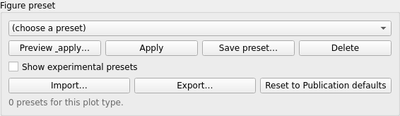
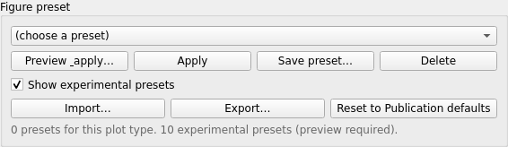
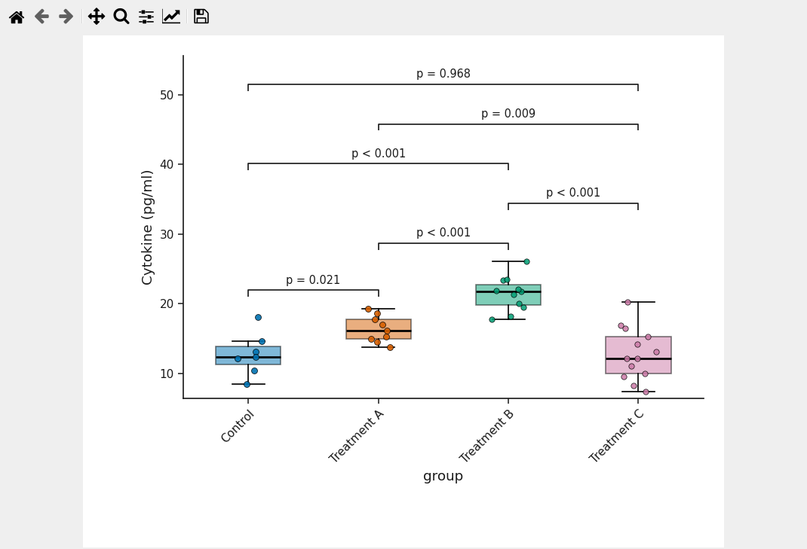
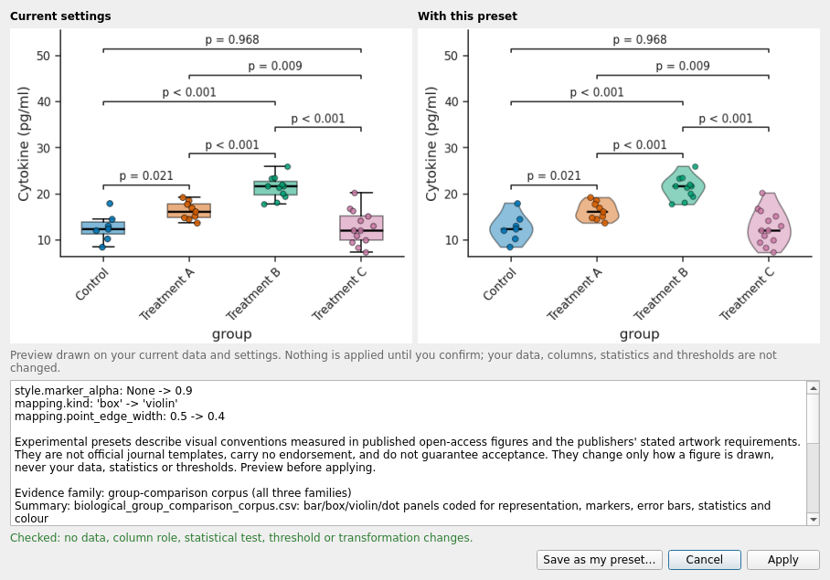
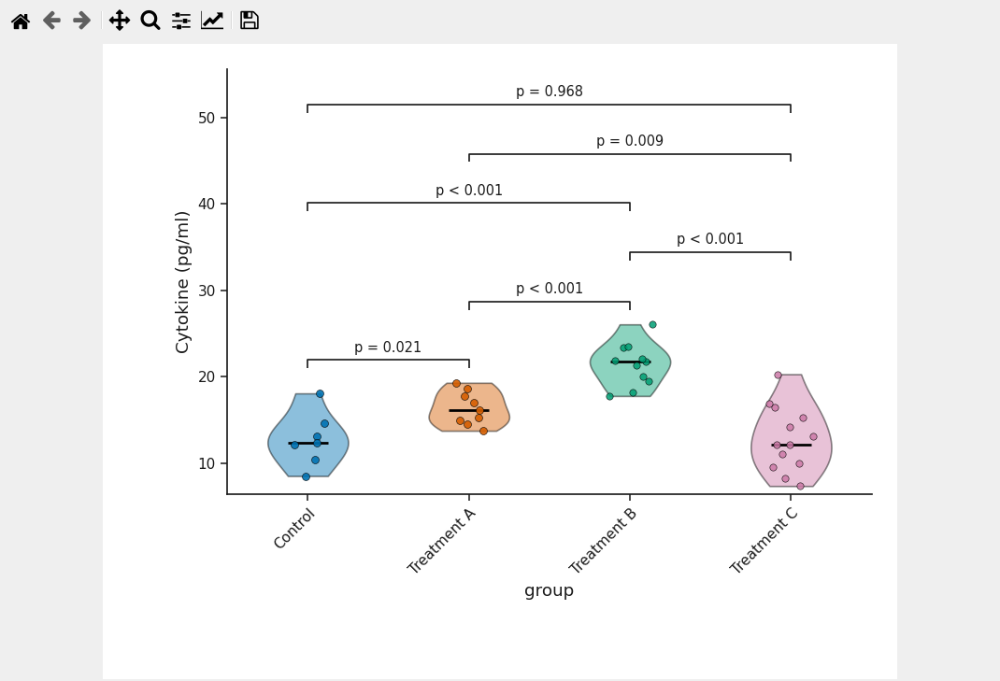
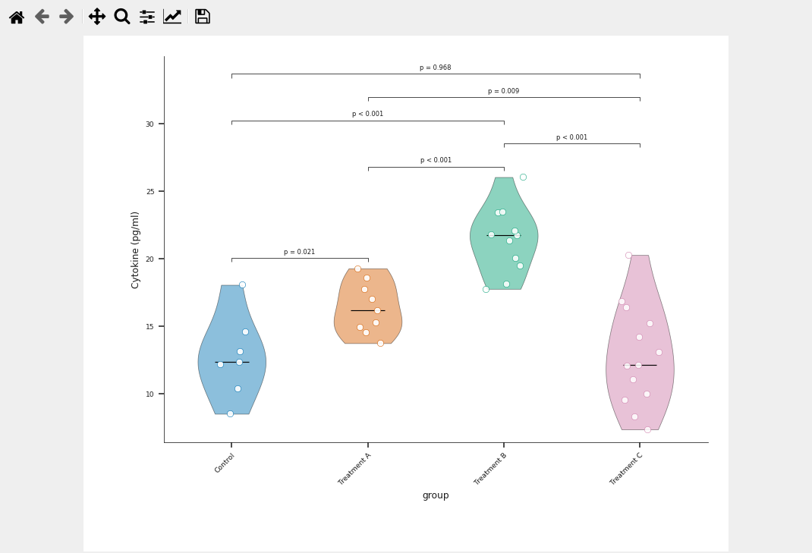
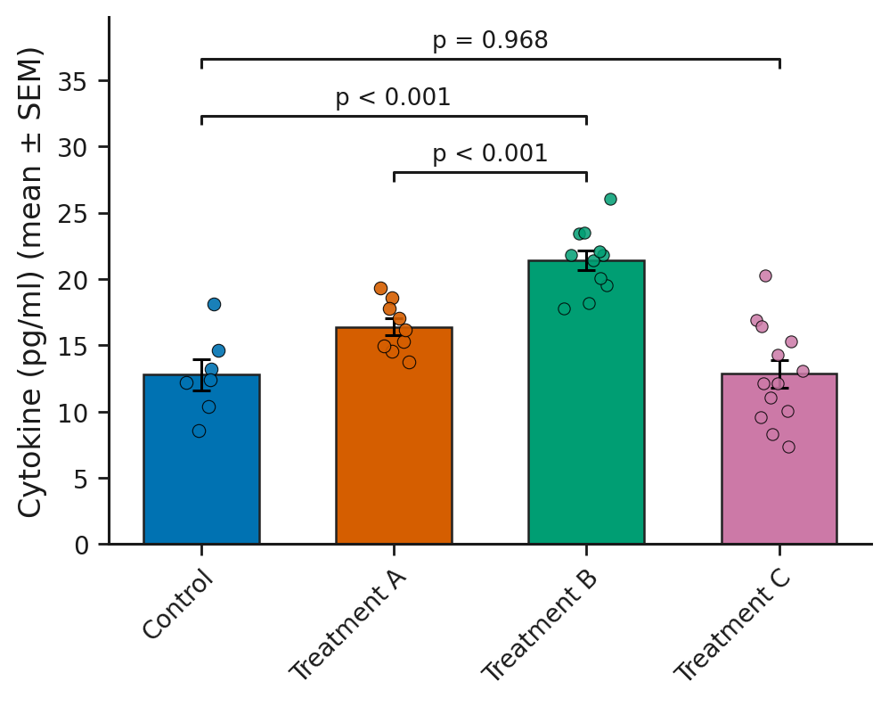
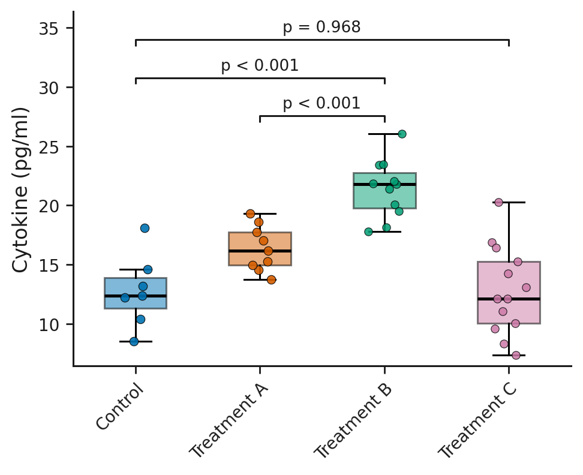
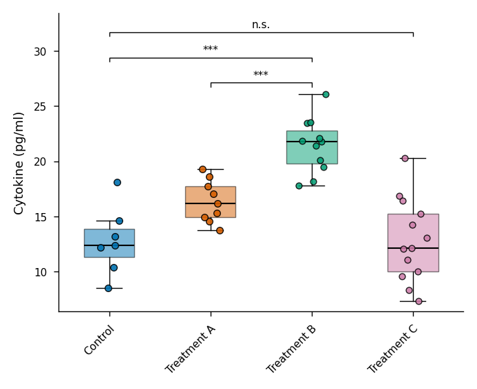

# Publication presets: preview, apply, keep adjusting

Besides the presets you save yourself, this branch ships twelve **experimental** publication
presets derived from a study of published open-access figures and the publishers' stated
artwork requirements. They are a starting configuration, previewed on your own data before
anything is applied. They are not journal templates and carry no endorsement; the letters in
their names, (S), (C), (N), identify the evidence set the values came from.

Validated run: `automation/tutorials/publication_presets.py` (13 checks PASS). Screenshots:
`screenshots/publication_presets/`. Preset files and their properties:
`showcase/presets_used.md`.

## Where they are

In the **Figure preset** panel tick **Show experimental presets**. The list gains entries such
as `Single column 89 mm (N)  [experimental, 89 mm]` and `Box + observations (outline)
[experimental]`, and the status line reads *0 presets for this plot type. 10 experimental
presets (preview required).* Experimental presets can only be applied through
**Preview & apply...**; the plain **Apply** button refuses them.

| panel before | panel after ticking the box |
|---|---|
|  |  |

The library (`style_profiles/experimental_publication_presets/`):

| preset | kind | what it sets |
|---|---|---|
| Single column 57 mm (S), 85 mm (C), 89 mm (N) | width presets, universal | physical figure width, typography, line weights, legend and export settings measured in that evidence set |
| Full width 174 mm (C), 183 mm (N), 184 mm (S) | width presets, universal | the two-column equivalents |
| Box + observations (outline), Box + observations (light fill), Violin + observations, Many observations per group | group-comparison presets for Box / violin plot with points | observation marker size, edge, opacity, box fill, widths |
| Bar + observations (jittered), Bar + observations (open circles) | for Bar plot with error bars | bars with observations on top |

## Before

`showcase_group_comparison.csv`, Box / violin plot with points, `x = group`,
`y = cytokine_pg_ml`, Welch's t-test all pairs with Holm correction.

## Preview

Select **Violin + observations**, click **Preview & apply...**. The dialog:

* two figures, *Current settings* and *With this preset*, drawn on the loaded data;
* the note *Preview drawn on your current data and settings. Nothing is applied until you
  confirm; your data, columns, statistics and thresholds are not changed.*;
* the list of settings that would change (`mapping.kind: box -> violin`, marker and edge
  values, ...), the provenance of the preset and its evidence family;
* the line *Checked: no data, column role, statistical test, threshold or transformation
  changes.* in green, or a red *Refused* line if a preset tried to change analytical settings;
* the buttons **Save as my preset...**, **Cancel**, **Apply**.

**Cancel** leaves everything as it was (status: *Preview closed; nothing applied.*).

## Apply

**Apply** changes the figure and the status line reads *Applied preset "Violin +
observations" after preview: 10 setting(s).* The statistics table is identical before and
after (checked in the run: same tests, P values, adjusted P values and n).

A width preset can go on top: **Single column 89 mm (N)** applied after preview reports
*38 setting(s)* - figure width, typography and line weights - while the violin configuration
stays.

## Keep adjusting

Nothing is locked. After both presets, *Point size* 30, *Point fill* open and *Point edge*
same were set in **3. Options**; fonts and colours remain editable under **5. Publication
style**; the statistics panel still runs. **Save as my preset...** in the preview dialog copies
an experimental preset into your own library, with a provenance note, so you can edit and share
it.

## Same observations, five presets (renderer output, manuscript typography)

| A default | B Box + observations (outline) | C Violin + observations |
|---|---|---|
|  |  |  |

| D Bar + observations (jittered) | E Box + observations (light fill) | F Single column 89 mm (N) |
|---|---|---|
|  |  |  |

B to F carry the same three comparisons (Control vs Treatment B, Treatment A vs Treatment B,
Control vs Treatment C; Welch, Holm); `audit/showcase_data_integrity.csv` records identical
P values, adjusted P values and n for every copy.

## What a preset can and cannot do

* It changes how the figure is drawn: typography, colours, widths, markers, legend, export,
  and the drawing options of its plot type.
* It never changes data, column roles, statistical tests, thresholds or transformations; the
  preview refuses a preset that would.
* Experimental presets describe conventions measured in published figures and stated
  publisher requirements; they are not official templates and do not guarantee acceptance.

Video: `VIDEO_URL_FIGURE_PRESET`; script `video_scripts/figure_preset.md` (updated).
