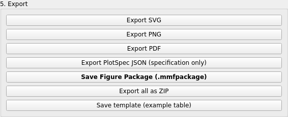
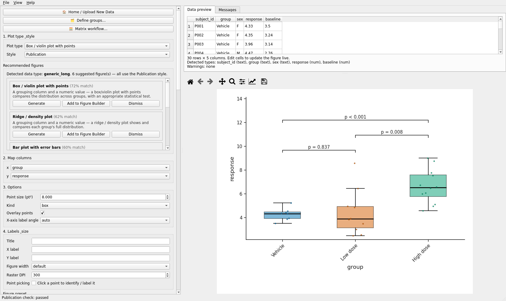
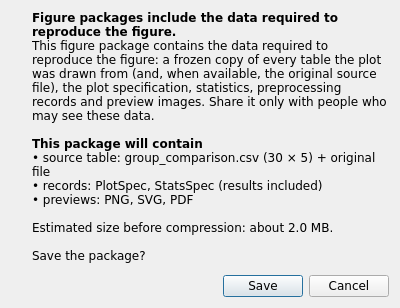
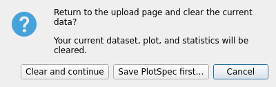
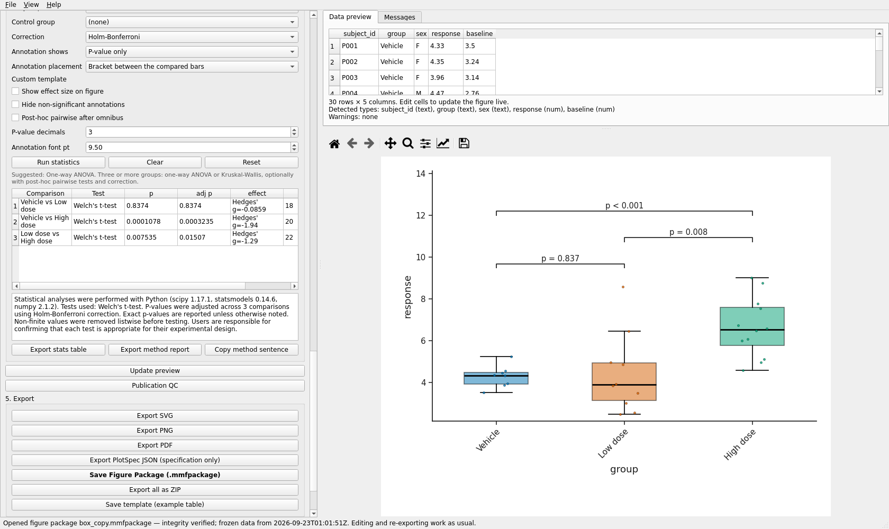
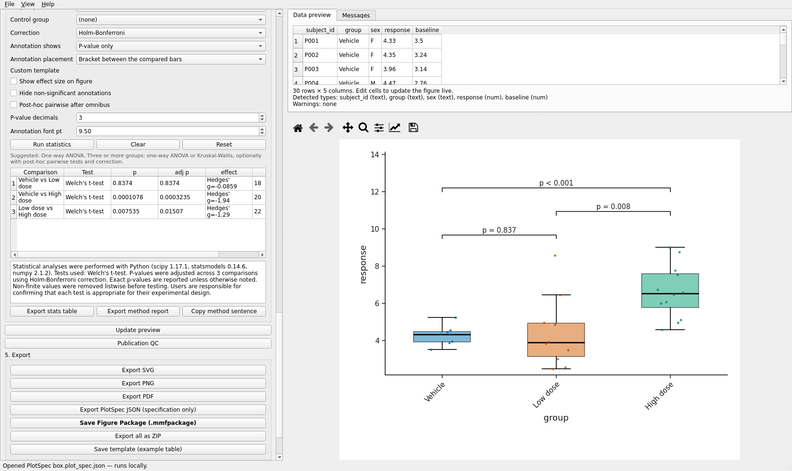

# Reproducibility: PlotSpec and Figure Package

Two files describe a figure. The **PlotSpec** is the specification alone: which plot type,
which columns in which roles, which options, which statistics; it needs the data file to be
redrawn. The **Figure Package** (`.mmfpackage`) is the specification plus a frozen copy of the
table (and the original file when available), the statistics results, previews and a manifest
with a checksum for every member. Move the one package file anywhere, open it, and the figure
returns.

Validated run: `automation/tutorials/figure_package.py`. Screenshots: `screenshots/figure_package/`.

## Where the commands are

Under **5. Export**: **Export PlotSpec JSON (specification only)** and **Save Figure Package
(.mmfpackage)**; the same two are in the File menu as *Open PlotSpec... (specification only;
needs the data file)*, *Save Reproducible Figure Package...* and *Open Figure Package...
(.mmfpackage: specification + frozen data)*. The start screen has **Open Figure Package**.
**Export all as ZIP** writes figures, specifications and a package together.



## Walk-through

1. Open `datasets/group_comparison.csv`, **Box / violin plot with points**, `x = group`,
   `y = response`; run Welch's t-test, all pairs, Holm, P-value only (statistics tutorial).

   

2. **Export PlotSpec JSON (specification only)** > `box.plot_spec.json`. The file has two top
   level keys, `plot_spec` and `render_metadata`; the specification carries a digest of the
   source table so the app can tell later whether the data changed.

3. **Save Figure Package (.mmfpackage)**. A confirmation lists what will be included:

   

   Click **Save** and choose the file name. A message *Figure package saved* reports the path
   and size (94 KB for this table).

4. Copy the package to another folder (the tutorial script copies it to `moved_elsewhere/`).

5. **Home / Upload New Data**. Because a plot exists, the app asks *Return to upload page?* with
   **Save PlotSpec first...**, **Clear and continue** and **Cancel**. Choose *Clear and
   continue*.

   

6. On the start screen click **Open Figure Package** and pick the copied file. The status bar
   reads *Opened figure package box_copy.mmfpackage - integrity verified; frozen data from
   2026-09-23T00:59:40Z. Editing and re-exporting work as usual.* The table, the mapping
   (`x = group`, `y = response`), the options and the statistics (panel enabled, brackets on the
   figure) are back without the original CSV.

   

7. For contrast, **Home** again and *File > Open PlotSpec...* > `box.plot_spec.json`. The app
   then opens a second dialog, *Select the data file for this PlotSpec*; pick
   `group_comparison.csv`. The figure is rebuilt from the specification and that file. If the
   data differ from the digest, a warning *Data differ from the saved PlotSpec* is shown; if you
   cancel the data dialog the Messages tab says *A data file is needed to reproduce this
   PlotSpec.*

   

## What is inside a package

The validated package contained:

```
manifest.json                       checksums and format version
README.txt
plot_spec.json                      the specification
stats_spec.json                     statistics settings and results
render_metadata.json
data/source.mmftable.json           the frozen table (typed)
data/source.csv                     the same table as CSV
data/original/source/group_comparison.csv   the original file
preview/figure.png  .svg  .pdf
environment/environment.json        software versions
```

Packages are checked before anything is drawn: member names, sizes, and the checksum of every
file. A corrupted or edited package is refused with a message. Nothing is executed.

## Privacy

A package contains your data. The confirmation dialog says so: share it only with people who
may see these data. A PlotSpec and a preset contain no data.

## Common mistakes

* Sending a PlotSpec and expecting the recipient to see the figure; they also need the table.
* Editing a package by hand: the checksum check will refuse it.
* Reopening a PlotSpec on a table that was edited since: the digest warning is the signal to
  re-check the figure.

Video: `VIDEO_URL_FIGURE_PACKAGE`; script `video_scripts/figure_package.md`.
