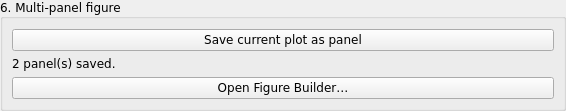
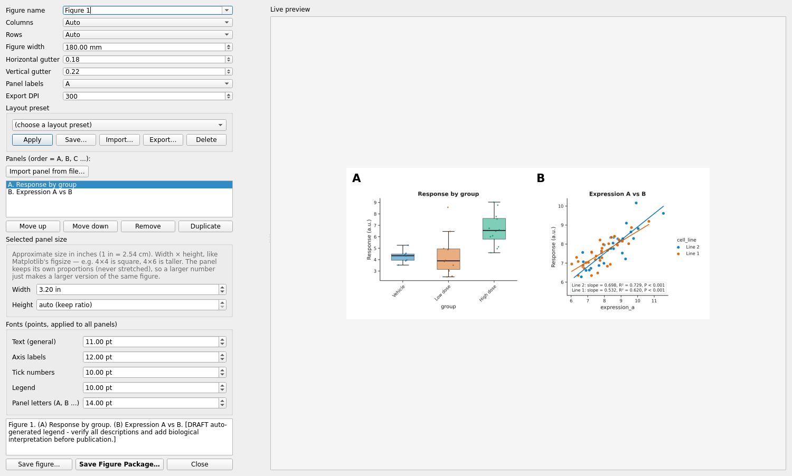

# Figure Builder: a multi-panel figure

The Figure Builder assembles plots you have saved as panels (and imported images) into one
composite figure with panel letters, a common width and common fonts, then exports it or saves
it as a Figure Package.

Validated run: `automation/tutorials/figure_builder.py`. Screenshots: `screenshots/figure_builder/`.

## Collect panels

1. Make a plot as usual - here `group_comparison.csv`, **Box / violin plot with points**,
   title "Response by group", y label "Response (a.u.)".
2. Under **6. Multi-panel figure** click **Save current plot as panel**. The label changes to
   *1 panel(s) saved.* The panel keeps its own copy of the table and its specification.
3. Open another table (`relationship_data.csv`), make a **Scatter plot**
   (`x = expression_a`, `y = expression_b`, `color = cell_line`, title "Expression A vs B") and
   save it as a panel too: *2 panel(s) saved.*

Recommendation cards also have **Add to Figure Builder**, which saves the recommended figure as
a panel without opening it in the editor.

## Open the builder

**Open Figure Builder...** opens the *Multi-panel Figure Builder* window: controls on the left,
a live preview on the right.

Controls, as shown:

| control | choices / default |
|---|---|
| Figure name | Figure 1, Figure 2, Extended Data Figure 1, Supplementary Figure 1 (editable) |
| Columns, Rows | Auto, 1 ... 6 |
| Figure width | 180.00 mm |
| Horizontal gutter, Vertical gutter | 0.18, 0.22 |
| Panel labels | A, a, 1 |
| Export DPI | 300 |
| Layout preset | (choose a layout preset) with Apply, Save..., Import..., Export..., Delete |
| Panels (order = A, B, C ...) | the list; **Import panel from file...**, **Move up**, **Move down**, **Remove**, **Duplicate** |
| Selected panel size | Width (3.20 in), Height (auto - keep ratio); the panel keeps its proportions |
| Fonts (points, applied to all panels) | Text (general) 11, Axis labels 12, Tick numbers 10, Legend 10, Panel letters 14 |

A draft legend is generated under the fonts box ("Figure 1. (A) Response by group. (B)
Expression A vs B. [DRAFT auto-generated legend - verify all descriptions and add biological
interpretation before publication.]").

## Export

**Save figure...** writes the composite (PNG at the export DPI, PDF and SVG). **Save Figure
Package...** writes one `.mmfpackage` with the FigureSpec, every panel's specification and
table; reopening it (start screen, **Open Figure Package**) restores the whole composite in the
builder. **Close** returns to the editor; the saved panels stay available.

## Common mistakes

* Saving a panel before the preview has rendered: the app answers *Render a plot before saving
  it as a panel.*
* Resizing panels expecting a stretch: a panel is scaled, never distorted; change *Columns* or
  the width instead.
* Forgetting that panel fonts are applied to all panels; per-panel typography is set before
  saving the panel.

Video: `VIDEO_URL_FIGURE_BUILDER`; script `video_scripts/figure_builder.md`.
