# Plot gallery - Make My Figure 1.1.1

39 registered plot types, rendered from the bundled synthetic examples with the same renderer the desktop application uses. Column roles are the rows of **2. Map columns** for that plot type. Tutorials appear as they are written; video links are filled from `videos/video_links.json`.

## Basic plots and distributions

| | plot | purpose | column roles | tutorial | video |
|---|---|---|---|---|---|
| 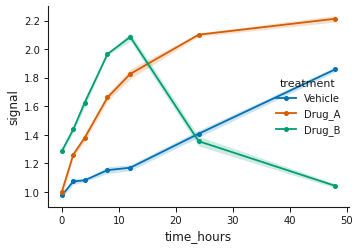 | **Line / time-course with error band** `lineplot_timecourse_with_error_band` | Mean response over time per treatment, with a shaded SEM/CI error band | x, y, color, style_by | not yet written | - |
| 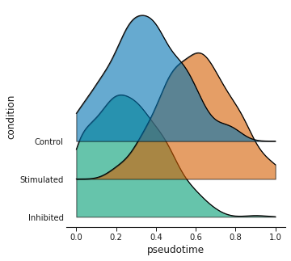 | **Ridge / density plot** `ridge_or_density_plot` | Stacked density (ridgeline) distributions of a value per condition | x, group | not yet written | - |
| 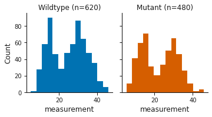 | **Histogram (binned distribution)** `histogram_distribution` | Binned counts of one measurement, as separate panels per group or overlaid - shows the distribution's actual shape (modes, gaps, tails) rather than a smoothed curve | x, group, value_columns | not yet written | - |
| 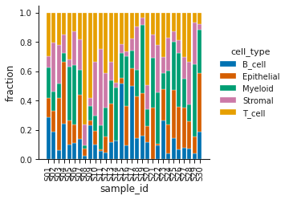 | **Stacked composition bar plot** `stacked_bar_composition` | Cell-type (or category) composition per sample as stacked fractions | x, stack, y, facet_or_sort_by | not yet written | - |
| 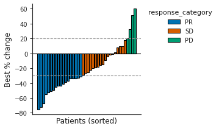 | **Waterfall plot** `waterfall_plot` | Best percent change per patient (oncology response), sorted into a waterfall | x, y, color | not yet written | - |

## Group comparisons

| | plot | purpose | column roles | tutorial | video |
|---|---|---|---|---|---|
| 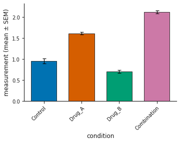 | **Bar plot with error bars** `barplot_with_error_bar` | Compare a mean readout across experimental conditions with replicate error bars | x, y, color | not yet written | - |
| 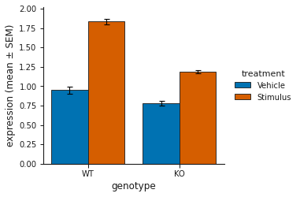 | **Grouped bar plot with error bars** `grouped_barplot_with_error_bar` | Two-factor comparison (e.g | x, group, y | not yet written | - |
| 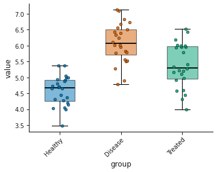 | **Box / violin plot with points** `boxplot_or_violin_with_points` | Show full distributions per group as box or violin plots with overlaid points | x, y, hue | [tutorial](plots/boxplot_or_violin_with_points.md) | - |
| 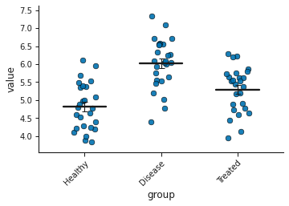 | **Dot / strip plot** `dot_strip_plot` | Show every observation per group with an optional mean/median summary — a readable alternative to a bar plot | x, y, color | not yet written | - |
| 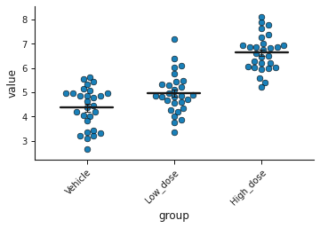 | **Beeswarm plot** `beeswarm_plot` | Show every observation per group with a collision-avoiding layout — a readable alternative to a bar plot | x, y, color | not yet written | - |
| 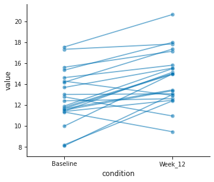 | **Paired dot plot / slopegraph** `paired_slopegraph` | Connect matched observations across conditions/timepoints (before/after, repeated measures) | subject, condition, value, color | not yet written | - |
| 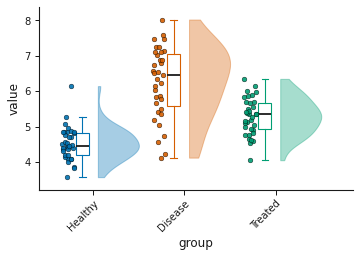 | **Raincloud plot** `raincloud_plot` | Full distribution per group as a half-violin cloud + box summary + raw points | x, y | not yet written | - |

## Relationships, regression and classifier curves

| | plot | purpose | column roles | tutorial | video |
|---|---|---|---|---|---|
| 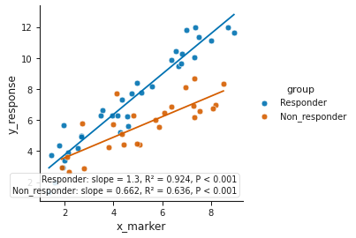 | **Scatter plot** `scatterplot_with_regression` | Relationship between two continuous variables, colored by group, optional fit line | x, y, color, label | [tutorial](plots/scatterplot_with_regression.md) | - |
| 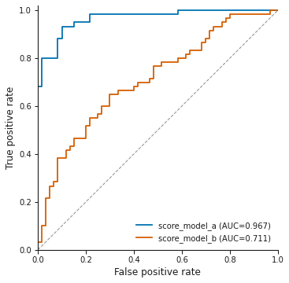 | **ROC curve** `roc_curve` | ROC curves with AUC comparing one or two classifier scores | label, score, score2 | not yet written | - |
| 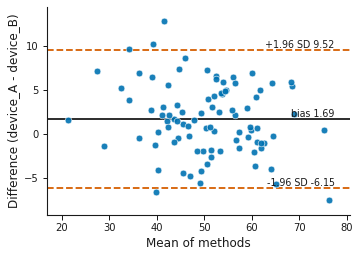 | **Bland-Altman (method agreement)** `bland_altman_plot` | Agreement between two measurement methods (bias and limits of agreement) | method_a, method_b, label | not yet written | - |
| 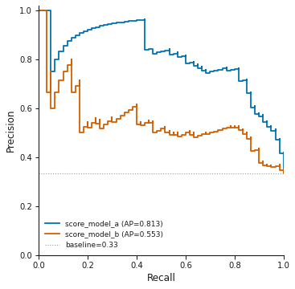 | **Precision-recall curve** `precision_recall_curve` | Precision vs recall for one or two classifiers on an imbalanced outcome, with average precision (AUPRC) | label, score, score2 | not yet written | - |
| 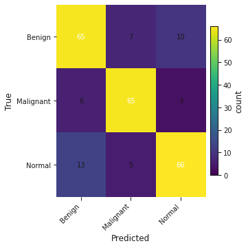 | **Confusion matrix** `confusion_matrix` | Classification confusion matrix (binary or multiclass) with optional row/column/total normalization | true, predicted | not yet written | - |
| 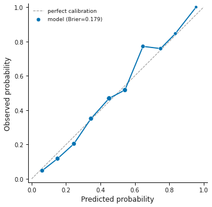 | **Calibration plot** `calibration_plot` | Reliability of a clinical risk model: predicted vs observed probability, binned, with a perfect-calibration diagonal | label, prob | not yet written | - |
| 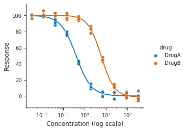 | **Dose-response curve** `dose_response_curve` | Drug dose-response with a 4-parameter logistic fit and EC50/IC50 per group | dose, response, group | not yet written | - |

## Matrices, dimension reduction and differential results

| | plot | purpose | column roles | tutorial | video |
|---|---|---|---|---|---|
| 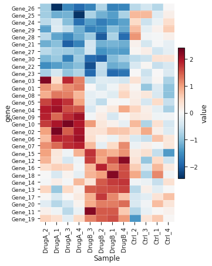 | **Clustered heatmap** `heatmap_clustered_matrix` | Gene-by-sample expression matrix with optional row/column clustering | row_id | [tutorial](plots/heatmap_clustered_matrix.md) | - |
| 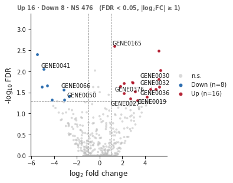 | **Volcano plot** `volcano_plot` | Differential expression: log2 fold change vs significance, highlighting hits | x, p, label, id_col | [tutorial](plots/volcano_plot.md) | - |
| 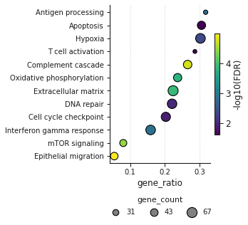 | **Enrichment dot plot** `enrichment_dotplot` | Pathway/term enrichment: dot size = gene count, color = significance | y, x, size, color | not yet written | - |
| 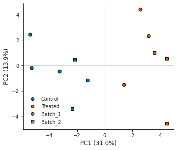 | **PCA scatter (matrix + metadata)** `pca_scatter_from_matrix` | PCA of an expression matrix; samples colored by group and shaped by batch | matrix_row_id | not yet written | - |
| 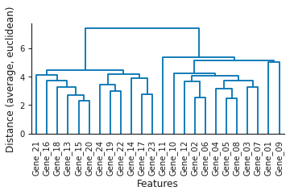 | **Hierarchical clustering dendrogram** `hierarchical_dendrogram` | Hierarchical clustering of a feature-by-sample matrix as a standalone dendrogram | row_id | not yet written | - |
| 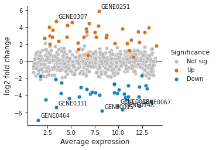 | **MA plot (differential expression)** `ma_plot` | Differential expression: average abundance (A) vs log fold change (M), colored by significance | x, y, p, label, id_col | not yet written | - |
| 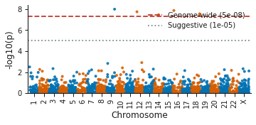 | **Manhattan plot (GWAS)** `manhattan_plot` | Genome-wide association -log10(p) across chromosomes with significance thresholds | chrom, pos, p, snp | not yet written | - |
| 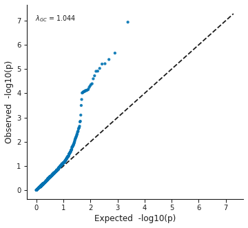 | **Q-Q plot (p-value / quantile)** `qq_plot` | Observed vs expected -log10(p) Q-Q plot with genomic inflation (lambda) | p | not yet written | - |
| 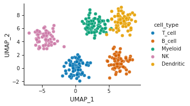 | **UMAP / t-SNE embedding scatter** `embedding_scatter` | Single-cell / sample embedding (UMAP or t-SNE) colored by cluster or metadata | x, y, color, shape, label | not yet written | - |
| 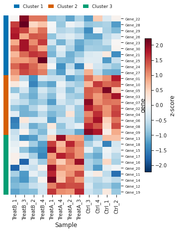 | **Hierarchical clustering (heatmap + clusters)** `hierarchical_clustering` | Cluster a feature-by-sample matrix into k groups and export the cluster assignment table | row_id | not yet written | - |

## Survival, effect estimates and clinical timelines

| | plot | purpose | column roles | tutorial | video |
|---|---|---|---|---|---|
| 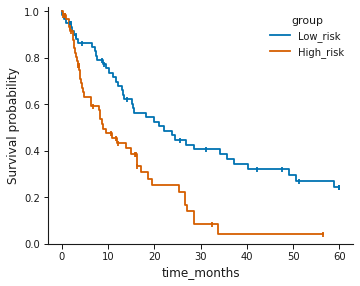 | **Kaplan-Meier survival curve** `kaplan_meier_survival_curve` | Survival probability over time by group, with censoring marks | time, event, group, survival_columns | [tutorial](plots/kaplan_meier_survival_curve.md) | - |
| 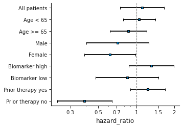 | **Forest plot** `forest_plot` | Subgroup effect sizes (hazard/odds ratios) with confidence intervals | label, estimate, lower, upper | not yet written | - |
| 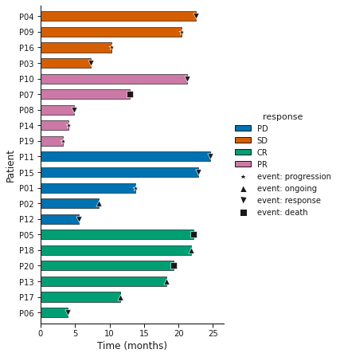 | **Swimmer plot** `swimmer_plot` | Per-patient treatment/follow-up timelines (oncology), colored by response with event markers | subject, start, end, duration, event, group | not yet written | - |
| 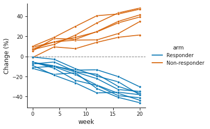 | **Spider plot (longitudinal change)** `spider_plot` | Longitudinal per-patient change over time (e.g | subject, time, value, group | not yet written | - |

## Specialised plots

| | plot | purpose | column roles | tutorial | video |
|---|---|---|---|---|---|
| 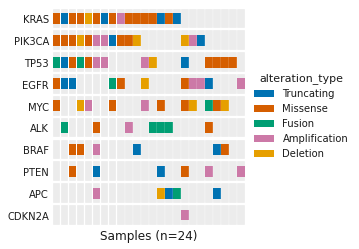 | **Oncoprint mutation heatmap** `oncoprint_mutation_heatmap` | Gene-by-sample alteration grid (oncoprint) colored by alteration type | sample, row, fill | not yet written | - |
| 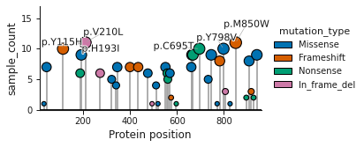 | **Lollipop mutation plot** `lollipop_mutation_plot` | Mutation counts along a protein, as lollipops colored by mutation type | x, y, color, label | not yet written | - |
| 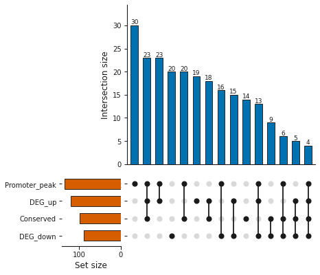 | **UpSet plot (set intersections)** `upset_plot` | Intersections among many sets (a scalable alternative to Venn diagrams) | chosen in Map columns | not yet written | - |
| 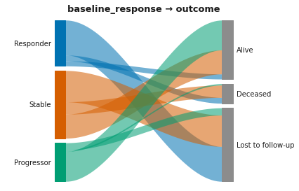 | **Sankey / alluvial flow (two-stage)** `sankey_plot` | Flow between two sets of categories (e.g | source, target, value | not yet written | - |
| 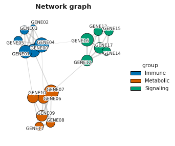 | **Network graph** `network_graph` | Interaction / co-expression network: nodes are genes/features, edges are interactions or correlations, colored by module and sized by degree | source, target, weight, interaction_type | not yet written | - |
| 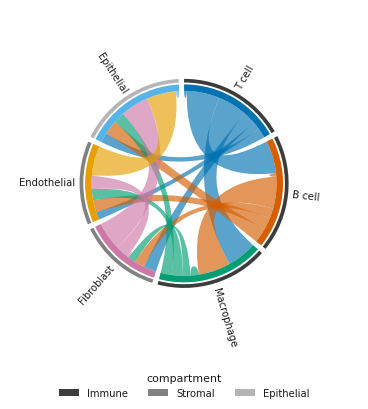 | **Circos-style chord diagram** `chord_diagram` | Ligand-receptor interaction counts between cell types drawn as a Circos-style chord diagram: one segment per cell type sized by its total interactions, ribbons sized by the count of each pair, and a compartment band on the outside | source, target, value, group | not yet written | - |
