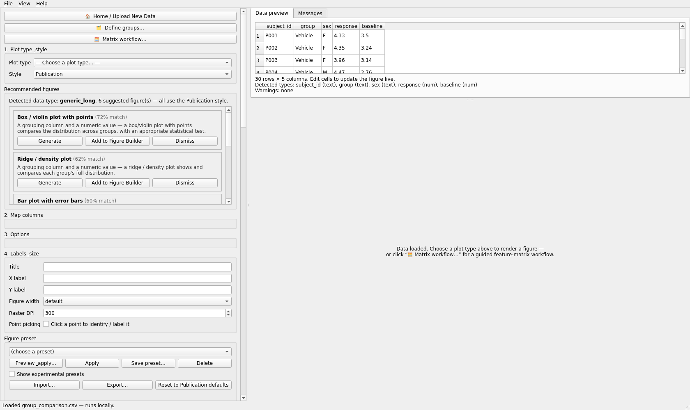
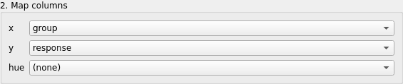
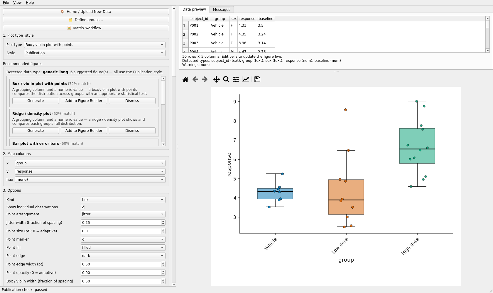
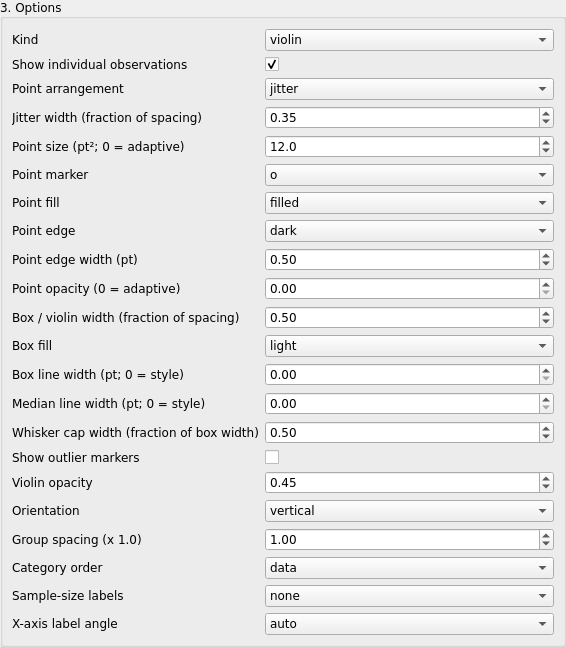
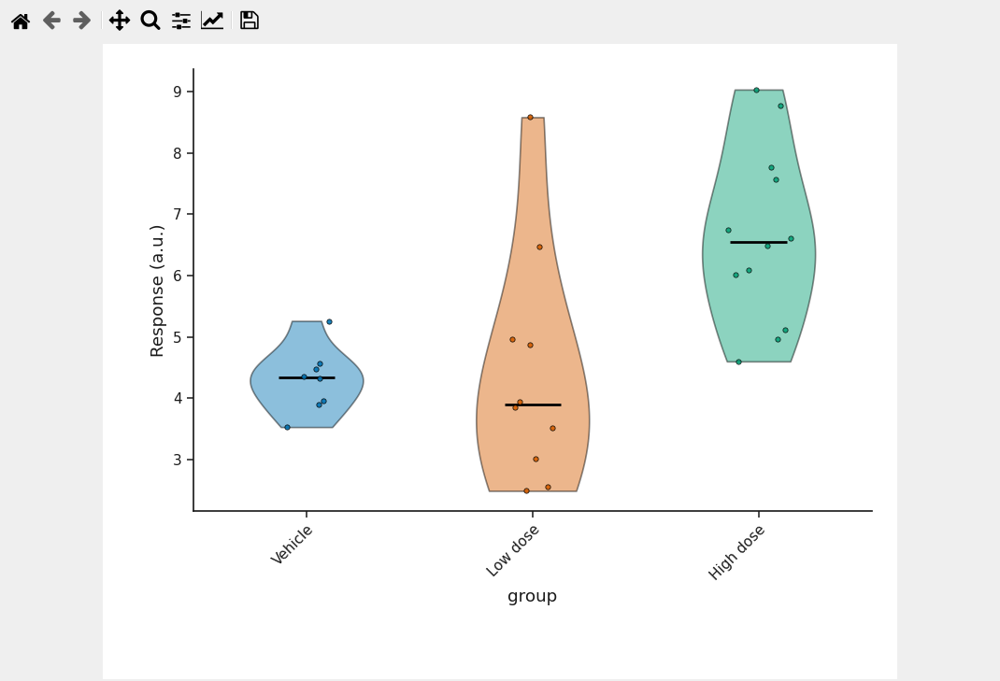
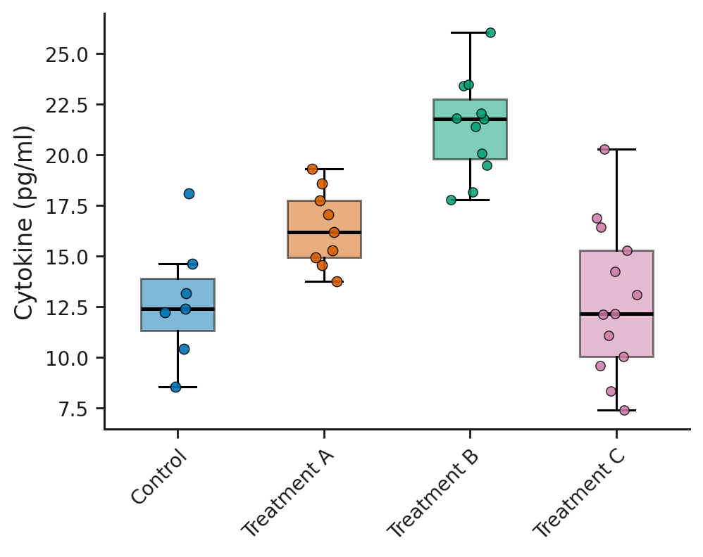
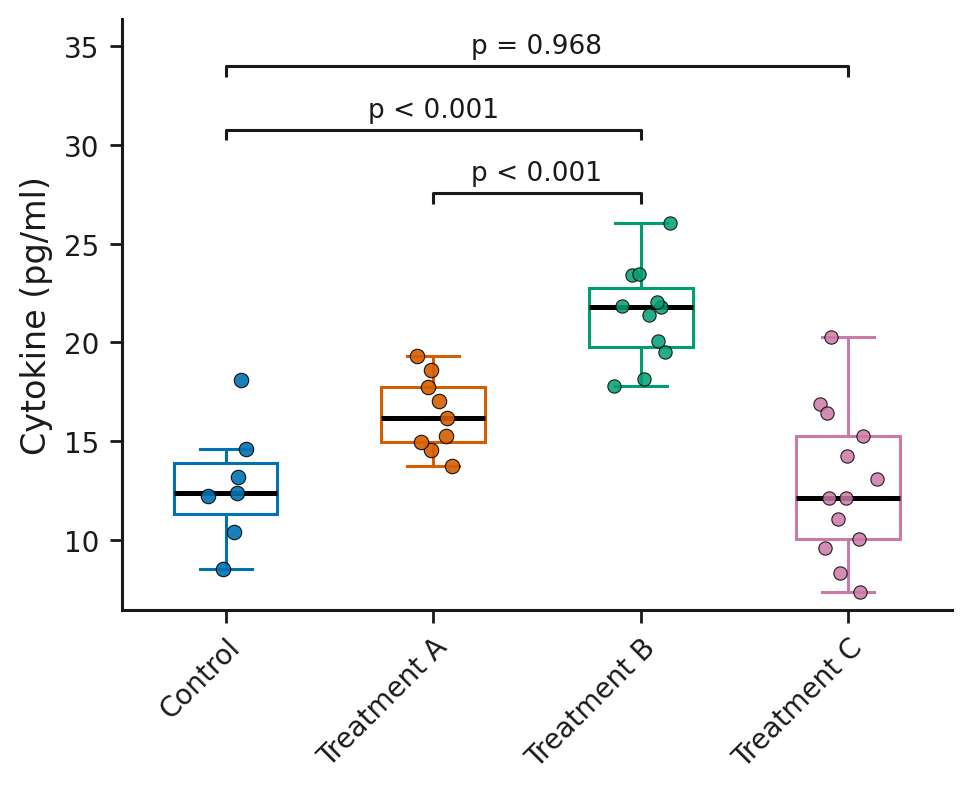
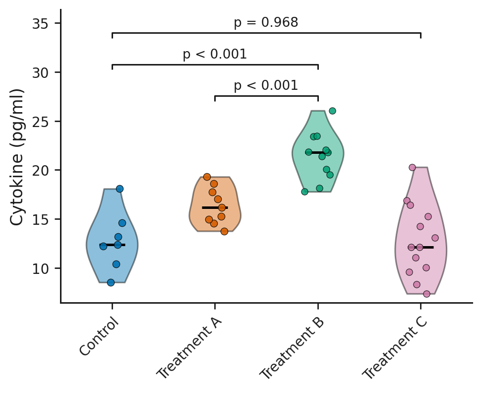
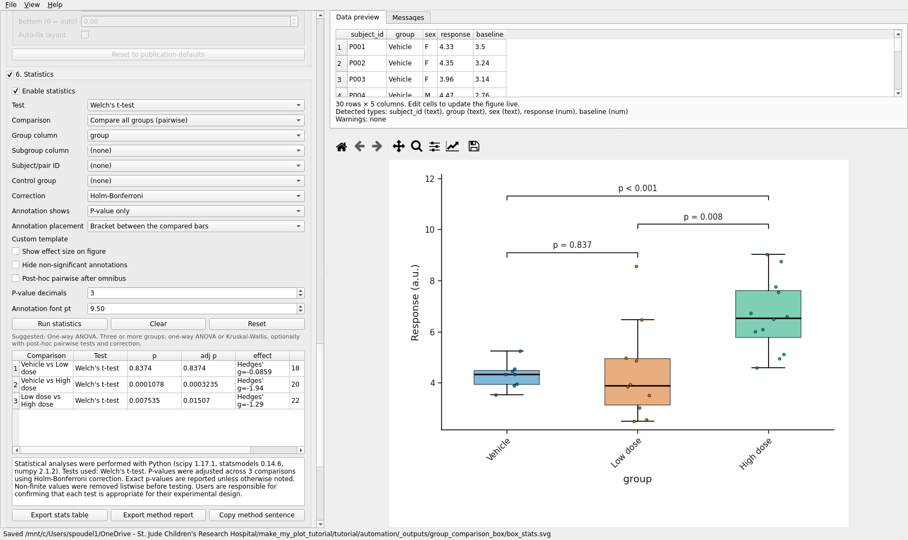

# Box / violin plot with points

Plot id `boxplot_or_violin_with_points`. Validated run: `automation/tutorials/group_comparison_box.py`.
Screenshots: `screenshots/group_comparison_box/`.

## What this plot shows

One box (or violin) per group summarises the distribution of a numeric readout, with every
observation drawn as a point on top. It is the standard figure for comparing a measurement
between experimental groups, and it is the plot type where the statistics panel adds
significance brackets.

## Example question

Does the response differ between vehicle, low-dose and high-dose groups of unequal size?

## Required data

`datasets/group_comparison.csv` (simulated), 30 rows, groups of 8, 10 and 12:

| column | role here | example |
|---|---|---|
| `group` | **x** | Vehicle / Low dose / High dose |
| `response` | **y** | 4.33 |
| `subject_id`, `sex`, `baseline` | unused here | P001, F, 3.5 |

## Open the data

**Open data file** > `group_comparison.csv`. The header reads *Detected data type:
generic_long. 6 suggested figure(s)*; the first card is *Box / violin plot with points (72%
match)*.

## Map the columns

Choose **Box / violin plot with points**. The proposal is already `x = group`,
`y = response`. Confirm it, or pick another numeric column (for example `baseline`) for **y**.

## Create the plot

## Customize

**3. Options**: *Point size (pt²)* (8), *Kind* (box / violin), *Overlay points* (on), *X-axis
label angle* (auto). The tutorial switched *Kind* to violin and the point size to 12, then back
to box for the statistics step; the y label was set to "Response (a.u.)".

## Statistics

Open **6. Statistics**: tick the box in the group title, then **Enable statistics**. The panel
suggests a test from the data ("Suggested: One-way ANOVA. Three or more groups: one-way ANOVA or
Kruskal-Wallis, optionally with post-hoc pairwise tests and correction"). The choice is yours.
Settings used in the tutorial:

| control | value |
|---|---|
| Test | Welch's t-test |
| Comparison | Compare all groups (pairwise) |
| Group column | group |
| Correction | Holm-Bonferroni |
| Annotation shows | P-value only |
| Annotation placement | Bracket between the compared bars |

Click **Run statistics**. Brackets with exact P values appear on the figure; the table lists
each comparison with test, p, adjusted p, effect size (Hedges' g) and n; the method sentence
appears under it. **Export stats table** (CSV / TSV), **Export method report** (Markdown / JSON)
and **Copy method sentence** are below the table.

Recorded results: Vehicle vs Low dose p = 0.837; Vehicle vs High dose adjusted p = 0.00032;
Low dose vs High dose adjusted p = 0.015.

Other test choices for this plot: Student's t, Mann-Whitney U, paired t / Wilcoxon (need a
*Subject/pair ID*), one-way ANOVA, Kruskal-Wallis, Dunn's post-hoc. *Compare to control* needs a
*Control group*; *Hide non-significant annotations* removes brackets with p above the cutoff.

## Annotation

Annotation content (stars, P, adjusted P, statistic, effect size, custom template), decimals and
font size are in the statistics panel. Annotations move with the data; they are recomputed on
every run.

## Figure Preset

Style presets transfer fonts, colours, layout and legend; *Kind*, point size and the statistics
settings travel in a *Full figure configuration* preset (see the presets tutorial).

## Save / reproduce

**Save Figure Package (.mmfpackage)** stores the table, the PlotSpec and the StatsSpec with its
results, so the brackets come back when the package is reopened (validated in the
reproducibility tutorial).

## Export

**Export PNG** and **Export SVG** were used; PDF is the third button. The stats table and the
method report were exported from the statistics panel.

## Before / after - the same observations, other presentations

See [Showing individual observations and controlling jitter](../03_Group_Comparisons/showing_individual_observations_and_jitter.md)
for the full control list, and [Publication presets](../10_Figure_Presets/publication_presets.md)
for the same 40 observations under five experimental presets.

| default | Box + observations (outline) preset + statistics | Violin + observations preset |
|---|---|---|
|  |  |  |

## Common mistakes

* Forgetting the group title checkbox: the whole **6. Statistics** panel is greyed out until it
  is ticked, even if *Enable statistics* looks available.
* Running pairwise t-tests without a correction on many groups; choose a correction, or the
  omnibus test first (*Omnibus only*, then *Post-hoc pairwise after omnibus*).
* Using a paired test without a *Subject/pair ID*; the panel cannot pair rows by itself.
* Reading the suggested test as a recommendation to publish it. The application does not judge
  the design; the researcher chooses the test.

## Result

Video: `VIDEO_URL_BOX_VIOLIN`; script `video_scripts/group_comparison_box.md`.
