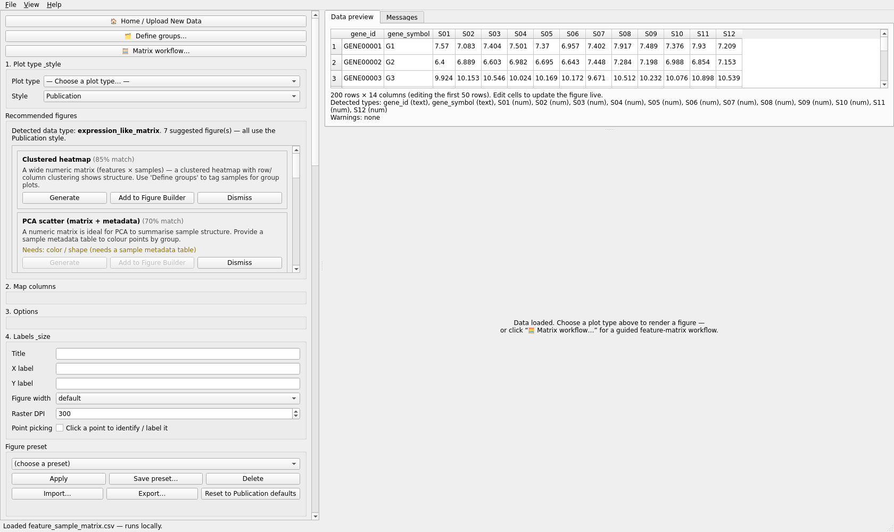
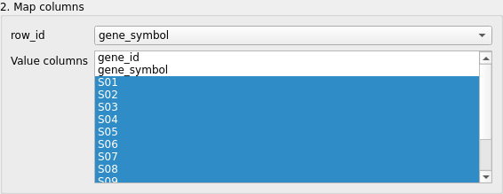
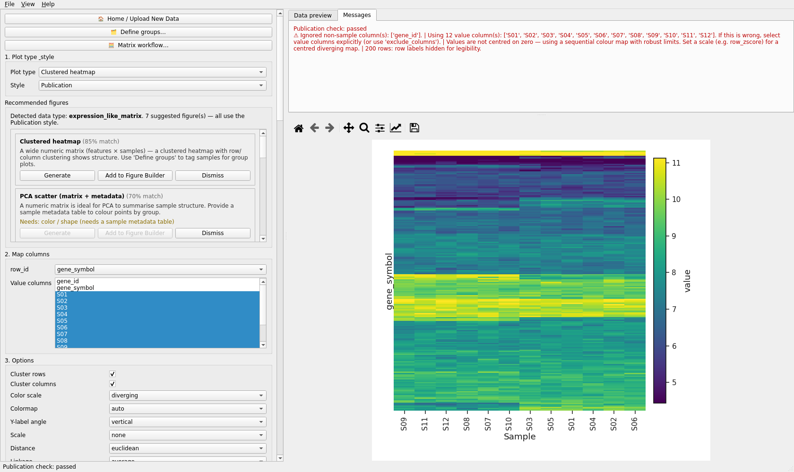
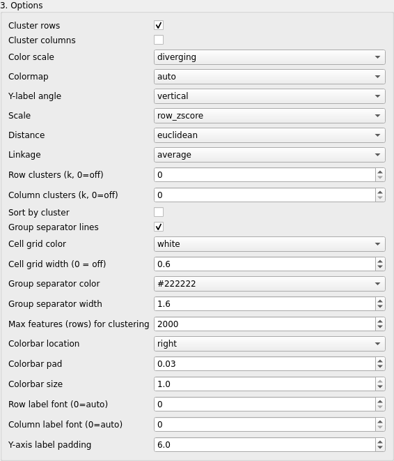
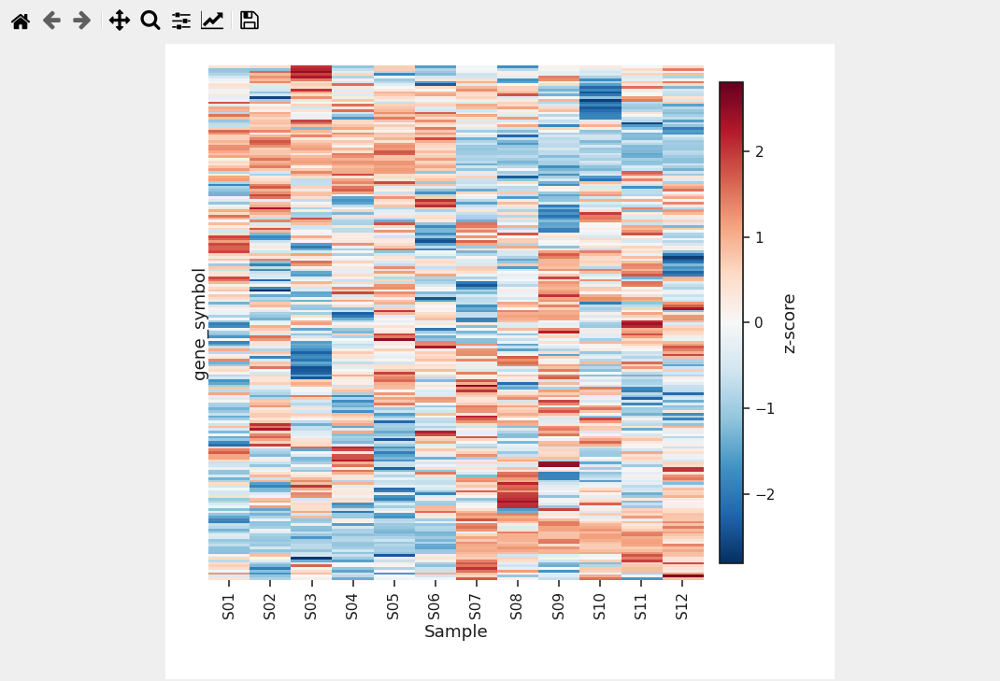
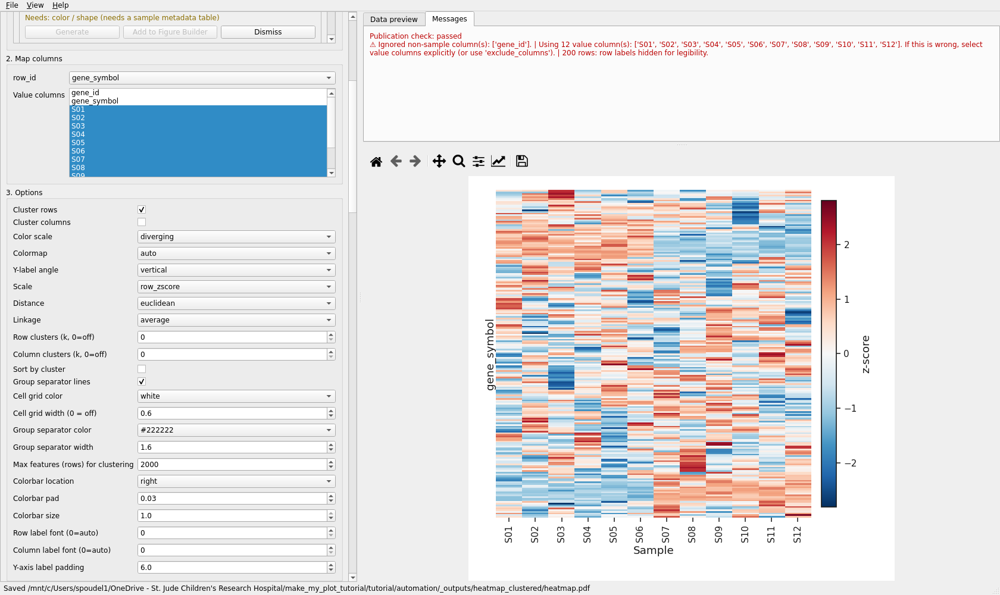

# Clustered heatmap

Plot id `heatmap_clustered_matrix`. Validated run: `automation/tutorials/heatmap_clustered.py`.
Screenshots: `screenshots/heatmap_clustered/`.

## What this plot shows

A feature-by-sample matrix drawn as coloured cells, with rows and columns reordered by
hierarchical clustering so that similar features and similar samples sit together. Row-wise
scaling (z-score) makes patterns comparable across features with different baselines.

## Example question

Which features share an expression pattern across twelve samples, and do the samples fall into
two groups?

## Required data

`datasets/feature_sample_matrix.csv` (simulated): 200 rows, one identifier column, one symbol
column and twelve numeric sample columns `S01` ... `S12` (log2 scale).

| column | role here |
|---|---|
| `gene_symbol` | **row_id** (row labels) |
| `S01` ... `S12` | **Value columns** |
| `gene_id` | not used (a second identifier) |

## Open the data

**Open data file** > `feature_sample_matrix.csv`. The header reads *Detected data type:
expression_like_matrix. 7 suggested figure(s)*; the first cards are *Clustered heatmap (85%
match)* and *PCA scatter (matrix + metadata) (70%)*.

## Map the columns

Choose **Clustered heatmap**. This plot type has one drop-down, **row_id**, plus a list called
**Value columns**. The application pre-selects the twelve numeric sample columns and leaves
`gene_id` and `gene_symbol` unselected; **row_id** starts at `(none)`. Set **row_id** to
`gene_symbol`. In the list, click to select or deselect columns (Ctrl / Cmd-click for single
toggles) - this is how you leave an annotation column out of the values.

## Create the plot

## Customize

**3. Options** for this plot type are many; the useful ones: *cluster_rows*, *cluster_columns*,
*color_scale*, *colormap*, *scale* (none / row_zscore / column_zscore / center_rows / log /
log_zscore), *distance_metric*, *linkage_method*, *cluster_k_rows*, *cluster_k_columns*,
*sort_by_cluster*, *group_separators*, cell borders. The tutorial set *scale* to `row_zscore`
and switched *cluster_columns* off so the samples keep their file order.

## Statistics

No inferential test is attached to a heatmap. For group-wise differential summaries use
**Matrix workflow...** (see the reshaping tutorial), which can hand a volcano or a grouped plot
back to the editor.

## Annotation

A sample-group colour strip can be added through **Define groups...** (tab *Assign sample groups
(wide matrix)*, option *Heatmap / PCA (keep the matrix + add a group color strip)*).

## Figure Preset

Style presets carry the colormap only if it is treated as style for this plot type; see the
preset's applied / skipped counts after **Apply**.

## Save / reproduce

**Save Figure Package (.mmfpackage)** stores the matrix with the specification. For matrices that
went through **Matrix workflow...**, the package also records MatrixSpec, SampleMetadataSpec and
PreprocessingSpec.

## Export

**Export PNG** and **Export PDF** were used. Large matrices export faster as PNG; PDF and SVG
stay vector.

## Common mistakes

* Leaving **row_id** at `(none)` and wondering where the row labels are.
* Keeping an identifier or annotation column selected in **Value columns** (it becomes a
  "sample").
* Forgetting *scale*: unscaled log2 values show baseline differences, not patterns.
* Reading clustered column order as the file order; either switch *cluster_columns* off or state
  in the legend that columns are clustered.

## Result

Video: `VIDEO_URL_HEATMAP`; script `video_scripts/heatmap_clustered.md`.
