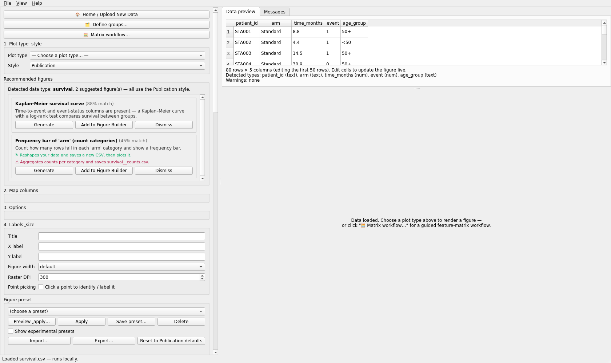
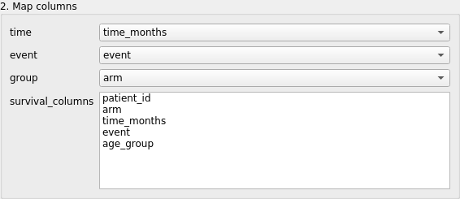
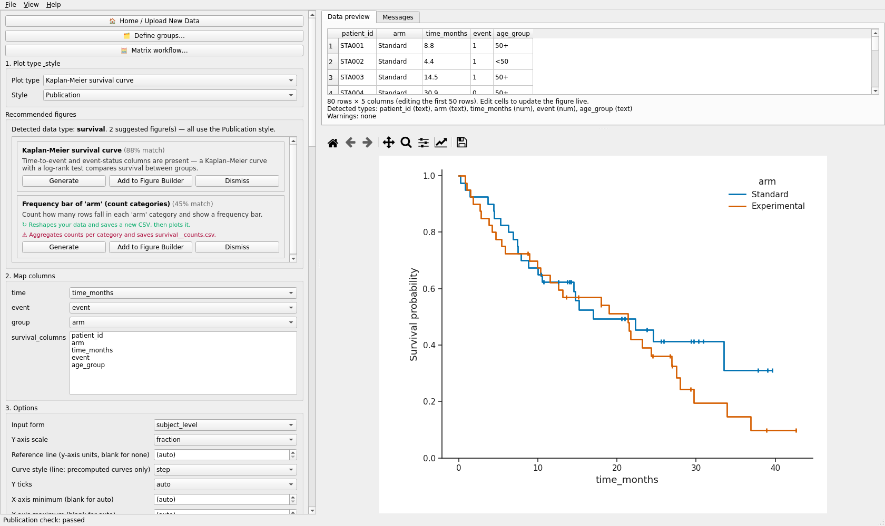
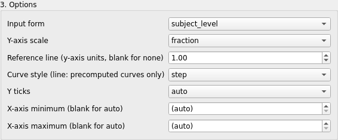
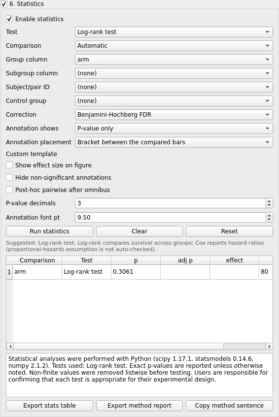
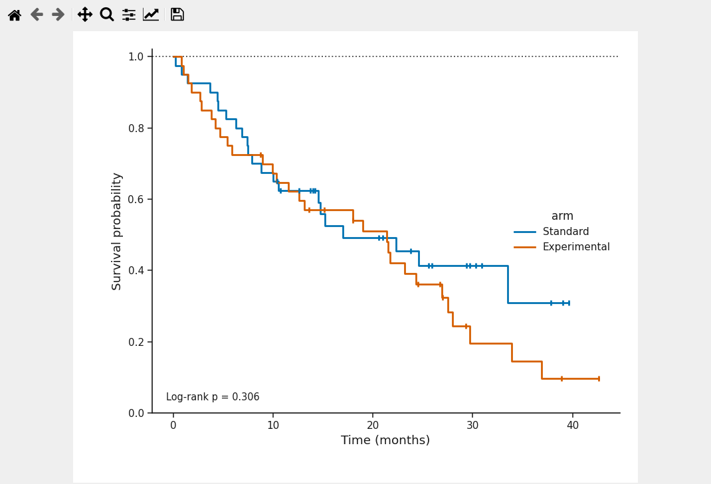
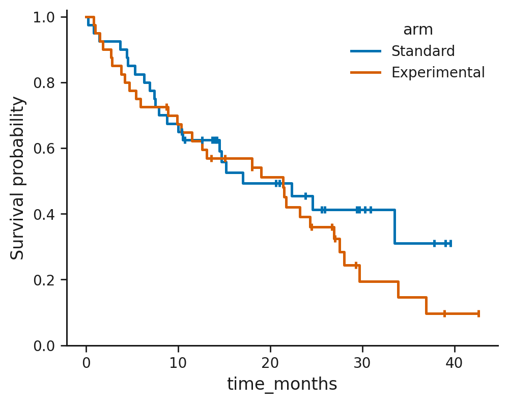
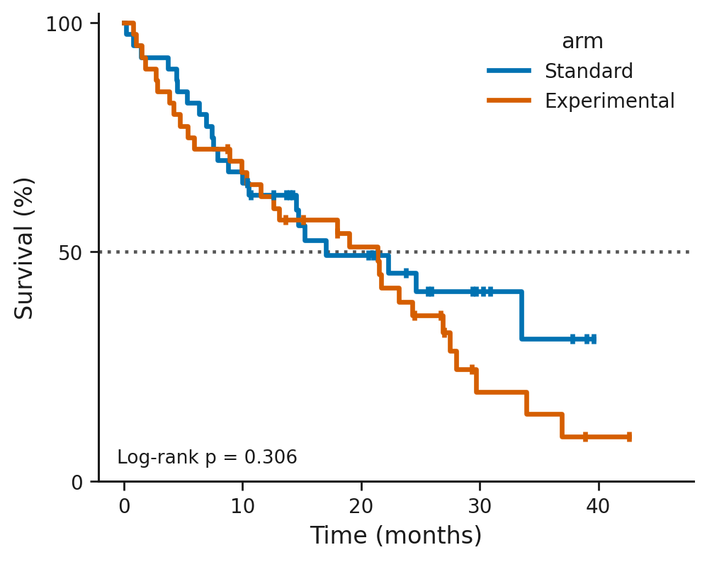
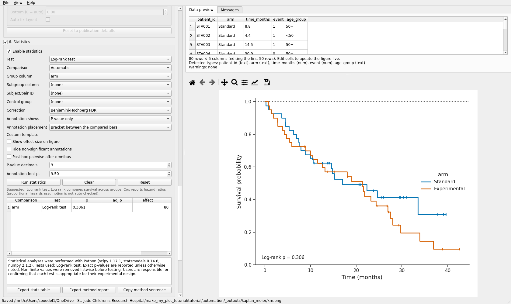

# Kaplan-Meier survival curve

Plot id `kaplan_meier_survival_curve`. Validated run: `automation/tutorials/kaplan_meier.py`.
Screenshots: `screenshots/kaplan_meier/`.

## What this plot shows

The estimated probability of remaining event-free over time, one step curve per group, with
tick marks at censored observations. A log-rank test compares the curves.

## Example question

Do patients on the experimental arm survive longer than those on the standard arm?

## Required data

`datasets/survival.csv` (simulated), 80 subjects:

| column | role here | example |
|---|---|---|
| `time_months` | **time** | 12.4 |
| `event` | **event** (1 = event, 0 = censored) | 1 |
| `arm` | **group** | Standard / Experimental |
| `patient_id`, `age_group` | unused | STA001, 50+ |

The plot type also accepts pre-computed curves (option *input_form = precomputed*, with the
multi-column role **survival_columns**); this tutorial uses subject-level rows.

## Open the data

**Open data file** > `survival.csv`. The header reads *Detected data type: survival. 2
suggested figure(s)*; the first card is *Kaplan-Meier survival curve (88% match)*.

## Map the columns

Choose **Kaplan-Meier survival curve**. The proposal is `time = time_months`, `event = event`,
`group = (none)`. Set **group** to `arm` to get two curves.

## Create the plot

## Customize

**3. Options**: *input_form* (subject_level / precomputed), *y_scale* (fraction / percent),
*reference_line* (a horizontal guide, numeric), *curve_style* (step / line), *y_ticks*
(auto / ends_and_midpoint), *x_min*, *x_max*. Axis labels were set to "Time (months)" and
"Survival probability".

## Statistics

Open **6. Statistics** (title checkbox, then *Enable statistics*), *Test = Log-rank test*,
*Group column = arm*, *Annotation shows = P-value only*, **Run statistics**. The figure gains a
text annotation "Log-rank p = ..." and the table lists the test with n = 80. *Cox
proportional-hazards (HR)* is the other survival test offered.

Recorded result: log-rank p = 0.306 (the simulated arms do not differ).

## Annotation

The P annotation is placed by the statistics panel; its decimals and font size are set there.

## Figure Preset

Style presets apply. Curve style and scales are plot options.

## Save / reproduce

**Save Figure Package (.mmfpackage)** keeps the subject table with the specification and the
log-rank result.

## Export

**Export PDF** and **Export PNG** were used.

## Before / after - the same 80 subjects

| default | refined (percent scale, 50 % reference line, x to 48 months, log-rank P, thicker curves) |
|---|---|
|  |  |

Line width comes from the Publication style profile; a number-at-risk table is not available.

## Common mistakes

* An **event** column coded the other way round (1 = censored). The application takes 1 as the
  event; recode or add a derived column with **Define groups... > Group by column values**.
* Leaving **group** at `(none)` and expecting a comparison; the log-rank test needs a group.
* Time in mixed units across rows; the column must be one unit.

## Result

Video: `VIDEO_URL_KAPLAN_MEIER`; script `video_scripts/kaplan_meier.md`.
