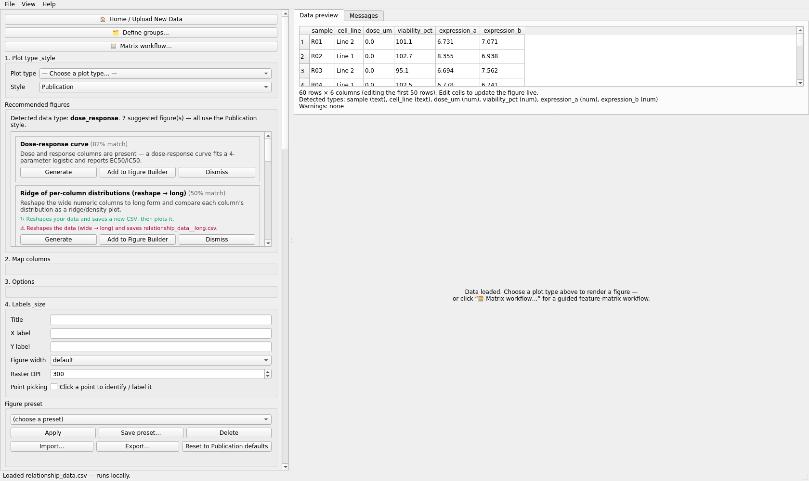
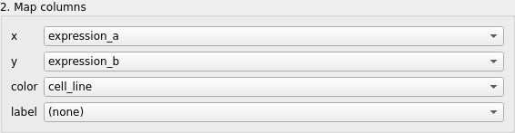
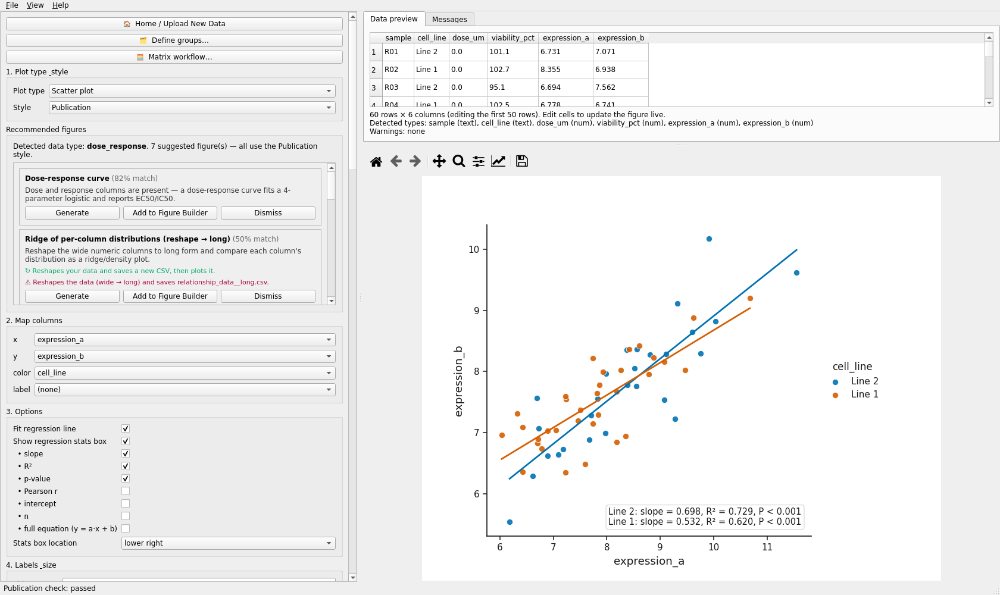
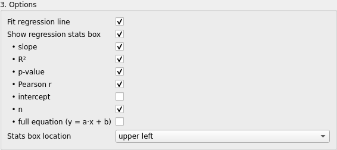
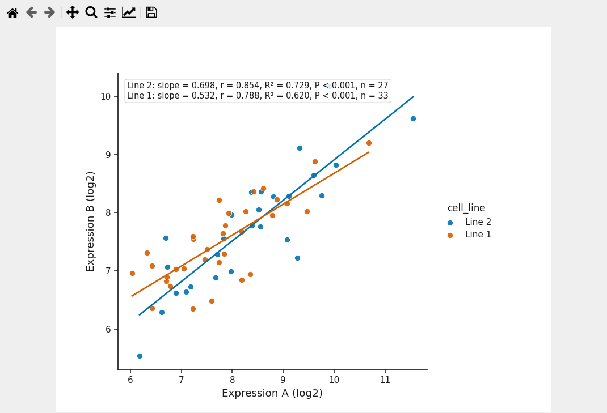
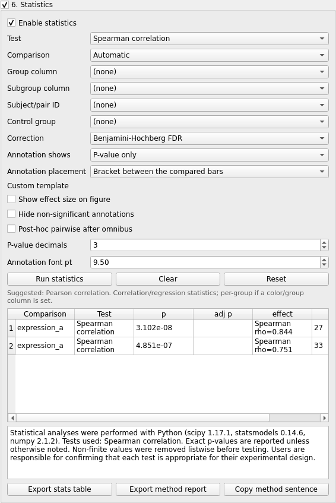

# Scatter plot (with regression)

Plot id `scatterplot_with_regression`. Validated run: `automation/tutorials/scatter_regression.py`.
Screenshots: `screenshots/scatter_regression/`.

## What this plot shows

Each row of the table becomes one point placed by two numeric columns. An optional colour role
splits the points into groups, and a regression line with its slope, R² and P can be drawn for
all points or for each group. It answers "do these two readouts move together?".

## Example question

Do two expression readouts measured on the same samples correlate, and is the relationship the
same in both cell lines?

## Required data

`datasets/relationship_data.csv` (simulated), 60 rows:

| column | role here | example |
|---|---|---|
| `expression_a` | **x** | 8.13 |
| `expression_b` | **y** | 7.62 |
| `cell_line` | **color** | Line 1 / Line 2 |
| `sample` | (identifier, unused) | R01 |
| `dose_um`, `viability_pct` | (other numeric columns) | 0.3, 91.2 |

## Open the data

1. **Open data file** > `relationship_data.csv`.
2. The recommendation header reads *Detected data type: dose_response* because the table also
   has a dose and a response column. That is a suggestion, not a constraint.

## Map the columns

Choose **Scatter plot** under **1. Plot type & style**. The application proposes
`x = dose_um`, `y = viability_pct` (the first two numeric columns) and leaves **color** and
**label** at `(none)`. Set the rows to what the question needs:

| row | column |
|---|---|
| **x** | `expression_a` |
| **y** | `expression_b` |
| **color** | `cell_line` |
| **label** | `(none)` |

## Create the plot

The preview redraws as you change rows; **Update preview** forces it. With a colour role the
regression is fitted per group and the stats box lists one line per group.

## Customize

**3. Options** (defaults in brackets): *Fit regression line* (on), *Show regression stats box*
(on) with its parts - slope (on), R² (on), p-value (on), Pearson r (off), intercept (off),
n (off), full equation (off) - and *Stats box location* (lower right). In the tutorial
*Pearson r* and *n* were switched on and the box moved to *upper left*; axis labels were set
under **4. Labels & size** to "Expression A (log2)" and "Expression B (log2)".

## Statistics

The regression box is descriptive. For a formal test open **6. Statistics** (tick the box in
its title, then *Enable statistics*), choose *Test = Spearman correlation* (or Pearson / Linear
regression) and click **Run statistics**. With a colour role the test runs per group: the table
under the panel lists one row per group with rho, P and n, and the method sentence below it
can be copied with **Copy method sentence**.

Recorded in the validated run: Spearman rho = 0.844 (n = 27) and 0.751 (n = 33) for the two
lines.

## Annotation

Tick **Click a point to identify / label it** under **4. Labels & size** and click points in the
preview to label them with the **label** column (set **label** to `sample` first).

## Figure Preset

Style presets apply (fonts, colours, layout, legend, export). Regression options belong to the
figure configuration and travel only in a *Full figure configuration* preset.

## Save / reproduce

**Export PlotSpec JSON (specification only)** writes the specification; **Save Figure Package
(.mmfpackage)** adds the frozen table and the statistics results.

## Export

**Export PDF** and **Export PNG** were used (5. Export); SVG is the third button.

## Common mistakes

* Accepting the proposed x / y. They are simply the first two numeric columns.
* Reading a per-group regression as a pooled one: with **color** set, every line and every stats
  row is per group. Set **color** to `(none)` for one fit over all points.
* Expecting the stats box to be a test result. Use **6. Statistics** for the test and the method
  sentence.
* A numeric column missing from the drop-downs: check the detected-types line; identifier-like
  names are typed as text.

## Result

Video: `VIDEO_URL_SCATTER`; script `video_scripts/scatter_regression.md`.
