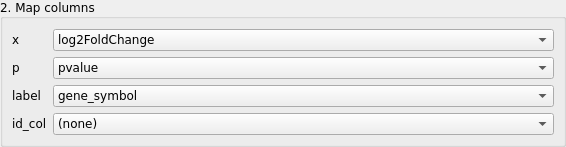
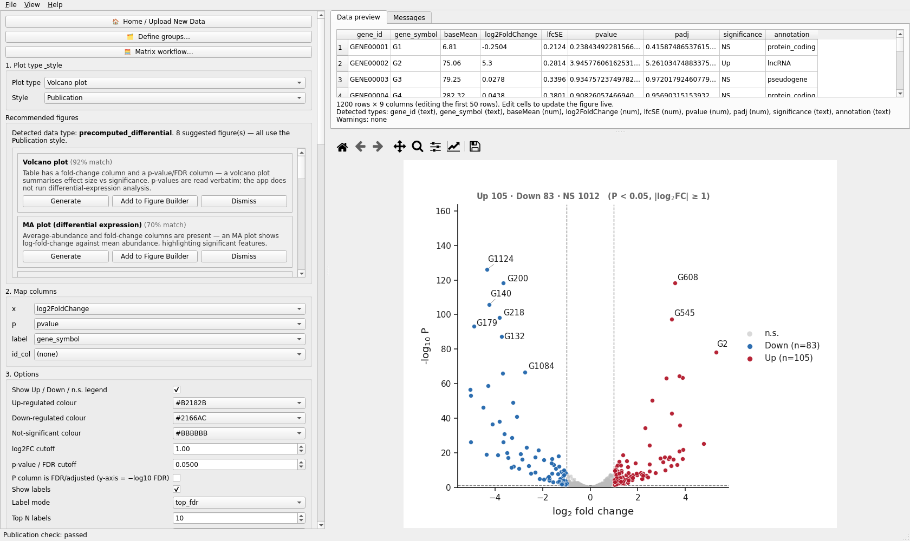
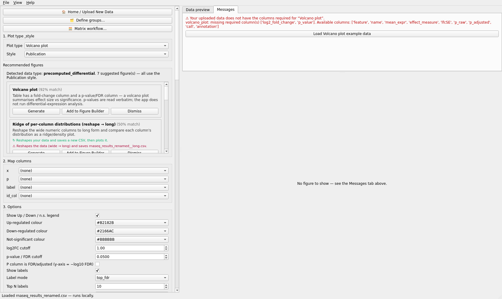
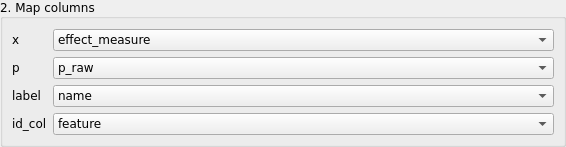
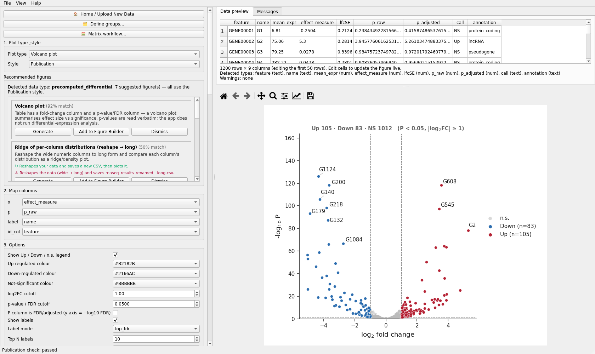
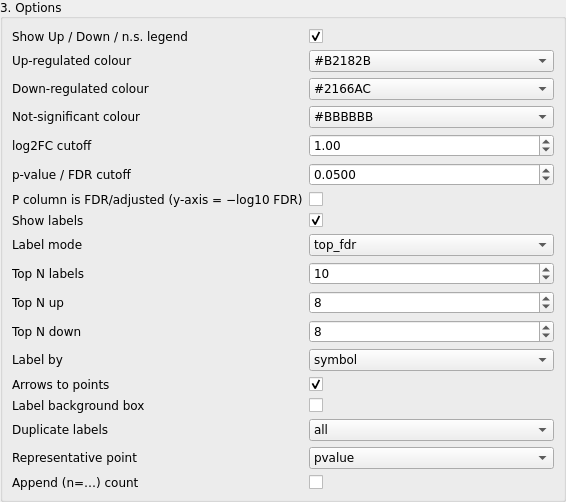
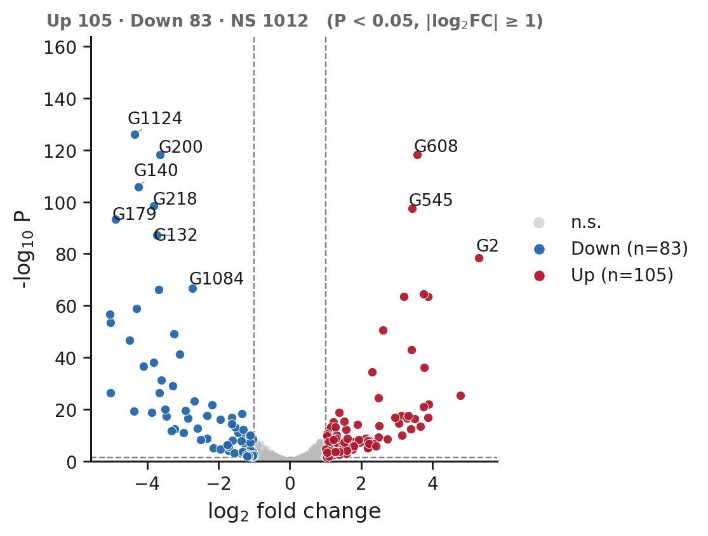
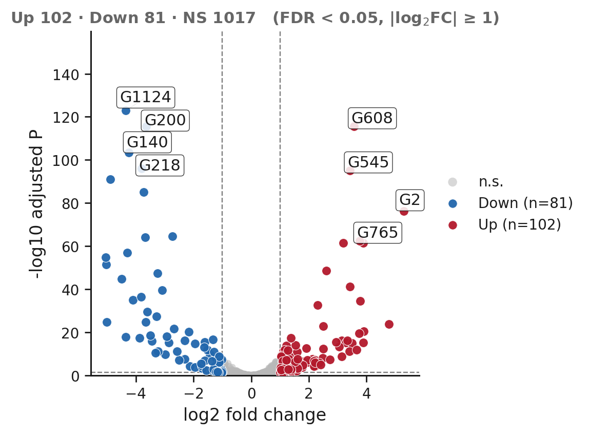
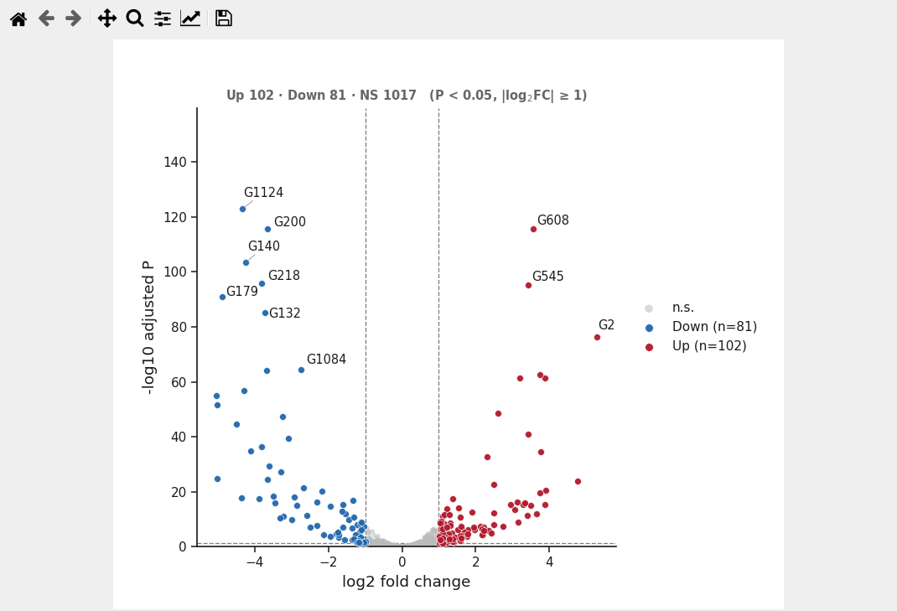

# Volcano plot

Plot id `volcano_plot`. Validated run: `automation/tutorials/volcano_manual_mapping.py`.
Screenshots: `screenshots/volcano_manual_mapping/`.

## What this plot shows

Every feature (gene, protein, peptide) is one point: effect size on the x axis (log2 fold
change), evidence on the y axis (-log10 P). Cutoffs split the points into up, down and not
significant; the strongest hits are labelled. The application reads the P values as given - it
does not run differential-expression analysis.

## Example question

Which features change most between two conditions in a differential-expression result table?

## Required data

Two versions of the same simulated table (1200 rows):

| `datasets/rnaseq_results.csv` (DESeq2-like names) | `datasets/rnaseq_results_renamed.csv` (non-standard names) | role |
|---|---|---|
| `log2FoldChange` | `effect_measure` | **x** |
| `pvalue` / `padj` | `p_raw` / `p_adjusted` | **p** |
| `gene_symbol` | `name` | **label** |
| `gene_id` | `feature` | **id_col** |
| `baseMean`, `lfcSE`, `significance`, `annotation` | `mean_expr`, `lfcSE`, `call`, `annotation` | unused |

## Part 1 - standard names are detected

1. **Open data file** > `rnaseq_results.csv`. The header reads *Detected data type:
   precomputed_differential*; the first card is *Volcano plot (92% match)*, then *MA plot*.
2. Choose **Volcano plot**. The rows fill themselves: `x = log2FoldChange`, `p = pvalue`,
   `label = gene_symbol`, `id_col = (none)`. The Messages tab lists the detected columns and asks
   you to confirm them. The figure draws.

## Part 2 - the same data with names the detector does not know

1. **Open data file** > `rnaseq_results_renamed.csv`, then choose **Volcano plot** again.
2. Now every row shows `(none)`, no figure is drawn, and the Messages tab says:

   > Your uploaded data does not have the columns required for "Volcano plot".
   > volcano_plot: missing required column(s) ['log2_fold_change', 'p_value']. Available columns: ['feature', 'name', 'mean_expr', 'effect_measure', ...]

   with a button *Load Volcano plot example data*. Ignore the button; map the columns instead.

3. Assign the roles by hand:

| row | column |
|---|---|
| **x** | `effect_measure` |
| **p** | `p_raw` |
| **label** | `name` |
| **id_col** | `feature` |

The volcano renders - the same figure as in Part 1, from the same numbers under other names.

## Customize

**3. Options**: *Show Up / Down / n.s. legend*, the three colours, *log2FC cutoff* (1.00),
*p-value / FDR cutoff* (0.05), *P column is FDR/adjusted (y-axis = -log10 FDR)*, *Show labels*,
*Label mode* (top_fdr ...), *Top N labels* (10), plus duplicate-label handling. The tutorial
switched **p** to `p_adjusted` and set the axis labels to "log2 fold change" and "-log10
adjusted P". The title line above the plot reports the counts (Up 102, Down 81, NS 1017 in the
validated run).

## Statistics

None are computed: P values are taken from the table. The statistics panel does not apply.

## Annotation

Labels come from the **label** column; *Top N labels* and *Label mode* choose which points are
labelled. With **Click a point to identify / label it** ticked, click points to add labels.

## Figure Preset

Style presets transfer appearance; cutoffs and colours by class are options and travel in a
*Full figure configuration* preset.

## Save / reproduce

**Export PlotSpec JSON (specification only)** was used; the file records the roles by column
name, so it reopens on this table or on any table with these headers. **Save Figure Package**
freezes the table too.

## Export

**Export PNG** and **Export PDF** were used.

## Before / after - the same 1,200 features

| default (raw P axis, ten labels) | refined (adjusted P axis, 4 + 4 boxed labels, larger markers, neutral n.s.) |
|---|---|
|  |  |

Up / down / n.s. counts differ between the two only because one uses raw P and the other the
adjusted P for the cut-off; the values are the same table (`audit/showcase_data_integrity.csv`).

## Common mistakes

* Mapping the adjusted P column to **p** without ticking *P column is FDR/adjusted*: the axis
  label would still say -log10 P.
* Leaving **label** at `(none)`: no gene names appear even with *Show labels* on.
* Trusting the detector with unusual headers: it knows DESeq2 / edgeR conventions
  (`log2FoldChange`, `logFC`, `pvalue`, `P.Value`, `padj` ...). Anything else is yours to map.
* Expecting a test: the application never recomputes P values for a volcano.

## Result

Video: `VIDEO_URL_VOLCANO`; script `video_scripts/volcano_manual_mapping.md`.
